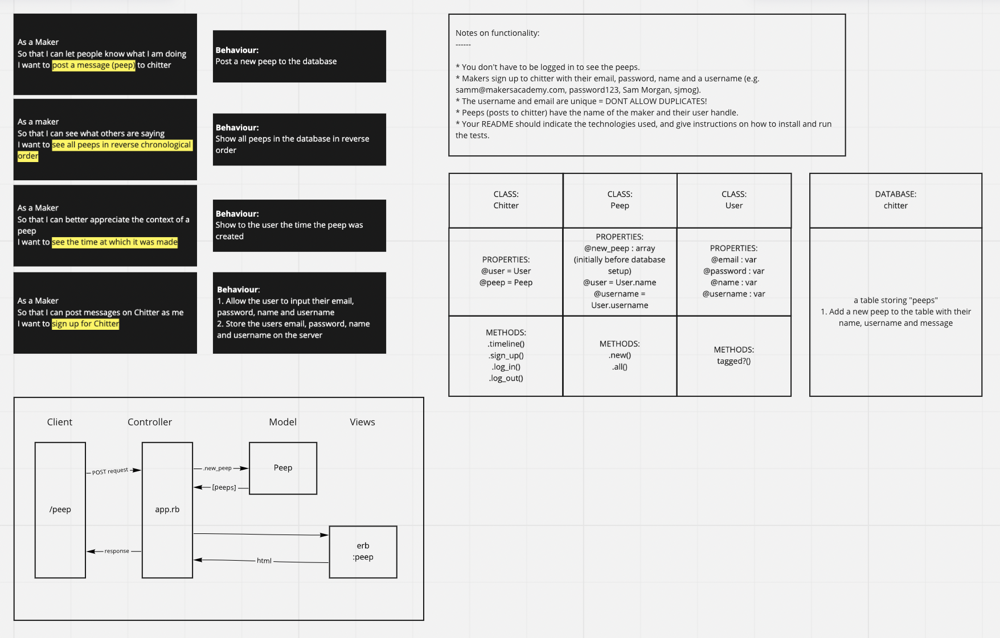

# Chitter app
A small Twitter clone with simple user features.
## Initial Plan:


## User Stories:
```
1:
As a Maker
So that I can let people know what I am doing  
I want to post a message (peep) to chitter
```

```
2:
As a maker
So that I can see what others are saying  
I want to see all peeps in reverse chronological order
```

```
3:
As a Maker
So that I can better appreciate the context of a peep
I want to see the time at which it was made
```

```
4:
As a Maker
So that I can post messages on Chitter as me
I want to sign up for Chitter
```

