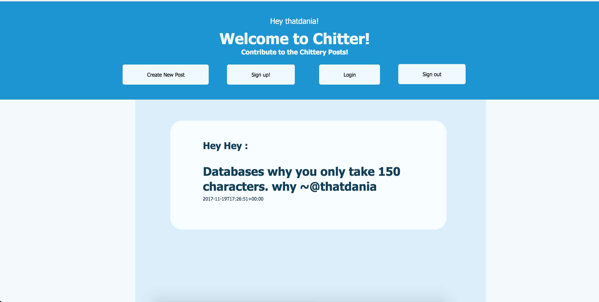

Chitter Challenge
=================

#Challenge:[](https://travis-ci.org/makersacademy/chitter-challenge)
-------
This weekend's challenge was to create a  Twitter clone that will allow the users to post messages to a public stream.

How To Use:
-------
1. Open the program terminal or an equivalent and enter:
```
$ git clone https://github.com/thatdania/chitter-challenge.git
```
2. Change directory into the folder
```
$cd chitter-challenge/
```
3. Install the gems required
```
$bundle install
```
4. Use the terminal to open the website in browser
```
$rackup
```
5. There will be a port listed when you run rackup, (ie. port: 9292). Depending on your computer, type in the following in your search browser
```
$http://localhost:9292/
```

Have fun playing around with the features :)

Approach
-------



Initially, I sketched out how all the pages were going to connect to each other and in what order. Making Domain Models, allowed to order the features in which I had to do them and how the user would interact with the program.

I'm pretty surprised that I manage to do most of the stuff that I struggled over the week. There is a sign up page, create post, login and logout (only shows if you are logged in, smart). The posts that one post also stays there and you can write as many as you want. I also manage to create a nice aesthetic for the User.

If I had more time, I would have fixed the errors such as storing the data in a database, not allowing the user to sign in if an email exist and tagging the posts with the person's name so u could see posts done by which user.


Domain Models
-------

Creating a Domain Model allows me to specify what the focus of every test should be. It also tells me what functions needs to be included in the challenge along with it's outcomes for when I'm testing it. Writing a Domain Model helps to list out what is needed for a program accordingly and
also helps to see what the order of the pages needs to be in.

| Objects       | Messages      | Test outcomes                            |
| ------------- |:-------------:| ----------------------------------------:|
| Message(peep) | message       | Post a peep to chitter                   |
| Order(peep)   | See all       | Peeps are in reverse chronological order |
| time          | made          | See the time which the peep was made     |
| Chitter       | sign up       | Register username(2x), password and name |
| Chitter       | log in        | Log in to post chitter as user's chitter |
| Chitter       | log out       | To avoid posting messages under user     |
| Chitter, email| receive       | Receives email if tagged by a peep       |


Resources
-------


Code Review
-----------

In code review we'll be hoping to see:

* All tests passing
* High [Test coverage](https://github.com/makersacademy/course/blob/master/pills/test_coverage.md) (>95% is good)
* The code is elegant: every class has a clear responsibility, methods are short etc.

Reviewers will potentially be using this [code review rubric](docs/review.md).  Referring to this rubric in advance may make the challenge somewhat easier.  You should be the judge of how much challenge you want this weekend.

Notes on test coverage
----------------------

Please ensure you have the following **AT THE TOP** of your spec_helper.rb in order to have test coverage stats generated
on your pull request:

```ruby
require 'simplecov'
require 'simplecov-console'

SimpleCov.formatter = SimpleCov::Formatter::MultiFormatter.new([
  SimpleCov::Formatter::Console,
  # Want a nice code coverage website? Uncomment this next line!
  # SimpleCov::Formatter::HTMLFormatter
])
SimpleCov.start
```

You can see your test coverage when you run your tests. If you want this in a graphical form, uncomment the `HTMLFormatter` line and see what happens!
