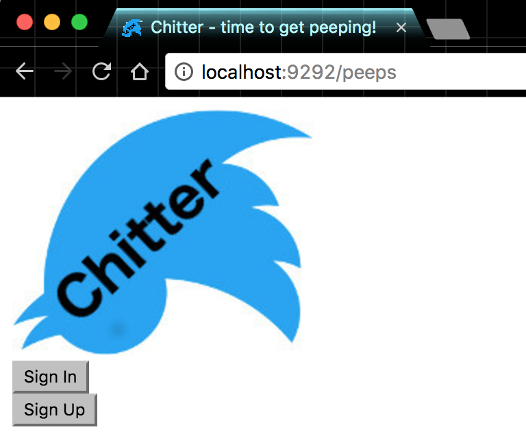
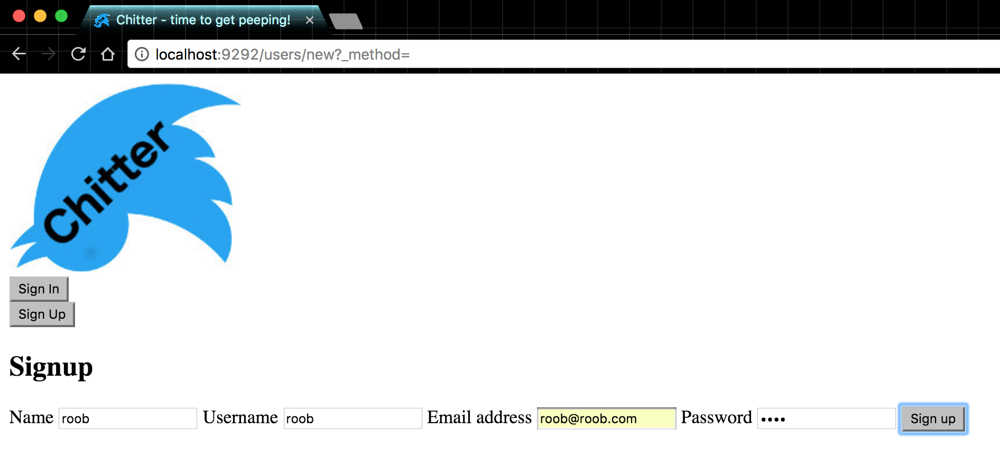
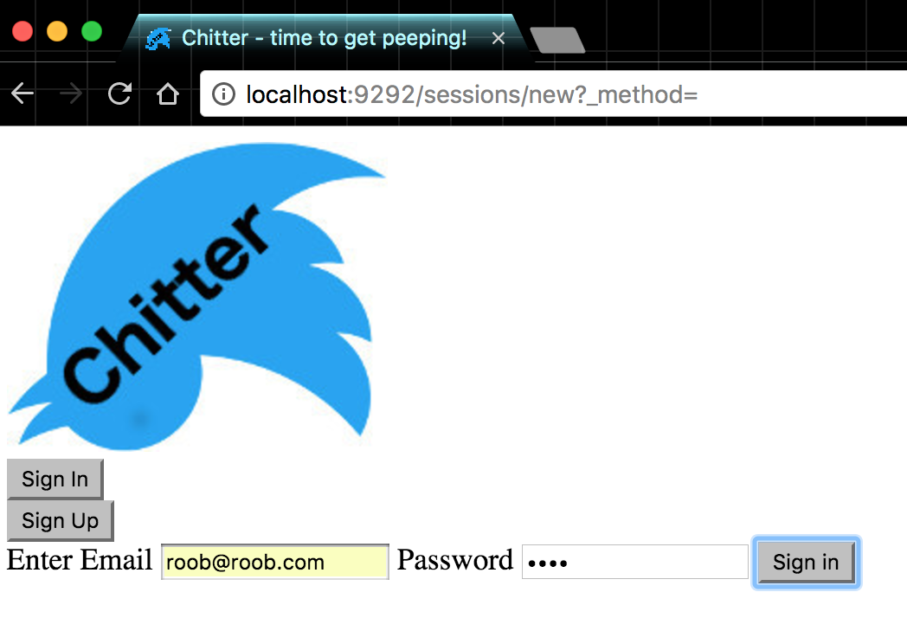
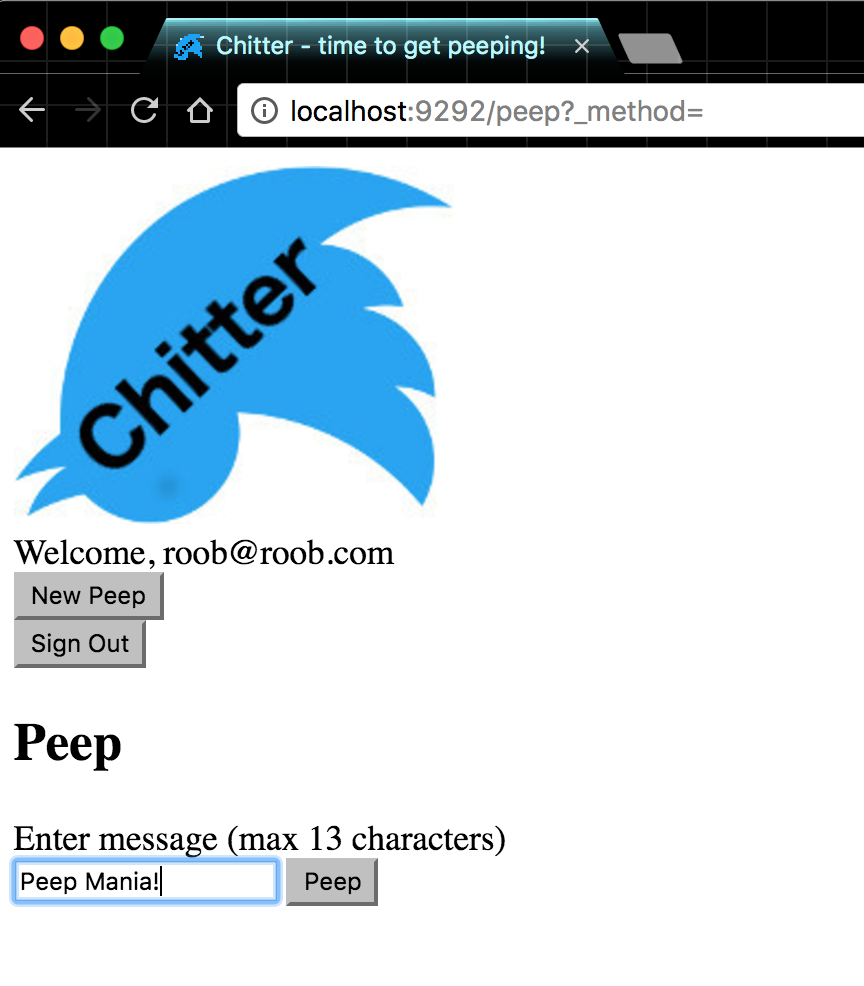
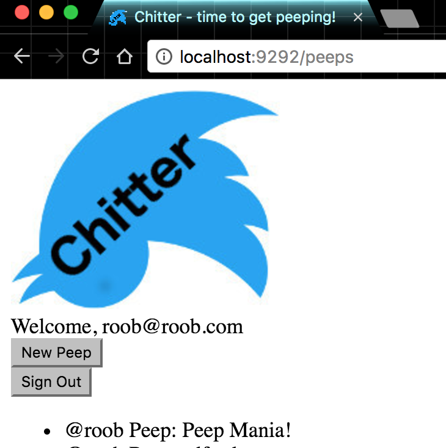
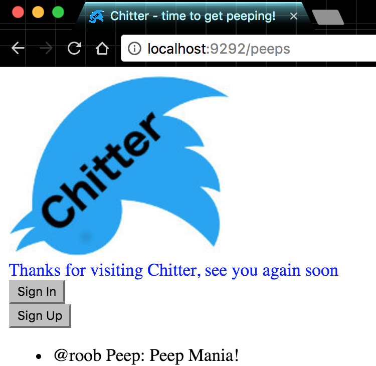

[](https://travis-ci.org/sultanhq/chitter-challenge)

Chitter Challenge
=================

### Instructions

* Clone repo
* Create a postgres database call 'chitter_development'
* run ```bundle install``` in repo root folder
* run rackup
* go to http://localhost:9292/

* Start Peeping!













### To do:

* add time stamp to peeps
