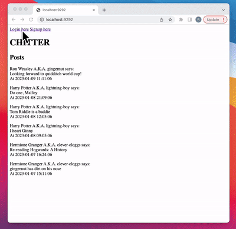

Chitter Challenge
=================

This is a social media platform which enables users to view all messages, login and create their own messages, logout, or sign up to the platform. <br>

This program has been built with Ruby, PostgreSQL, Sinatra, and uses RSpec for testing. <br> 

For the full design process including user stories and table design, [view the docs folder.](https://github.com/rachelnewby/chitter-challenge/tree/main/docs)

Technology Used
-------
<div align="center">
	<code></code>
	<code></code>

</div>

To Run
-------
Start by cloning this repository. The code has the following dependencies:

```ruby
gem "pg" # "~> 1.4"
gem "sinatra" # "~> 3.0"
gem "sinatra-contrib" # "~> 3.0"
gem "webrick" # "~> 1.7"
gem "rack-test" # "~> 2.0"
```
Open your terminal and navigate into the directory, enter:
```
rackup
```
Then open your broswer and navigate to http://localhost:9292/. You will then be able to browse the site. 

Existing Functionality: 
-------
- You don't have to be logged on to see the peeps (chitter posts)
- Peeps are displayed in reverse chronological order
- You sign up with email, password, name, and user name
- The user name and email are unique
- Peeps have the name of the user and their user handle
- Logged in users can post a new peep
- Users can logout
- If a user tries to login and their username doesn't exist, user is redirected to sign up
- If a user tries to sign up with an existing username, they are told to choose a different username
- If a user enters the wrong password, login fails and they are told to try again
- If an email is already assigned to an account, a user cannot sign up with that email address and they are redirected to login


Things to do: 
-------
- Sessions have not been tested - there are potential bugs
- Passwords are not currently encrypted! Please be aware of this while testing
- You cannot delete a peep or a user
- You cannot edit a peep or a user
- You cannot view only your own posts
- You cannot be tagged/ you cannot tag others in peeps
- You will not get an email if you are tagged in a peep
- You cannot reply to peeps
- CSS has not been added

Chitter in Action
-----


100% Test Coverage
-----
