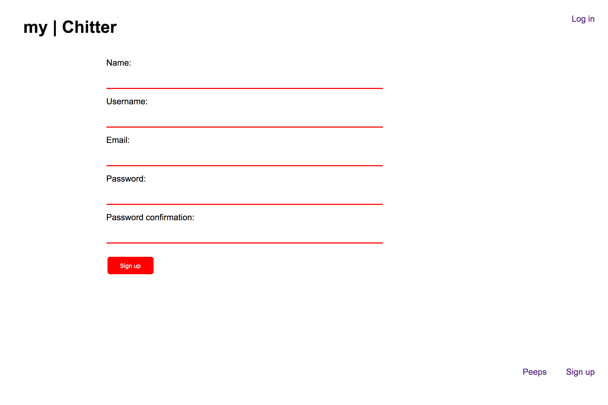
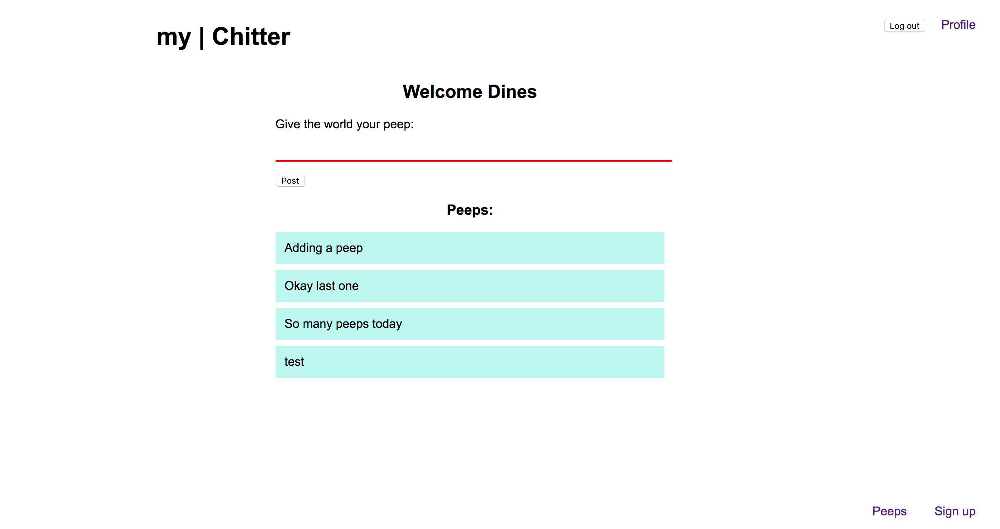
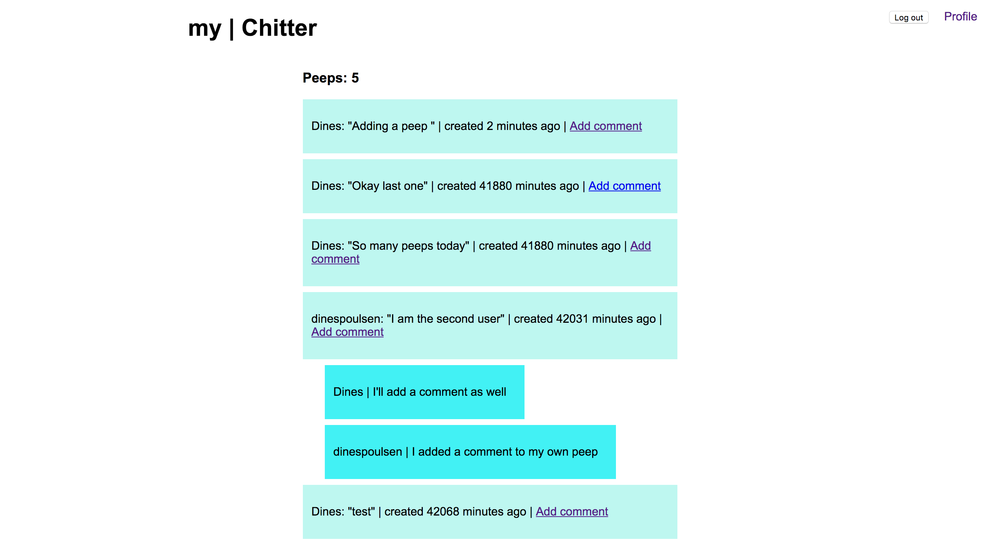
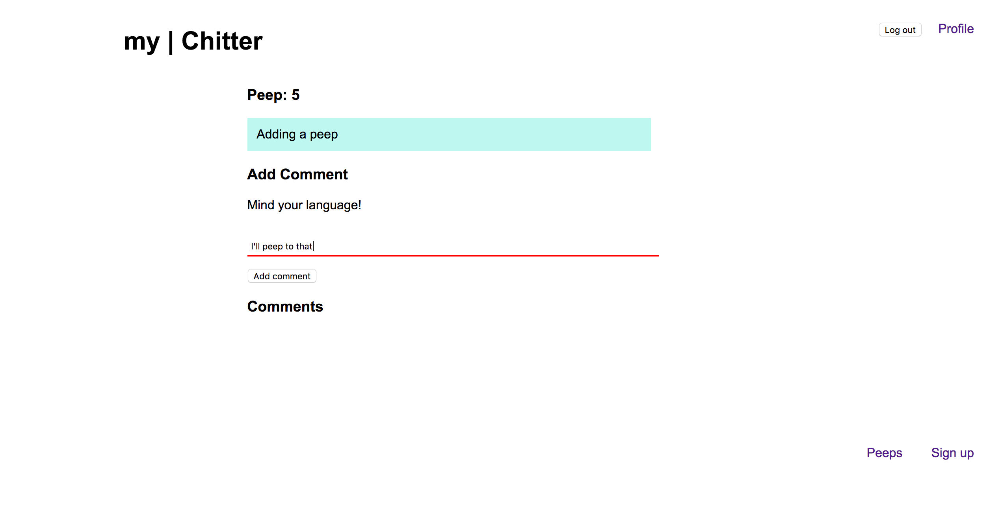

Chitter application
==================

Introduction
-------
The Chitter application is the third weekend challenge at the Makers Academy in London. The challenge was to build an application that could handle a user sign up system that would allow users to post peeps and comments to each other. I have built the application in a test driven approach using rspec and Capybara. I built my application via the Sinatra framework and the intent was to implement techniques related to relational database mapping. I have used DataMapper and Postgres as the adapter to set up my database. I have added client and database validation to the application and conditional routing to my controller in order to enhance user security.
I have implemented the MailGun API to allow for password recovery.

You can check out the application via http://my-chitter.herokuapp.com/

Features that needed to be implemented:
-------

```
As a Maker
So that I can post messages on Chitter as me
I want to sign up for Chitter

As a Maker
So that I can post messages on Chitter as me
I want to log in to Chitter

As a Maker
So that I can avoid others posting messages on Chitter as me
I want to log out of Chitter

As a Maker
So that I can let people know what I am doing  
I want to post a message (peep) to chitter

As a maker
So that I can see what others are saying  
I want to see all peeps in reverse chronological order

As a maker
So that I can better appreciate the context of a peep
I want to see the time at which it was made
```

Installation
-----
* Run the command 'bundle install' in the project directory to ensure you have all the gems.


How to use the applicaton
-----

To run the program start a local server by writing ruby app/app.rb in the terminal and the app.rb file from the project directory will be executed.

Technologies used
-----
* PostgreSQL database
* DataMapper
* Sinatra framework
* Database Cleaner
* RSpec & Capybara testing
* Heroku for web hosting
* MailGun

Areas to improve
-----

* Improving user profile and enabling editing of profile
* Adding notification when commenting
* Like features to peeps
* Improving the design features.

Example
-----

Signing up a user.



Adding a peep.



View peeps.



Add comment.


