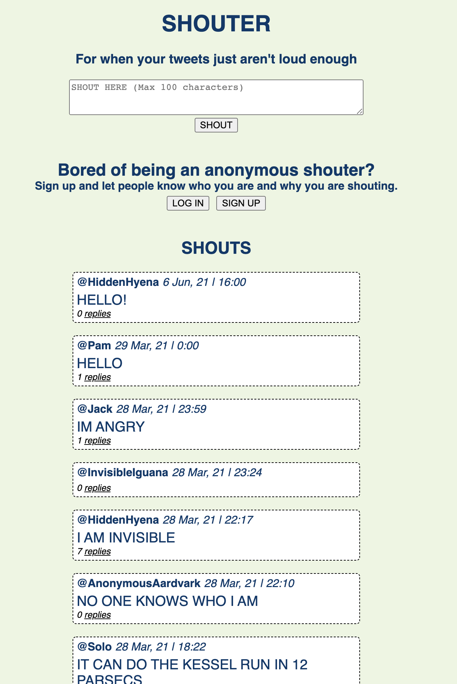

Chitter Challenge
=================

## Welcome to SHOUTER - my answer to the Chitter Challenge
Created by jackmcc08 for week 4 weekend challenge - Makers

This app was developed after the culmination of 4 weeks of solid Ruby study. I decided to implement a twist on Twitter and call it Shouter, where you all your posts are auto cap locked and shouted into the void. You can also login/logout. If you don't login you are anonymised when you shout.

On submission:
- RSPEC tests all passed
- Rubocop - no violations detected

## To use
1. git clone to your local machine
2. run bundle install
3. Set up both of the below databases following the command below - you will need PostgreSQL
4. run rspec and get clean tests to ensure setup correctly
5. run `rackup -p 5001` to start app
6. Connect in browser via `localhost:5001`

#### To set up the database for actual use
1. Connect to psql `psql`
2. Create the database using the psql command `CREATE DATABASE  shouter_database;`
3. Connect to the database using the pqsl command `\c shouter_database;`
4. Run the querys we have saved in the file `01_create_shouter_tables.sql`

#### Set up database for testing
1. Connect to psql `psql`
2. Create the database using the psql command `CREATE DATABASE shouter_database_test;`
3. Tables will create and reset automatically when you run rspec

## Development History

See my Development_notes.md file for a breakdown of how I developed the app.
[Link to Domain Modelling and CRC cards](https://docs.google.com/spreadsheets/d/1n7Jcf08kXf7UYjEGKVqBzyhoxwa44A7R4Y4w0MMAbaA/edit?usp=sharing)

The app meets all of the user stories required in the challenge except for sending an email when a reply is made to a shout.

The app also includes an attempt at password encryption using bcrypt, but not sure if implemented in the correct way to ensure best possible security.

The app was developed via BDD and focused on a mixture of automated feature tests and unit tests. All written with RSPEC and Capybara.

## Techstack
- Ruby v2.6.5
- Sinatara, Sinatra-Flash, Sinatra-Contrib to build the web app
- PostgreSQL database to store data
- PG Gem to interface between the app and the database
- BCrypt gem for password encryption
- Capybara, simpleCov, rubocop, timecop and RSPEC for testing

## Future Improvements

Areas to improve:
- Input does not protect against SQL Injection
- Password & email has no validation on what is allowed (but no duplicate usernames or emails are allowed)
- Would like to include email notification
- Did not get a chance to investigate ORM
- Did not refactor significantly enough
- need to review code rubric
- Is there a way to automate the SQL commands? (Rake setup, rake migrate?)
