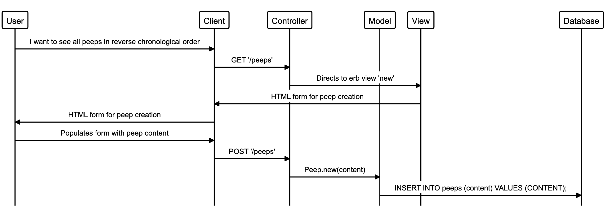
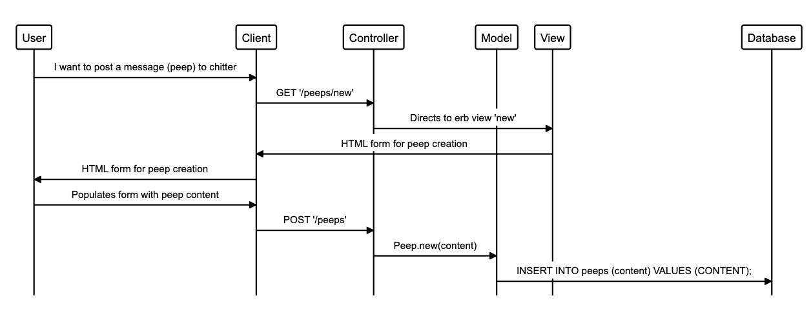

Chitter Challenge:
-------

# Notes on functionality

As it stands, my web app allows you to view peeps in reverse-chronological order without signing up. Peeps have a time stamp attributed to them. I decided to add this functionality directly within the SQL table using a "last modified" column. This allows peeps to be time stamped whilst removing responsibility from the application model. That being said, I had to implement a method within the model to format the dates when being read from the SQL table so that they read in the format DD/MM/YYY HH:MM.

This was the first time that I split my controllers according to their functionality. This way I had a controller dedicated to the user-facing side of the application. 

To maintain restful URL practice, I created a dynamic URL welcome page for when a user signs up, whereby the address is unique depending on the user's ID number. 

Creating a new peep takes the user to a signup page if the user hasn’t already signed up. This form takes the user's name, username, email and password. This is stored within a separate "users" table within the SQL database.

I used the BCrypt gem to convert the passwords to a secure hash before they are written into the database. Once the user has signed in, a session is created storing the user's ID number and username. This unlocks functionality to post new peeps, which can have a maximum of 140 characters.

If I were to continue working on this project, I would like to implement the following improvements:

-   Log in / log out functionality. I almost got to this stage but unfortunately run out of time. I Would implement a new function that could check credentials against the database when logging in, similar to my .find method.
-   Unique username. I would ensure that usernames were unique when entering them by cross referencing the input field with the database.
-   I would add functionality to raise flash errors when users enter form fields in the incorrect format.
-   I would create email alerts to notify users when they are tagged in peeps.
-   Reply functionality.
-   CSS styling and better HTML layouts.

Features!
-------

```
STRAIGHT UP

As a Maker
So that I can let people know what I am doing  
I want to post a message (peep) to chitter

As a maker
So that I can see what others are saying  
I want to see all peeps in reverse chronological order

As a Maker
So that I can better appreciate the context of a peep
I want to see the time at which it was made

As a Maker
So that I can post messages on Chitter as me
I want to sign up for Chitter

HARDER

As a Maker
So that only I can post messages on Chitter as me
I want to log in to Chitter

As a Maker
So that I can avoid others posting messages on Chitter as me
I want to log out of Chitter

ADVANCED

As a Maker
So that I can stay constantly tapped in to the shouty box of Chitter
I want to receive an email if I am tagged in a Peep
```


Technical Approach:
-----

In this unit, you integrated a database into Bookmark Manager using the `PG` gem and `SQL` queries. You can continue to use this approach when building Chitter Challenge.

If you'd like more technical challenge now, try using an [Object Relational Mapper](https://en.wikipedia.org/wiki/Object-relational_mapping) as the database interface.

Some useful resources:
**DataMapper**
- [Datamapper wiki](https://en.wikipedia.org/wiki/DataMapper)
- [Sinatra, PostgreSQL & DataMapper recipe](https://github.com/sinatra/sinatra-recipes/blob/master/databases/postgresql-datamapper.md)

**Ruby Object Mapper**
- [ROM](https://rom-rb.org/)

**ActiveRecord**
- [ActiveRecord ORM](https://guides.rubyonrails.org/active_record_basics.html)
- [Sinatra, PostgreSQL & ActiveRecord recipe](http://recipes.sinatrarb.com/p/databases/postgresql-activerecord?#article)

Notes on functionality:
------

* You don't have to be logged in to see the peeps.
* Makers sign up to chitter with their email, password, name and a username (e.g. samm@makersacademy.com, password123, Sam Morgan, sjmog).
* The username and email are unique.
* Peeps (posts to chitter) have the name of the maker and their user handle.
* Your README should indicate the technologies used, and give instructions on how to install and run the tests.

Bonus:
-----

If you have time you can implement the following:

* In order to start a conversation as a maker I want to reply to a peep from another maker.

And/Or:

* Work on the CSS to make it look good.

Good luck and let the chitter begin!

Code Review
-----------

In code review we'll be hoping to see:

* All tests passing
* High [Test coverage](https://github.com/makersacademy/course/blob/master/pills/test_coverage.md) (>95% is good)
* The code is elegant: every class has a clear responsibility, methods are short etc.

Reviewers will potentially be using this [code review rubric](docs/review.md).  Referring to this rubric in advance may make the challenge somewhat easier.  You should be the judge of how much challenge you want at this moment.

Automated Tests:
-----

Opening a pull request against this repository will will trigger Travis CI to perform a build of your application and run your full suite of RSpec tests. If any of your tests rely on a connection with your database - and they should - this is likely to cause a problem. The build of your application created by has no connection to the local database you will have created on your machine, so when your tests try to interact with it they'll be unable to do so and will fail.

If you want a green tick against your pull request you'll need to configure Travis' build process by adding the necessary steps for creating your database to the `.travis.yml` file.

- [Travis Basics](https://docs.travis-ci.com/user/tutorial/)
- [Travis - Setting up Databases](https://docs.travis-ci.com/user/database-setup/)

Notes on test coverage
----------------------

Please ensure you have the following **AT THE TOP** of your spec_helper.rb in order to have test coverage stats generated
on your pull request:

```ruby
require 'simplecov'
require 'simplecov-console'

SimpleCov.formatter = SimpleCov::Formatter::MultiFormatter.new([
  SimpleCov::Formatter::Console,
  # Want a nice code coverage website? Uncomment this next line!
  # SimpleCov::Formatter::HTMLFormatter
])
SimpleCov.start
```

You can see your test coverage when you run your tests. If you want this in a graphical form, uncomment the `HTMLFormatter` line and see what happens!
