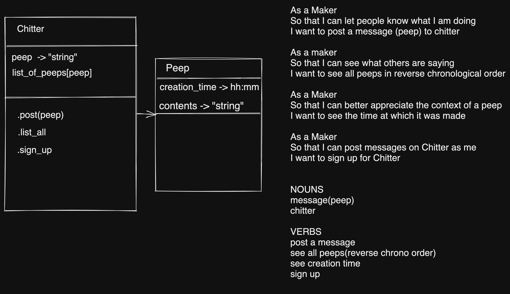
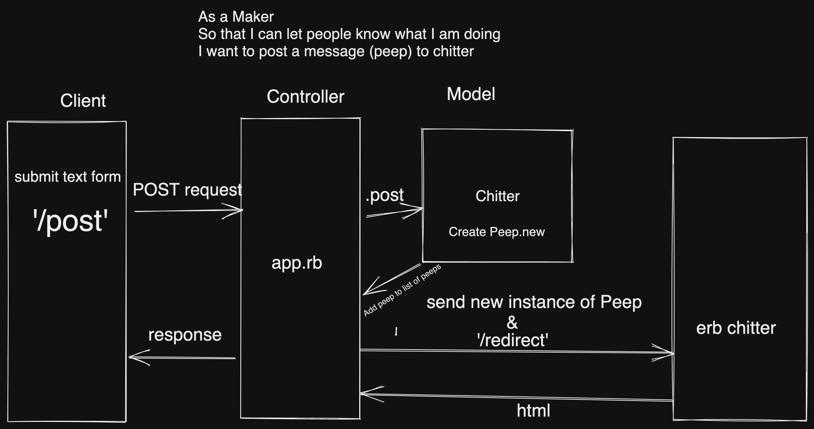

Chitter Challenge
=================


In order to user this web-app please follow these instructions:

* Clone this repo
* Run 'bundle' to install the required gems
* Connect to psql
* Create the database using the psql command CREATE DATABASE chitter;
* Connect to the database using the pqsl command \c chitter;
* Run the query saved in the file db/01_create_peeps_table.sql
* cd into this directory
* Run rackup in the terminal
* Visit http://localhost:9292/

My approach:
-------
 I set out to complete this challenge by setting up a class model and a domain model.
 I then went on to create a failing feature test, followed by a failing unit test for the first user story.
 I followed the TDD red-green-refactor method to pass the feature tests and satisfy the user stories.
 
Features:
-------
I satisfied the first three user-story requirements.
Unfortunately, due to time constraints, I only got part way through satisfying the fourth user-story; this is something I would like to revisit when I have the time.

```

As a Maker
So that I can let people know what I am doing  
I want to post a message (peep) to chitter

As a maker
So that I can see what others are saying  
I want to see all peeps in reverse chronological order

As a Maker
So that I can better appreciate the context of a peep
I want to see the time at which it was made

As a Maker
So that I can post messages on Chitter as me
I want to sign up for Chitter

```
Models:
-------




