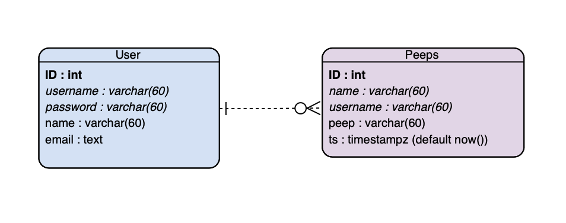
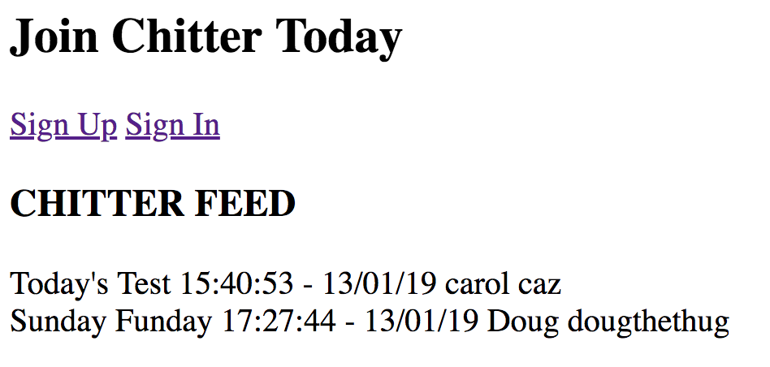

Chitter Challenge
=================

This web application is a Twitter clone that allows users to post messages, known as peeps, to a public stream.

## Features

A user can accomplish the following:

  * Post a message (peep) to Chitter
  * See all peeps in reverse chronological order
  * See the time at which a peep was made
  * Sign up to Chitter with a username and password
  * Log into Chitter
  * Log out of Chitter

## Notes on functionality:

  * You don't have to be logged in to see the peeps.
  * Makers sign up to chitter with their email, password, name and a username (e.g. samm@makersacademy.com, password123, Sam Morgan, sjmog).
  * The username and email are unique.
  * Peeps (posts to chitter) have the name of the maker and their user handle.

## Getting started

To run this on your computer, complete the following steps:

  1. Fork this repository, and clone it to your local machine
  2. If you do not have bundle installed already, run the command ‘gem install bundle’
  3. When the installation completes, run bundle

## Database set up
This project requires a database to be set up in postgresql.
To do this, complete the following steps:

  1. Download postgresql
  2. Open postgresql in your terminal with the following command: psql
  3. Type in the following to create a database called chitter_manager "CREATE DATABASE chitter_manager;"
  4. Copy and paste the commands in the file '/db/migrations/01_peeps_table.sql' and '/db/migrations/02_user_table.sql' to create the tables.

## Running tests

To run tests, complete the following steps

  1. Open your terminal and make sure you are in the main folder 'chitter-challenge'.
  2. Type the command ‘rspec’ in the terminal to run all tests.

## How to contribute

If you would like to contribute to this project, you can follow the instructions below

  1. Clone this repository to your local computer
  2. Create a new branch: $ git checkout https://github.com/hiboabd/chitter_challenge -b name_for_new_branch.
  3. Make changes and test
  4. Submit Pull Request with comprehensive description of changes

You could implement the following:

  * Enabling the user to post peeps as themselves.
  * Receive an email if they are tagged in a peep.
  * Work on the CSS to make it look good.
