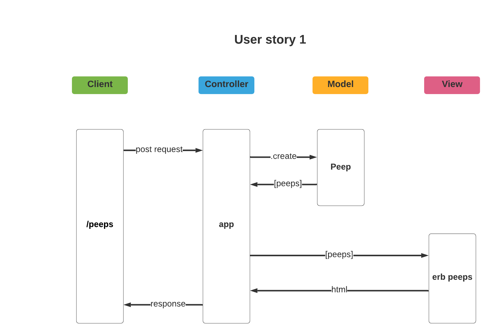
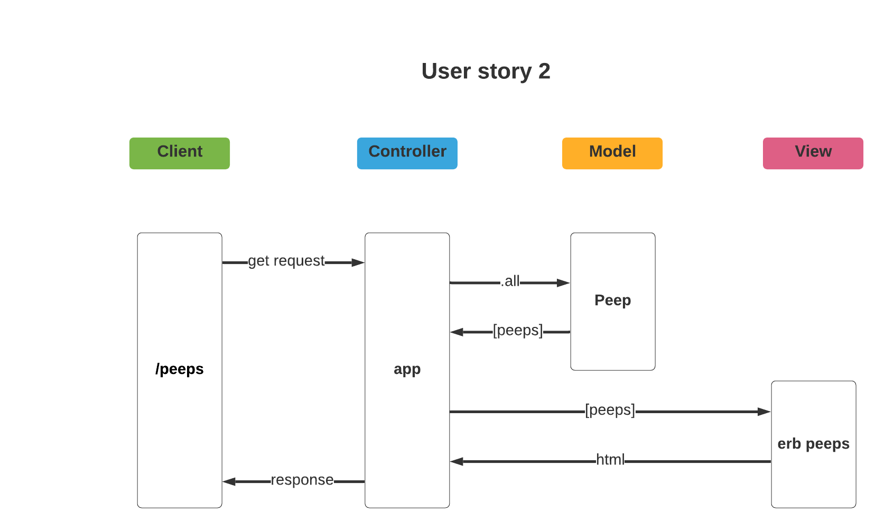

Chitter Challenge
=================

Challenge:
-------

As usual please start by forking this repo.

We are going to write a small Twitter clone that will allow the users to post messages to a public stream.

Features implemented:
---------------------


```
STRAIGHT UP

As a Maker
So that I can let people know what I am doing  
I want to post a message (peep) to chitter

As a maker
So that I can see what others are saying  
I want to see all peeps in reverse chronological order
```


