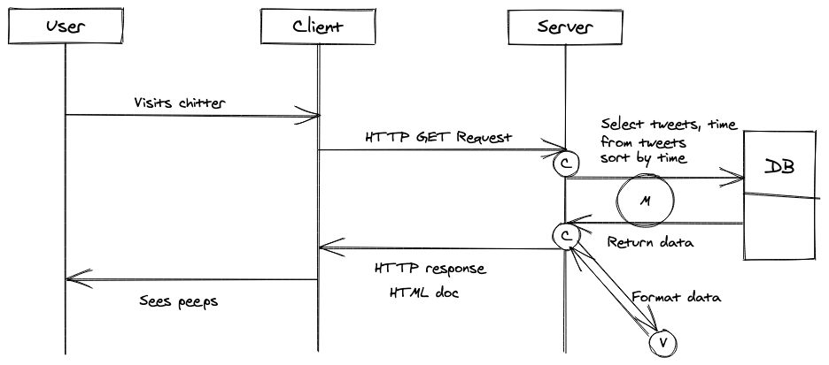

# Repo title #

*This programme does...this (programme description)*

I created this programme as part of a challenge at [Makers Academy](https://makers.tech). See [Specification](#Specification) for more information on the programme's requirements.

* [Getting started](#Getting-Started)
* [Useage](#useage)
* [Running tests](#Running-tests)
* [Specification](#Specification)
* [How I built it](#How-i-built-it)
* [Credits](#credits)


## Getting Started ##

1. Fork this repo, and clone to your local machine. Navigate into the folder.
2. Run the command `gem install bundle` (if you don't have bundle already)
3. When the installation completes, run `bundle`

## Useage ##

1. Connect to psql
2. Create the database using the psql command: 
    ```sql
    CREATE DATABASE bookmark_manager;
    ```
3. Connect to the database: 
    ```sql
    \c bookmark_manager;
    ```
4. Open /db/migrations/01_create_bookmarks_table.sql and run the command in the file in your terminal.

- where to use
- example code
- example output

## Running tests ##

1. Navigate to top level of project directory
2. In your command line type:

```shell
$ rspec
```

## Specification ##

### User Stories ###

```
STRAIGHT UP

As a Maker
So that I can let people know what I am doing  
I want to post a message (peep) to chitter

As a maker
So that I can see what others are saying  
I want to see all peeps in reverse chronological order

As a Maker
So that I can better appreciate the context of a peep
I want to see the time at which it was made

As a Maker
So that I can post messages on Chitter as me
I want to sign up for Chitter

HARDER

As a Maker
So that only I can post messages on Chitter as me
I want to log in to Chitter

As a Maker
So that I can avoid others posting messages on Chitter as me
I want to log out of Chitter

```

### Functionality ###

1. You don't have to be logged in to see the peeps.
2. Makers sign up to chitter with their email, password, name and a username (e.g. samm@makersacademy.com, password123, Sam Morgan, sjmog).
3. The username and email are unique.
4. Peeps (posts to chitter) have the name of the maker and their user handle.
5. Your README should indicate the technologies used, and give instructions on how to install and run the tests.

## How I built it ##

### Sequence Diagrams ###

User stories 1-3



### Class Diagrams ###

1. 

| Object: |**Tweet**| | ||
|:------:|:------------:|:-:|:-:|:-:|
|**Attributes:**|Text|Time|Username|||
|**Class Methods:**|Create|All|Find|Delete

2. 

| Object: |**User**| | 
|:------:|:------------:|:-:|
|**Attributes:**|Username|email|password|
|**Class Methods:**|Create|Find |


### Database Designs ###

Table: Tweets

| id | username | tweet | time |  
|:--:|:-------:|:-----:|:----:|
| PK | FK(users) | string | time |  
|1|lookupdaily|"Would you look at the weather"| 2020-01-13 11:20 GMT |

Table: Users

| username | name | email | password | signup_date |
|:--------:|:-----:|:-----:|:--------:|:-----------:|
| string(PK) | string | string | string(authenticated?) | date |
|1|lookupdaily| Liz Daly | test@gmail.com| *** | 2020-01-13 11:00 GMT |

### Designing tests ###

When planning my code I thought about the tests I might need, and tried to order them by simplicity

#### Feature tests ####

1. When visiting app - user sees all tweets with a timestamp
2. User sees all tweets in reverse chronological order
3. User can sign up and gets a confirmation message
4. User can log in
5. User can log out


#### Unit Tests ####

1. Tweet.all runs a database query to show all tweets with time stamp
2. Tweet.all orders tweets in reverse chronological order
3. User.create adds a user to a database table
4. Object on user?? Adds a users details to session
5. Object on user?? Removes a users details from session
6. Tweet.create adds a new tweet IF session contains a user

#### Edge Cases ####

1. Null fields
2. user tries to sign up with a username or email that already exists

## Further Improvements ##

ADVANCED
```
As a Maker
So that I can stay constantly tapped in to the shouty box of Chitter
I want to receive an email if I am tagged in a Peep
```

## Credits ##

List any credits or inspiration here
