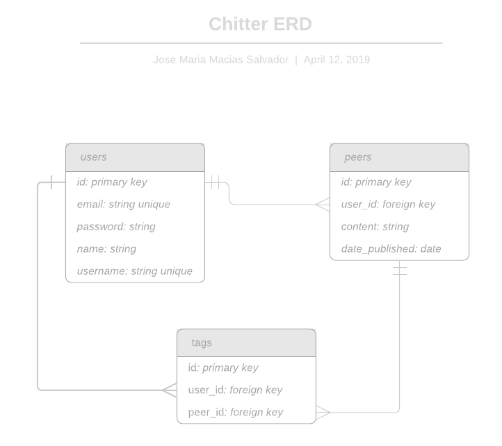

# Chitter Challenge
In this challenge we will try to build a web application with database integration to post peers.

## User stories

STRAIGHT UP

>As a Maker
So that I can let people know what I am doing  
I want to post a message (peep) to chitter

>As a maker
So that I can see what others are saying  
I want to see all peeps in reverse chronological order

>As a Maker
So that I can better appreciate the context of a peep
I want to see the time at which it was made

>As a Maker
So that I can post messages on Chitter as me
I want to sign up for Chitter

HARDER

>As a Maker
So that only I can post messages on Chitter as me
I want to log in to Chitter

>As a Maker
So that I can avoid others posting messages on Chitter as me
I want to log out of Chitter

ADVANCED

>As a Maker
So that I can stay constantly tapped in to the shouty box of Chitter
I want to receive an email if I am tagged in a Peep

## Domain model


## Entity Relationship Diagram



## How to use

### To set up the project

Clone this repository and then run:

```
bundle
```

### To set up the database

Connect to `psql` and create the `chitter` and `chitter_test` databases:

```
CREATE DATABASE chitter;
CREATE DATABASE chitter_test;
```

To set up the appropriate tables, connect to each database in `psql` and run the SQL scripts in the `db/migrations` folder in the given order.

### To run the Bookmark Manager app:

```
rackup -p 1773
```

To view bookmarks, navigate to `localhost:1773/bookmarks`.

### To run tests:

```
rspec
```

### To run linting:

```
rubocop
```
