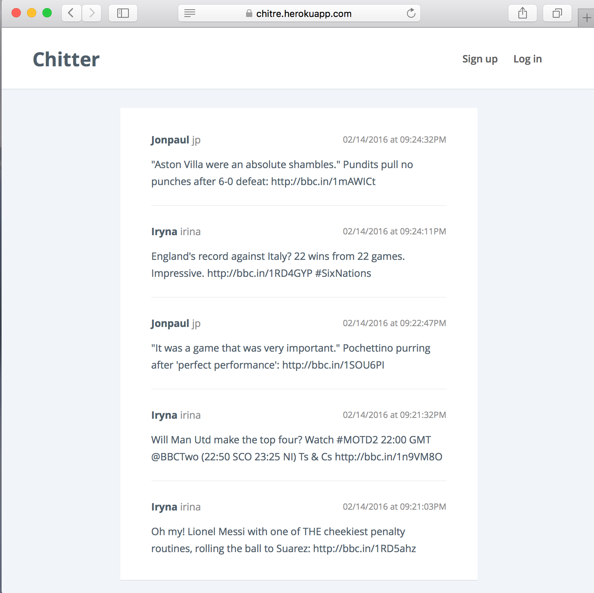
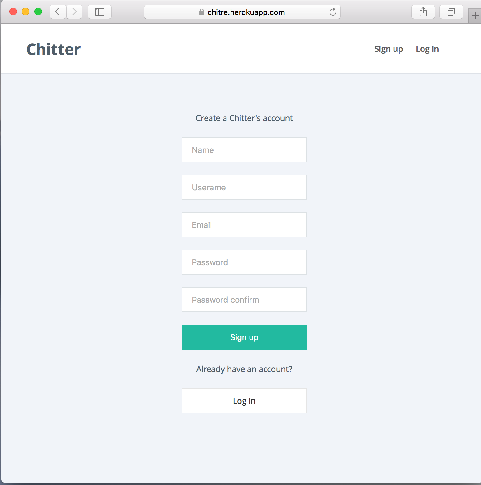
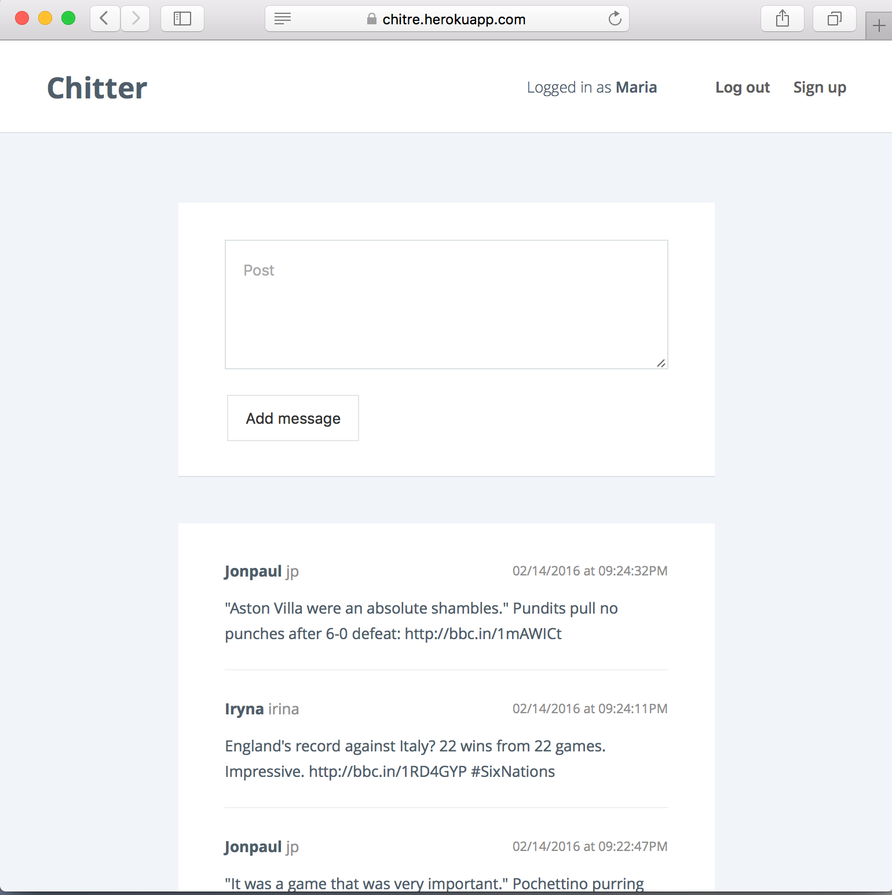
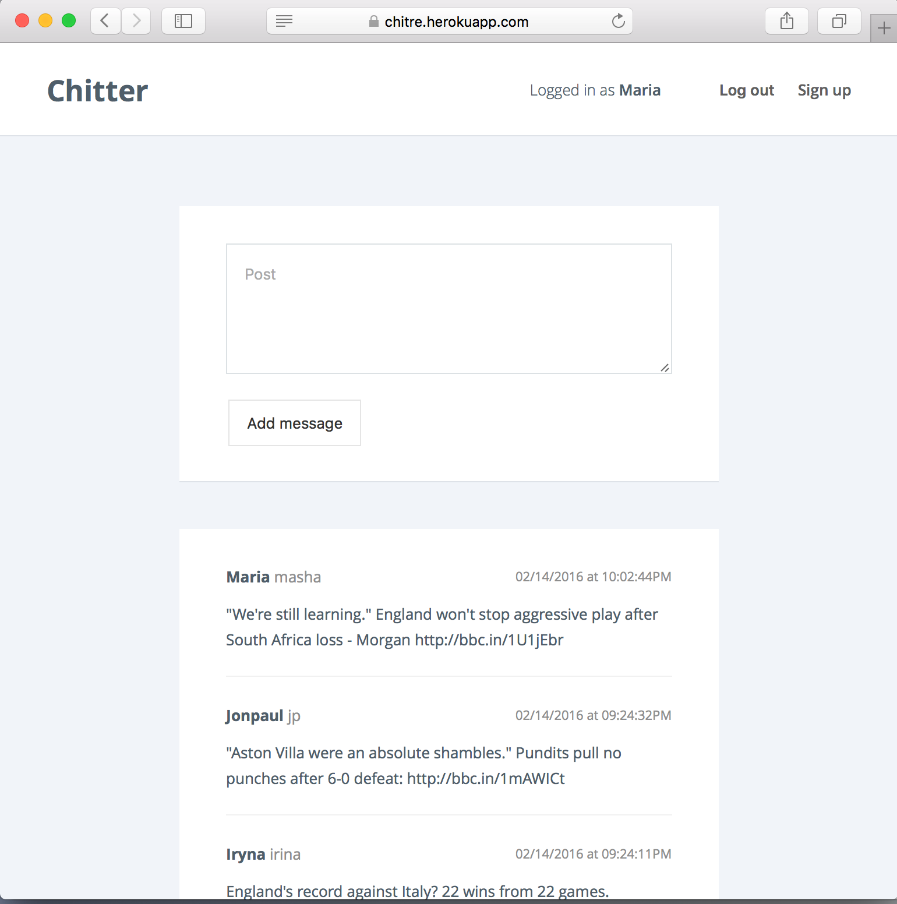
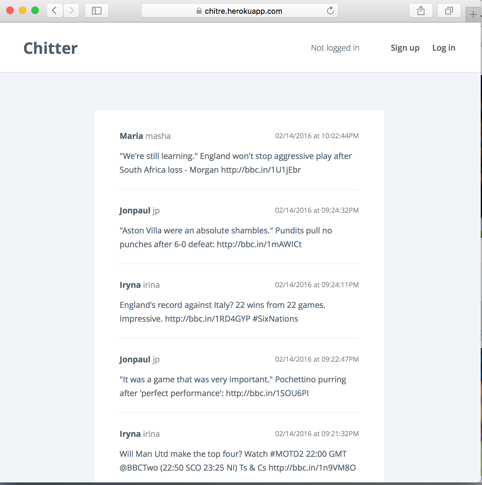
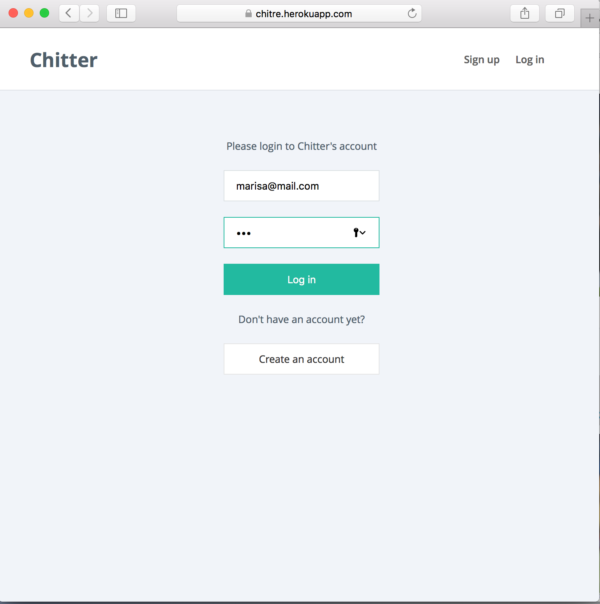

Chitter Challenge
=================
[](https://travis-ci.org/irynahowarth/chitter-challenge)
[](https://coveralls.io/github/irynahowarth/chitter-challenge?branch=master)


Week 4 weekend challenge to create a web application - twitter clone - which will allow user to signup,login and post messages to the public stream.
More information about the task can be found [here](INSTRUCTIONS.md)

Features
--------

* user should be able to sign up for Chitter
* user should be able to log in to Chitter
* user should be able to log out of Chitter
* user should be able to post a message (peep) to Chitter
* user should be able to see all peeps in reverse chronological order even if not logged in
* user should be able to see the time at which each message (peep) was posted

Technologies & Principles
-------------------------

* Ruby
* Sinatra
* Capybara
* OOD, TDD, SOLID
* Testing with RSpec

Installing & Testing
-----------------------------
```
$ git clone https://github.com/irynahowarth/chitter-challenge
$ bundle
$ createdb chitter_development
$ rake auto_migrate
$ rspec
$ rackup
```
To see application online use [this heroku link](https://chitre.herokuapp.com/)

Example of using the System
-----------------------------
| | |
|-----------------|---------------|
|  |  |
|  |  |
|  |  |

Implementation
-----------------

Code is finished with basic functionality.

Main functionality implemented:

### User
| Functionality | Descriprion |
|-----------------|---------------|
| Sign up | Register to use Chitter with name/username/email/password |
| Log in | Authorise in a system to be able to post messages |
| Log out | Exit the system so no one can post messages from my username|
| View peeps | View messages(peeps) from other system users|
| Post peep | Post a message(peep) so people can read what user wants to say|

### Peep
| Functionality | Descriprion |
|-----------------|---------------|
| Has User | Associated  with peep |
| Has time | of creation |

What can be improved
-----------------------

* reply to a peep from another user
* provide password restore prompt

