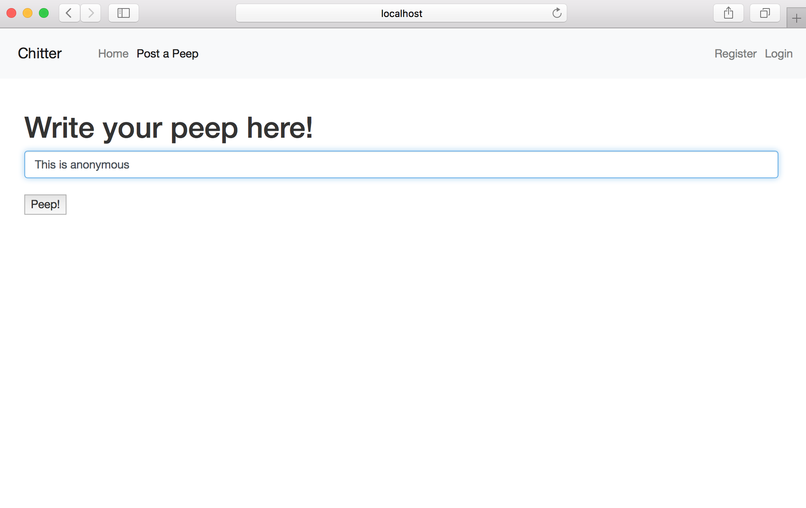
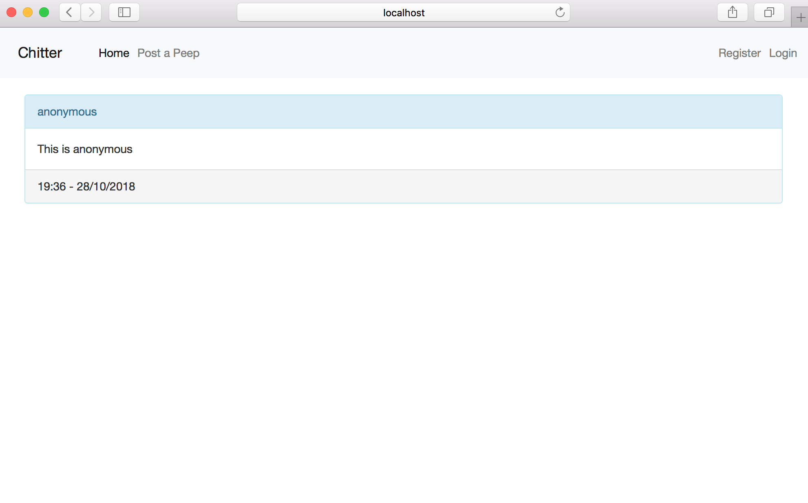
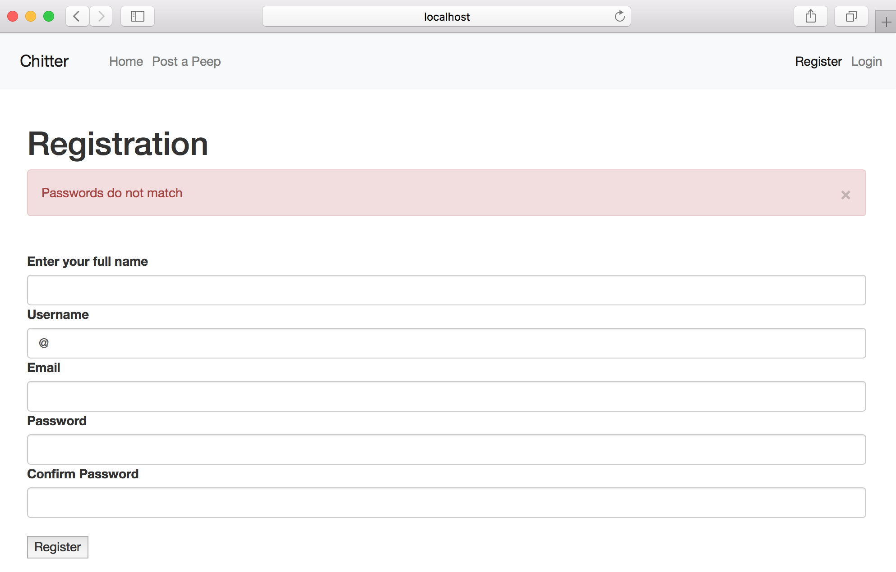
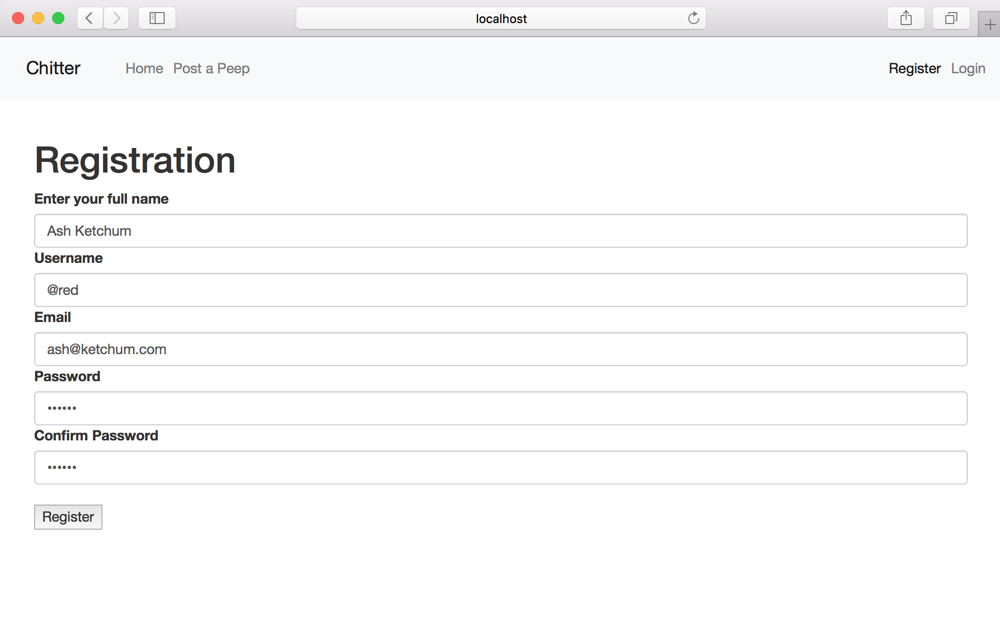
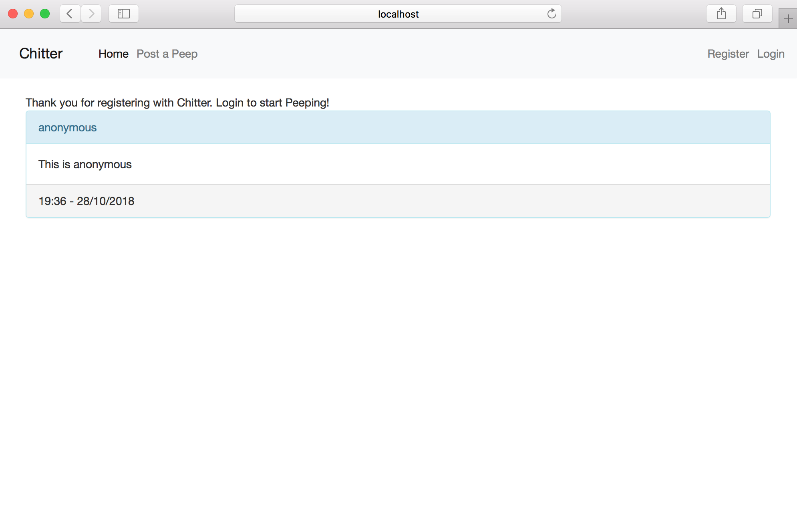
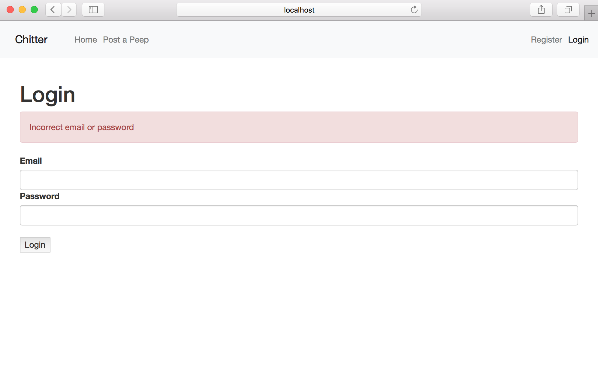
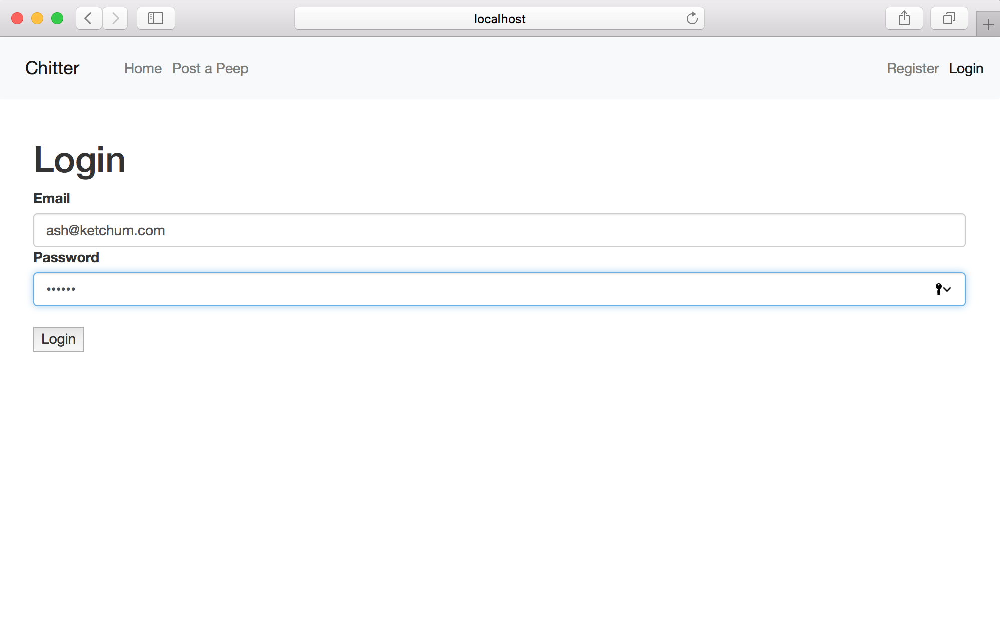
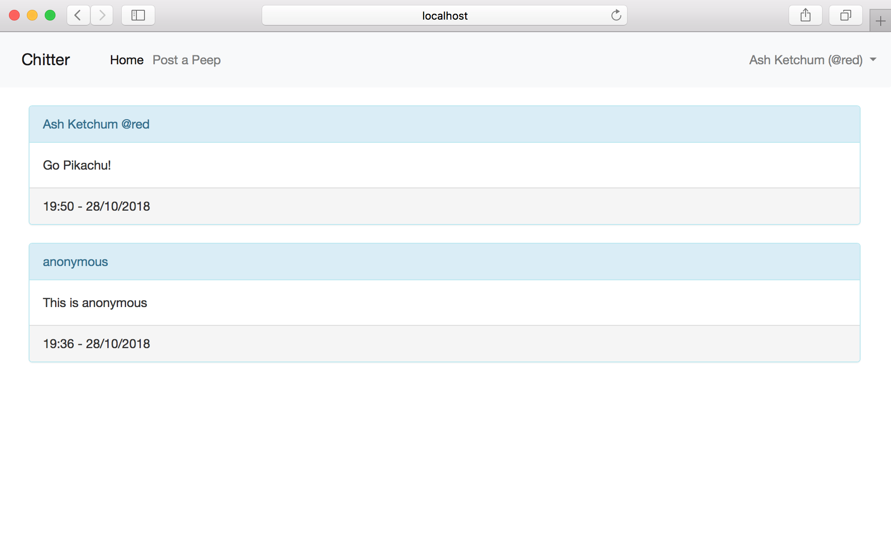
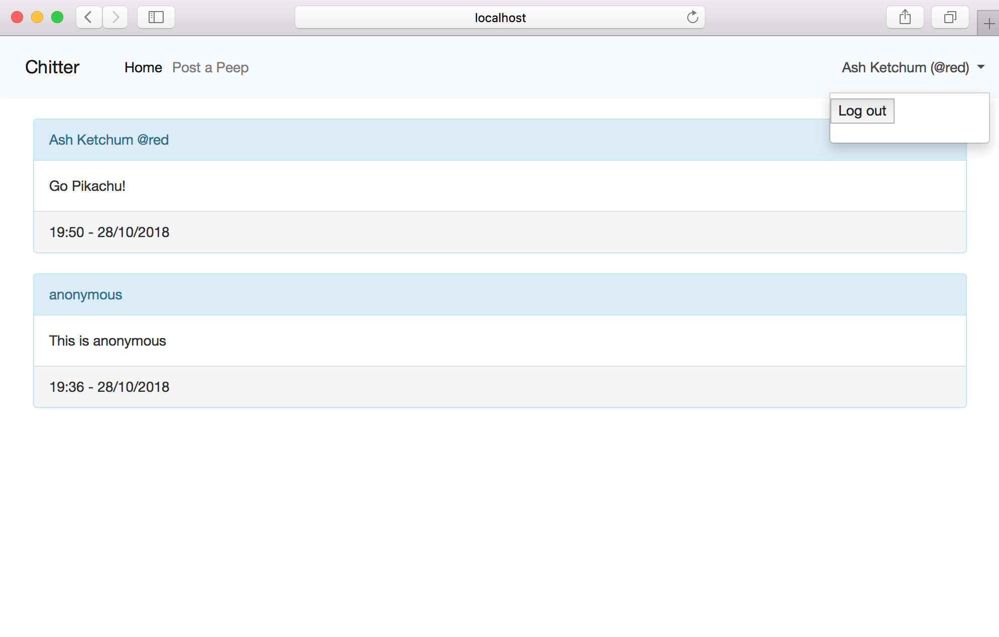
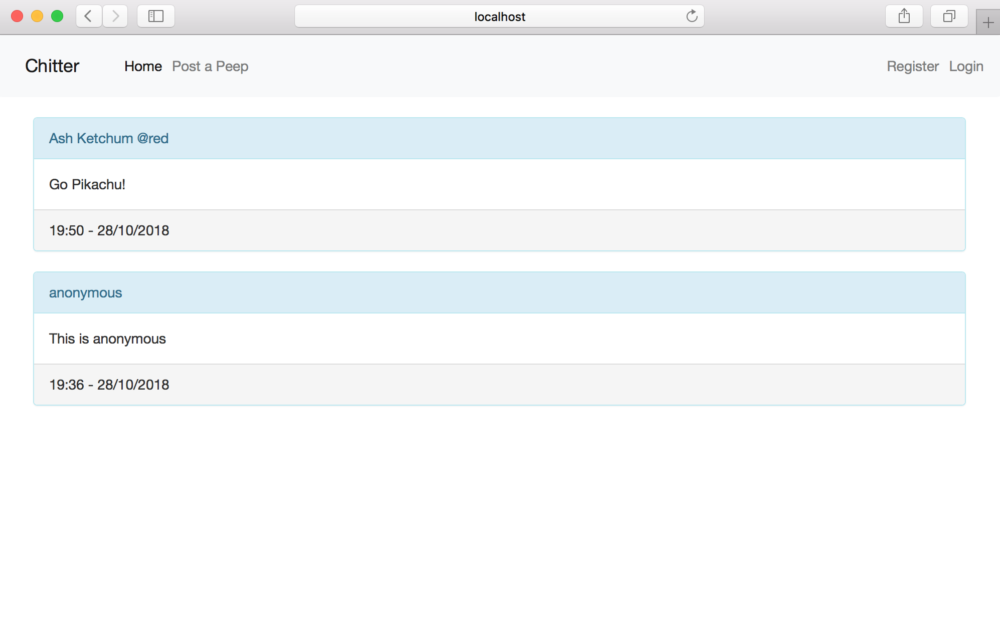

Chitter Challenge
=================
## About the Program

This is a program that mimics Twitter. It has basic fucntionality which allows users to register, sign in and post 'Peeps', either has the registered user or anonymously. These 'Peeps' are then listed in reverse chronological order (see images below).

The application was built using the stories provided by Makers Academy. It has an MVC architecture with a PostgreSQL database to store user information and 'Peeps'. It was built in Ruby and used RSpec and Capybara as the testing framework.

TDD practices were used in the production of this program. User stories were broken down into feature test; the error messages inform the code that needs to be written. Unit tests were also written for that classes that make up the model and achieved 100% test coverage.

The program has an OOD where each responsibility was assigned its own class, fulfilling the single responsibility principle. This should ensure that implementing any future changes or additional functionality can happen with minimal impact to the rest of the program.


## Installation
1. Clone this repo
2. `cd` into the directory
3. Run `bundle` to install the required gems
4. Run `rake build_chitter_database`
5. Run `ruby app.rb` to start the server
6. Visit `http://localhost:4567` in your browser
7. Enjoy!

## Test
Tests can be viewed within the `spec` folder in the directory

To run the tests:
1. Clone this repo
2. `cd` into the directory
3. Run `rspec`

## Example Usage
### Posting an anonymous peep

- Click 'Post a Peep'


- Click 'Submit'



### Registering

- Click 'Register'


- Error if passwords do not match when registering


- Click 'Register'



### Logging In

- Click 'Login'


- Error message if incorrect password or email


- Click 'Login'


- While logged in, the users name and handle is persistant on the top right hand side while using the website

### Posting Peeps While Logged In

- Peeps while logged in contain the users full name and username

### Logging Out

- Click name and click 'Log out'



# Instructions for Chitter Challenge

* Challenge time: rest of the day and weekend, until Monday 9am
* Feel free to use Google, your notes, books, etc. but work on your own
* If you refer to the solution of another coach or student, please put a link to that in your README
* If you have a partial solution, **still check in a partial solution**
* You must submit a pull request to this repo with your code by 9am Monday morning

Challenge:
-------

As usual please start by forking this repo.

We are going to write a small Twitter clone that will allow the users to post messages to a public stream.

Features:
-------

```
STRAIGHT UP

As a Maker
So that I can let people know what I am doing
I want to post a message (peep) to chitter

As a maker
So that I can see what others are saying
I want to see all peeps in reverse chronological order

As a Maker
So that I can better appreciate the context of a peep
I want to see the time at which it was made

As a Maker
So that I can post messages on Chitter as me
I want to sign up for Chitter

HARDER

As a Maker
So that only I can post messages on Chitter as me
I want to log in to Chitter

As a Maker
So that I can avoid others posting messages on Chitter as me
I want to log out of Chitter

ADVANCED

As a Maker
So that I can stay constantly tapped in to the shouty box of Chitter
I want to receive an email if I am tagged in a Peep
```

Notes on functionality:
------

* You don't have to be logged in to see the peeps.
* Makers sign up to chitter with their email, password, name and a username (e.g. samm@makersacademy.com, password123, Sam Morgan, sjmog).
* The username and email are unique.
* Peeps (posts to chitter) have the name of the maker and their user handle.
* Your README should indicate the technologies used, and give instructions on how to install and run the tests.

Bonus:
-----

If you have time you can implement the following:

* In order to start a conversation as a maker I want to reply to a peep from another maker.

And/Or:

* Work on the CSS to make it look good.

Good luck and let the chitter begin!

Code Review
-----------

In code review we'll be hoping to see:

* All tests passing
* High [Test coverage](https://github.com/makersacademy/course/blob/master/pills/test_coverage.md) (>95% is good)
* The code is elegant: every class has a clear responsibility, methods are short etc.

Reviewers will potentially be using this [code review rubric](docs/review.md).  Referring to this rubric in advance may make the challenge somewhat easier.  You should be the judge of how much challenge you want this weekend.

Notes on test coverage
----------------------

Please ensure you have the following **AT THE TOP** of your spec_helper.rb in order to have test coverage stats generated
on your pull request:

```ruby
require 'simplecov'
require 'simplecov-console'

SimpleCov.formatter = SimpleCov::Formatter::MultiFormatter.new([
  SimpleCov::Formatter::Console,
  # Want a nice code coverage website? Uncomment this next line!
  # SimpleCov::Formatter::HTMLFormatter
])
SimpleCov.start
```

You can see your test coverage when you run your tests. If you want this in a graphical form, uncomment the `HTMLFormatter` line and see what happens!
