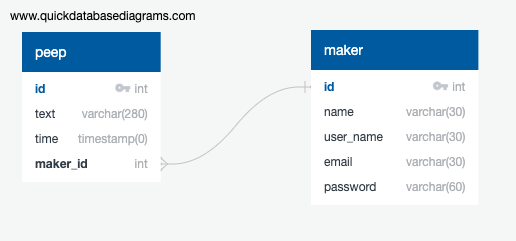

Chitter Challenge
=================

We are going to write a small Twitter clone that will allow the users to post messages to a public stream.

Features:
-------

```
STRAIGHT UP

As a Maker
So that I can let people know what I am doing  
I want to post a message (peep) to chitter

As a maker
So that I can see what others are saying  
I want to see all peeps in reverse chronological order

As a Maker
So that I can better appreciate the context of a peep
I want to see the time at which it was made

As a Maker
So that I can post messages on Chitter as me
I want to sign up for Chitter

HARDER

As a Maker
So that only I can post messages on Chitter as me
I want to log in to Chitter

As a Maker
So that I can avoid others posting messages on Chitter as me
I want to log out of Chitter

ADVANCED

As a Maker
So that I can stay constantly tapped in to the shouty box of Chitter
I want to receive an email if I am tagged in a Peep
```

Notes on functionality:
------

* You don't have to be logged in to see the peeps.
* Makers sign up to chitter with their email, password, name and a username (e.g. samm@makersacademy.com, password123, Sam Morgan, sjmog).
* The username and email are unique.
* Peeps (posts to chitter) have the name of the maker and their user handle.
* Your README should indicate the technologies used, and give instructions on how to install and run the tests.

Bonus:
-----

If you have time you can implement the following:

* In order to start a conversation as a maker I want to reply to a peep from another maker.

And/Or:

* Work on the CSS to make it look good.

Good luck and let the chitter begin!

Automated Tests:
-----

Opening a pull request against this repository will will trigger Travis CI to perform a build of your application and run your full suite of RSpec tests. If any of your tests rely on a connection with your database - and they should - this is likely to cause a problem. The build of your application created by has no connection to the local database you will have created on your machine, so when your tests try to interact with it they'll be unable to do so and will fail.

If you want a green tick against your pull request you'll need to configure Travis' build process by adding the necessary steps for creating your database to the `.travis.yml` file.

- [Travis Basics](https://docs.travis-ci.com/user/tutorial/)
- [Travis - Setting up Databases](https://docs.travis-ci.com/user/database-setup/)

Main technologies used
-------

- Project language - [Ruby](https://www.ruby-lang.org/en/)
- Databases - [Postgresql](https://www.postgresql.org/)
- Encryption - [Bcrypt](https://github.com/codahale/bcrypt-ruby)
- Testing - [Rspec](https://rspec.info/), [Capybara](https://github.com/teamcapybara/capybara)


Getting Started
----------

```bash
# clone the repository to your local machine with either

# if you're using ssh
git clone git@github.com:PhilipVigus/chitter-challenge.git

# if you're using https
git clone https://github.com/PhilipVigus/chitter-challenge.git

# Dependencies
# The repository requires bundle, which can be installed with
gem install bundle

# then run bundle from the root project directory to install other dependencies
bundle
```

Setting up the databases
--------------------

The application uses Postgres for its database, which can be setup as follows (assuming you are using a mac)

```bash
# Install postgresql
brew install postgresql

# Set it to start every time you log in
brew services start postgresql

# Test it's installed - this starts the CLI
psql postgres

# Then run the following
# Create a database with the same name as your username
# this will automatically be connected to when you start up
CREATE DATABASE your_username;
# list databases
\l
# quit psql
\q
```

The application uses Rake for setting up the actual databases, as follows:

```bash
# from the project root directory
# set up the test db
rake create_test_db

# set up the deployment db
rake create_db

```

Note that the deployment database persists between uses, and is the one accessed when using the app via localhost. The test database is used solely when running the test suite, and is wiped clean each time tests are run.

Running tests
----------

```bash
# Runs the full test suite from the root project directory
rspec
```

Starting the app on the localhost
---------------

```bash
# Starts the server on port 9292
rackup

# Then visit localhost:9292 in your browser to use the app
```

Approach
--------
My focus with this challenge was to work in a strict time-box with the knowledge that I wouldn't be able to complete the entire task. At the end of the task, I would then analyse my progress, unimplemented user stories, and any other changes/additions along with their value to the user/customer. I also wanted to be clear in my head how I was going to break each story down into its feature test and the steps required to pass that.

I also focused on learning to use rake, which was completely new to me. I spent quite a while early in the project implementing database setup and cleaning using the Rakefile, and am happy with the results. However, I found setting up the tests for the Rakefile challenging, and am still not happy with their quality.

I decided to implement the user stories in a slightly different order to the one they were given in. It seemed that the three stories relating to signing-up, logging in and logging out were all connected and would be easier to implement closer together, so this was the approach I took.

As you will see, I didn't finish implementing the tagging story.

## Implementation
 
### 1st user story

```
As a maker
So that I can see what others are saying  
I want to see all peeps in reverse chronological order
```
Steps:

- write feature test
- pass feature test in simplest way using route and view
- refactor code to Peep class
- create databases

This story was the simplest to implement, with no difficulties.

### 2nd user story

```
As a Maker
So that I can post messages on Chitter as me
I want to sign up for Chitter
```
Steps:

- write feature test
- create maker table in db
- create sign up page
- link signup details to what is stored in db
- store current user id in session
- encrypt passwords in the db

This story was challenging, as it involved using encryption for the passwords, which I had not used before. Once I read the gem instructions though, it was straightfward to implement. 

### 3rd user story

```
As a Maker
So that I can let people know what I am doing  
I want to post a message (peep) to chitter
```

Steps:

- write feature test
- create add-peep form page
- link form to correct route
- use Peep.create to put new peep in database
- reload peeps list

It made sense to do this story at this stage, as it gave me flexibility when working on later user stories that relied on different makers being stored in the database. I had no difficulties implementing this.

### 4th user story

```
As a Maker
So that I can avoid others posting messages on Chitter as me
I want to log out of Chitter
```

- Write feature test
- Add log-out button to peeps list page when someone is logged in
- Go to an appropriate route and delete the maker_id session variabe
- Reload the peeps list page

This story was made straightforward because of the way I had implemented signing up a new maker.

### 5th user story

```
As a Maker
So that only I can post messages on Chitter as me
I want to log in to Chitter
```

Steps:
- write feature test
- create log-in page which will take you to sign up if you don't have an account
- add log-in method to Maker class to test the credentials
- use it
- assuming success, update the session user id and reload peeps list
- assuming fail, warn the user

It took me a while to complete this story, as I spent some time thinking about how the app would handle invalid inputs for usernames and passwords. I also went back and did the same for invalid sign-up details.

### Additional steps carried out at this point

- add link between maker and peep tables
- amend peep creation so they store the maker id
- show the maker details on the peeps list

These steps combined a number of the stories together, linking database tables and showing additional details on the peeps list. I found this very challenging, as I had left a subtle bug in the way I created peeps that took a long time to track down.

### 6th user story

```
As a Maker
So that I can better appreciate the context of a peep
I want to see the time at which it was made
```

- write feature test
- update peeps list to show date

With the other features implemented, this user story was straightforward, just requiring an additional string to be added to the peeps view.

### 7th user story

```
As a Maker
So that I can stay constantly tapped in to the shouty box of Chitter
I want to receive an email if I am tagged in a Peep
```

I started implementing this feature, but soon realised that I would not have time to complete it within my allocated time-box. As the state of the project was broken at that point, I removed the changes I had made so that it was stable, with all tests passing.

## Class diagram

[![](https://mermaid.ink/img/eyJjb2RlIjoiY2xhc3NEaWFncmFtXG5cdE1ha2VyIDx8LS0gUGVlcFxuXHREQkNvbm5lY3Rpb24gPHwtLSBQZWVwXG4gIERCQ29ubmVjdGlvbiA8fC0tIE1ha2VyXG4gIFxuICBjbGFzcyBEQkNvbm5lY3Rpb24ge1xuICAgICtjb25uZWN0KCkgLSBjbGFzcyBtZXRob2RcbiAgICArZGlzY29ubmVjdCgpIC0gY2xhc3MgbWV0aG9kXG4gICAgK3J1bl9xdWVyeSgpIC0gY2xhc3MgbWV0aG9kXG4gICAgLVBHOjpDb25uZWN0aW9uIGNvbm5cbiAgfVxuICBjbGFzcyBNYWtlciB7XG4gICAgK2ludCBpZFxuICAgICtzdHJpbmcgbmFtZVxuICAgICtzdHJpbmcgdXNlcm5hbWVcbiAgICArc3RyaW5nIGVtYWlsXG4gICAgK2luaXRpYWxpemUoaWQsIG5hbWUsIHVzZXJuYW1lLCBlbWFpbClcbiAgICArY3JlYXRlKG5hbWUsIHVzZXJuYW1lLCBlbWFpbCwgcGFzc3dvcmQpIC0gY2xhc3MgbWV0aG9kXG4gICAgK2ZpbmRfYnlfaWQoaWQpXG4gICAgK2ZpbmRfYnlfdXNlcm5hbWUodXNlcm5hbWUpXG4gICAgK3ZhbGlkX2NyZWRlbnRpYWxzPyh1c2VybmFtZSwgcGFzc3dvcmQpXG4gICAgLXZhbGlkX25ld19tYWtlcj8odXNlcm5hbWUsIGVtYWlsKVxuICB9XG5cbiAgY2xhc3MgUGVlcCB7XG4gICAgK2ludCBpZFxuICAgICtzdHJpbmcgdGV4dFxuICAgICtzdHJpbmcgdGltZVxuICAgICtNYWtlciBtYWtlclxuICAgICthbGwobWFrZXJfY2xhc3MpIC0gY2xhc3MgbWV0aG9kXG4gICAgK2NyZWF0ZSh0ZXh0LCB0aW1lLCBtYWtlcl9pZCwgbWFrZXJfY2xhc3MpIC0gY2xhc3MgbWV0aG9kXG4gICAgK2ZpbmRfYnlfaWQoaWQpIC0gY2xhc3MgbWV0aG9kXG4gIH1cblxuXHRcdFx0XHRcdCIsIm1lcm1haWQiOnsidGhlbWUiOiJkZWZhdWx0In0sInVwZGF0ZUVkaXRvciI6ZmFsc2V9)](https://mermaid-js.github.io/mermaid-live-editor/#/edit/eyJjb2RlIjoiY2xhc3NEaWFncmFtXG5cdE1ha2VyIDx8LS0gUGVlcFxuXHREQkNvbm5lY3Rpb24gPHwtLSBQZWVwXG4gIERCQ29ubmVjdGlvbiA8fC0tIE1ha2VyXG4gIFxuICBjbGFzcyBEQkNvbm5lY3Rpb24ge1xuICAgICtjb25uZWN0KCkgLSBjbGFzcyBtZXRob2RcbiAgICArZGlzY29ubmVjdCgpIC0gY2xhc3MgbWV0aG9kXG4gICAgK3J1bl9xdWVyeSgpIC0gY2xhc3MgbWV0aG9kXG4gICAgLVBHOjpDb25uZWN0aW9uIGNvbm5cbiAgfVxuICBjbGFzcyBNYWtlciB7XG4gICAgK2ludCBpZFxuICAgICtzdHJpbmcgbmFtZVxuICAgICtzdHJpbmcgdXNlcm5hbWVcbiAgICArc3RyaW5nIGVtYWlsXG4gICAgK2luaXRpYWxpemUoaWQsIG5hbWUsIHVzZXJuYW1lLCBlbWFpbClcbiAgICArY3JlYXRlKG5hbWUsIHVzZXJuYW1lLCBlbWFpbCwgcGFzc3dvcmQpIC0gY2xhc3MgbWV0aG9kXG4gICAgK2ZpbmRfYnlfaWQoaWQpXG4gICAgK2ZpbmRfYnlfdXNlcm5hbWUodXNlcm5hbWUpXG4gICAgK3ZhbGlkX2NyZWRlbnRpYWxzPyh1c2VybmFtZSwgcGFzc3dvcmQpXG4gICAgLXZhbGlkX25ld19tYWtlcj8odXNlcm5hbWUsIGVtYWlsKVxuICB9XG5cbiAgY2xhc3MgUGVlcCB7XG4gICAgK2ludCBpZFxuICAgICtzdHJpbmcgdGV4dFxuICAgICtzdHJpbmcgdGltZVxuICAgICtNYWtlciBtYWtlclxuICAgICthbGwobWFrZXJfY2xhc3MpIC0gY2xhc3MgbWV0aG9kXG4gICAgK2NyZWF0ZSh0ZXh0LCB0aW1lLCBtYWtlcl9pZCwgbWFrZXJfY2xhc3MpIC0gY2xhc3MgbWV0aG9kXG4gICAgK2ZpbmRfYnlfaWQoaWQpIC0gY2xhc3MgbWV0aG9kXG4gIH1cblxuXHRcdFx0XHRcdCIsIm1lcm1haWQiOnsidGhlbWUiOiJkZWZhdWx0In0sInVwZGF0ZUVkaXRvciI6ZmFsc2V9)

## Database entity relationship diagram



### Server endpoints

| Endpoint | Purpose |
| -------- | ------- |
| get / | redirects to /peeps |
| get /users/new | sign-up page |
| post /users | register new maker on db |
| get /peeps | peeps list page |
| post /peeps | create new peep |
| get /peeps/new | new peep page |
| get /sessions/destroy | log out maker |
| get /sessions/new |log-in page |
| post /sessions/new | attempt log-in |


## Improvements

The basis for this analysis is the impact of the improvements on the user and/or client. As can be seen, most improvements involve changes to the underlying code base with little direct impact on the user experience. If the application were to increase in size and/or complexity, these improvements would rapidly rise in priority, as their impact would make code proportionaly far easier to extend and manage. As things stand though, their priority is low.

| Improvement | User Priority | Reasoning |
| ----------- | -------- | --------- |
| Implement tagging user story | high | The site implements all other user stories successfully. However, this story would add significant functionality and make it more fun to use.
| Refactor validation into a single method that returns nil or the validated maker | low | This has no impact on site functionaliy, and would be more important for a more complex app where this would make the code more consistent. |
| Formatting of time display in peeps list | medium | The time is readable if unfriendly. Reformatting would make the site easier for makers to use. |
| Refactor overuse of $$ strings in database calls | low | I realised I'd overused/used these inappropriately towards the end of the time-box. It makes the code less readable, but it still functions.
| Look at alernatives to the number of expects in individual tests | low | It would make tests easier to read, but little impact to the user. |
| Rethink test strategy for the rake file | low | The rake tasks clearly work, even without tests and it's easy to determine this as they are quite simple. However the tests are brittle, and built more for coverage than anything. They need a rethink, but this has low importance. |
| Consider which model initialize methods can be made private | low | A code design issue. Most of the model class initialize methods can probably be made private, as the controller accesses the model through the create methods. However, some tests might need them. There is a design issue here that needs addressing, but it doesn't impact the user |