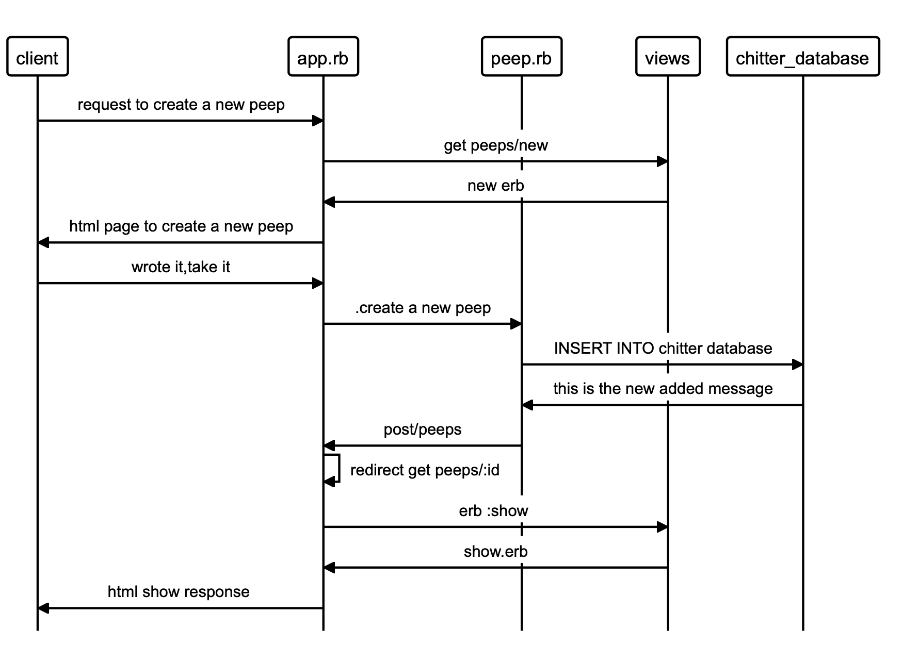
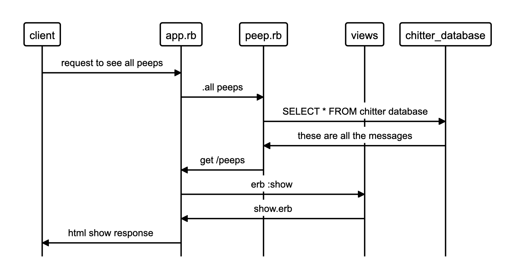
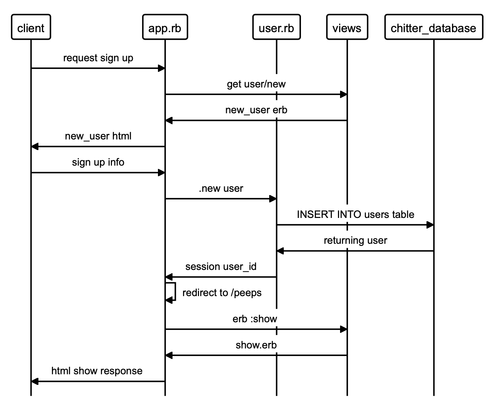

# Chitter Challenge

This is a small Twitter clone that will allow the users to post messages to a public stream.

## Tech/framework used
Ruby with Sinatra web framework, and PostgreSQL database. Tested using Rspec, and Capybara DSLs with Rubocop and Simplecov.

## Features
### User story 1
```
As a Maker
So that I can let people know what I am doing  
I want to post a message (peep) to chitter
```


### User story 2
```
As a maker
So that I can see what others are saying  
I want to see all peeps in reverse chronological order
```


### User Story 3
```
As a Maker
So that I can better appreciate the context of a peep
I want to see the time at which it was made
```
### User Story 4
```
As a Maker
So that I can post messages on Chitter as me
I want to sign up for Chitter
```


### User Story 5
```
As a Maker
So that only I can post messages on Chitter as me
I want to log in to Chitter
```


### User Story 6
```
As a Maker
So that I can avoid others posting messages on Chitter as me
I want to log out of Chitter

```

## Installation

1. Fork and clone this repo
2. Run `bundle`
3. Create databases


## How to use

1. Open psql.
2. Create databases chitter and chitter_test
3. Connect to your chitter database using the command `\c chitter`
4. Run the query we have saved in the file '02_create_peeps_table.sql'
5. Run the query we have saved in the file '03_add_time_column_on_peeps_table.sql'
6. Run the query we have saved in the file '04_create_users_table.sql'
7. Run the query we have saved in the file '05_add_column_user_id_to_peeps_table.sql'
8. Create a test database using the psql command `CREATE DATABASE chitter_test;`
9. Repeat steps 3 and 6 for the test database.

## How to run

 * rackup -p 3000
