Chitter Challenge
=================

We are going to write a small Twitter clone that will allow the users to post messages to a public stream.

-------

Features:

```
STRAIGHT UP

As a Maker
So that I can let people know what I am doing  
I want to post a message (peep) to chitter

As a maker
So that I can see what others are saying  
I want to see all peeps in reverse chronological order

As a Maker
So that I can better appreciate the context of a peep
I want to see the time at which it was made

As a Maker
So that I can post messages on Chitter as me
I want to sign up for Chitter

HARDER

As a Maker
So that only I can post messages on Chitter as me
I want to log in to Chitter

As a Maker
So that I can avoid others posting messages on Chitter as me
I want to log out of Chitter

ADVANCED

As a Maker
So that I can stay constantly tapped in to the shouty box of Chitter
I want to receive an email if I am tagged in a Peep
```

---

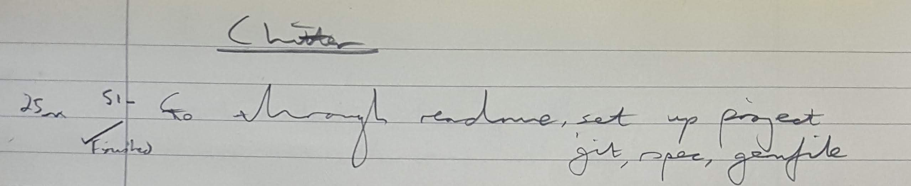

---

### User story 1

```
As a Maker
So that I can let people know what I am doing  
I want to post a message (peep) to chitter
```

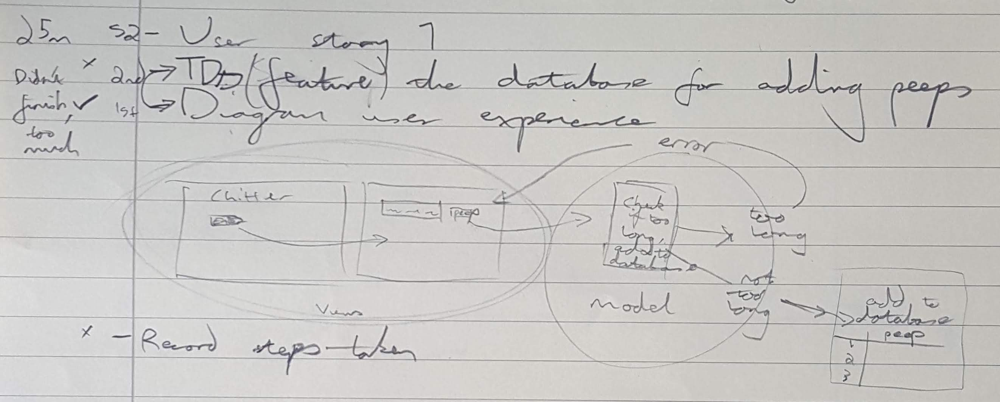

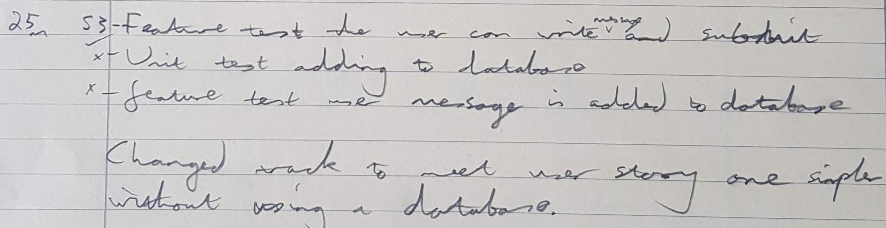

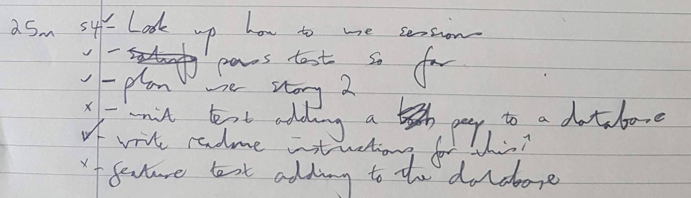

---

### User story 2

```
As a maker
So that I can see what others are saying  
I want to see all peeps in reverse chronological order
```


This require making the databases
* developer environment:
```
CREATE DATABASE chitter;
```
* test environment:
```
CREATE DATABASE chitter_test;
```

And then the first table:
```
CREATE TABLE peep (id SERIAL PRIMARY KEY, message VARCHAR(140));
```

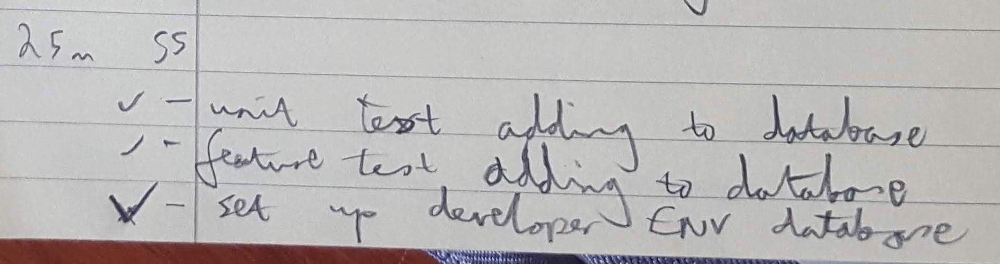

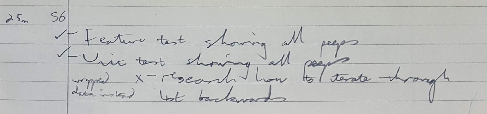

I also decided to add a character min and max during this user story

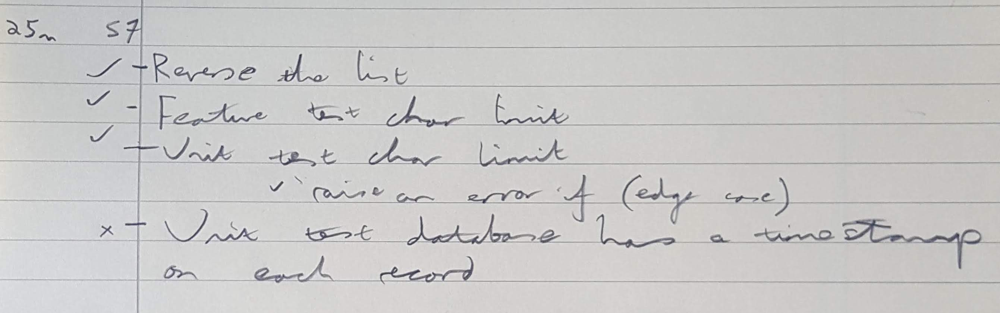

### User story 3

```
As a Maker
So that I can better appreciate the context of a peep
I want to see the time at which it was made
```

For this I had to alter the table with a new column:

```
ALTER TABLE peep ADD sent_at TIMESTAMP  DEFAULT CURRENT_TIMESTAMP;

```


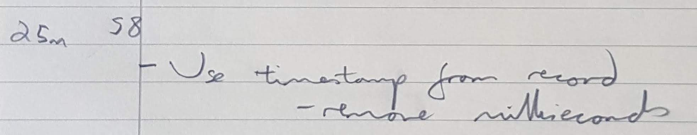

---

### User story 4

```
As a Maker
So that I can post messages on Chitter as me
I want to sign up for Chitter
```

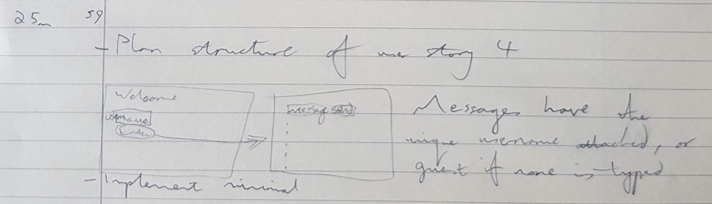

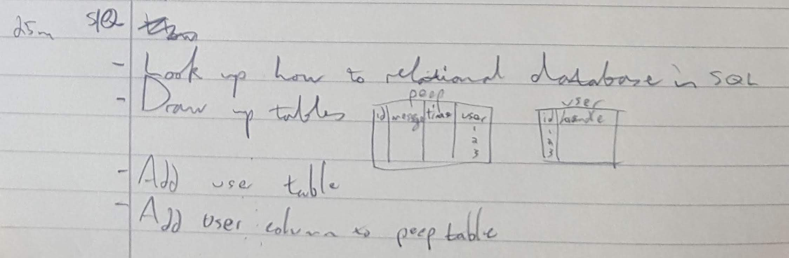

```
CREATE TABLE account (id SERIAL PRIMARY KEY, handle VARCHAR(20));
```

```
ALTER TABLE peep ADD CONSTRAINT account_id FOREIGN KEY (account_id) REFERENCES account(id);
```

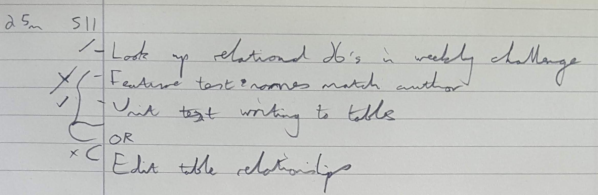

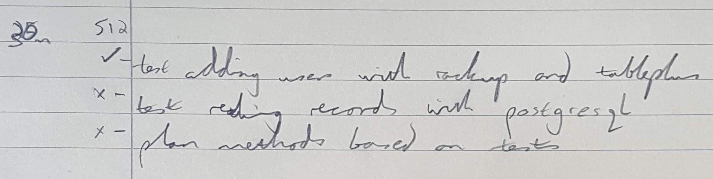

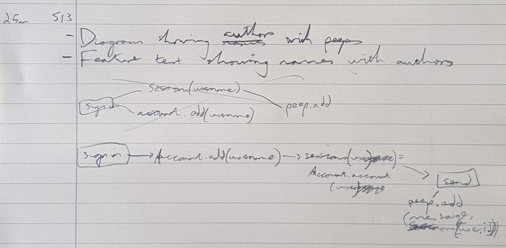
