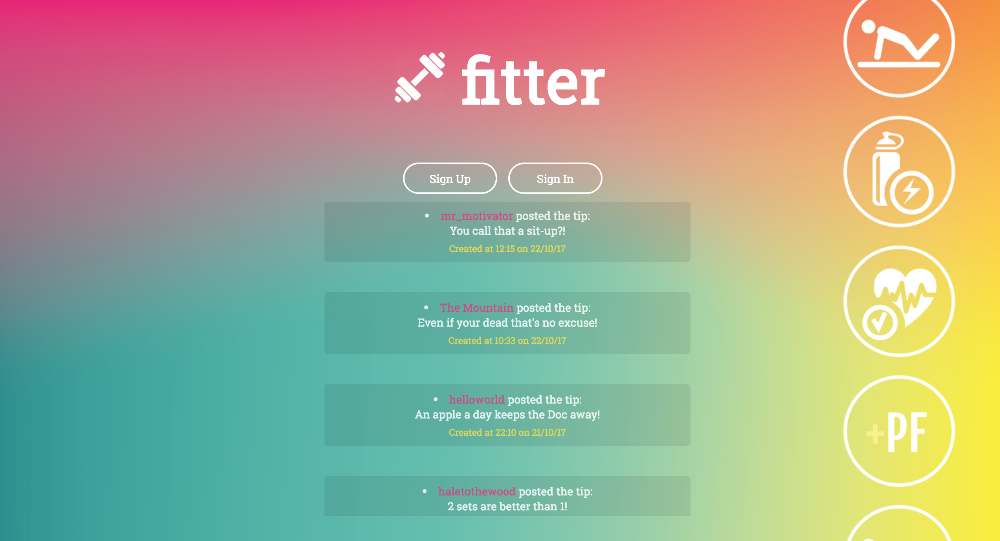
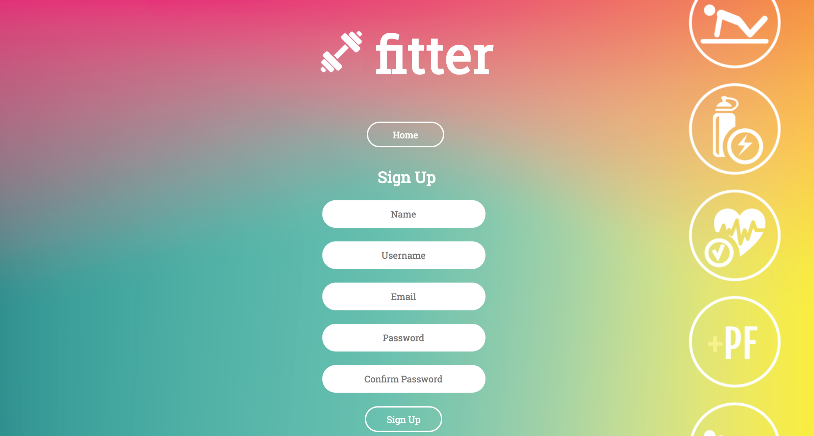
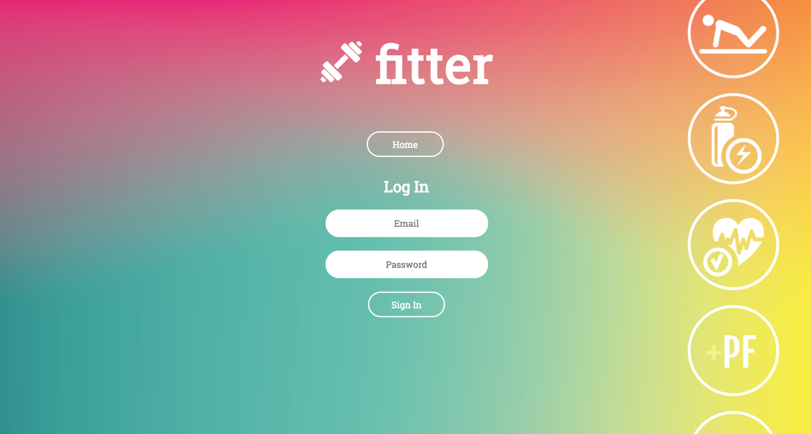
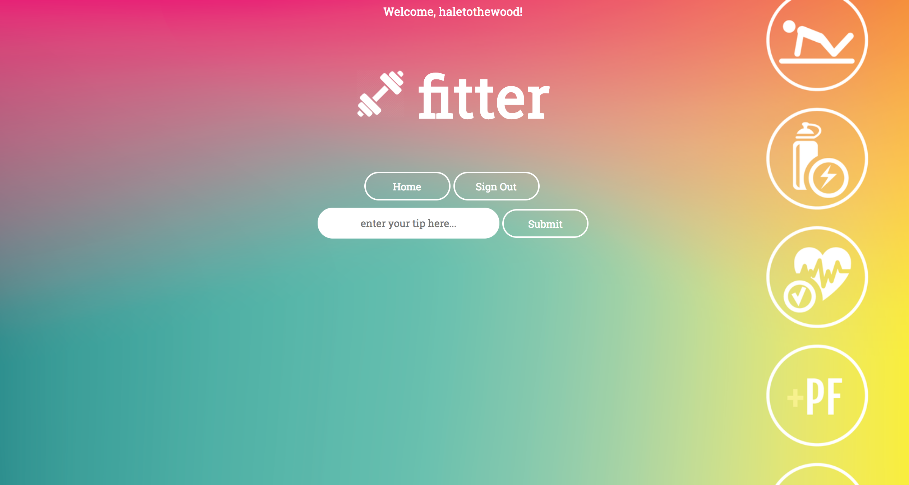

[](https://travis-ci.org/haletothewood/Fitter)

Fitter 
=================
My response to the Makers Academy Chitter Challenge. Fitter is a web application that allows logged in users to post fitness tips! Anyone can view the tips once posted!

Join the fun at: https://fitter-tips.herokuapp.com

<p align="center"></p>
  
The Brief:
-------

We are going to write a little Twitter clone that will allow the users to post messages to a public stream.

```
STRAIGHT UP

As a User
So that I can let people know what I am doing  
I want to post a message (tip) to fitter

As a User
So that I can see what others are saying  
I want to see all tips in reverse chronological order

As a User
So that I can better appreciate the context of a tip
I want to see the time at which it was made

As a User
So that I can post tips on fitter as me
I want to sign up for fitter

As a User
So that only I can post tips on fitter as me
I want to log in to fitter

As a User
So that I can avoid others posting tips on fitter as me
I want to log out of fitter
```

Installation:
------
```
$ git clone https://github.com/haletothewood/fitter  
$ bundle  
$ createdb fitter_development  
$ rake auto_migrate  
$ rspec  
$ rackup  
```

Tech
------
* Ruby  
* Sinatra  
* DataMapper  
* PSQL  
* Rake  
* Rspec  
* Capybara  

The Approach:
------

* The creation of this app was driven by testing using capybara and rspec
* Data Mapper and Postgres were used to store, save and recall, the data
* All posted tips are public but you have to be signed-up and logged-in to post a tip
* Users sign-up to fitter with their email, password, name and a user name (e.g. sirgregor@theredkeep.com, Viper, The Mountain, sirgregor).
* The username and email must be unique
* Tips (posts to fitter) have the name of the user and their user handle
* Bcrypt was used to secure the passwords

<p align="center"> Some more screenshots!</p>
<p align="center"></p>
<p align="center"></p>
<p align="center"></p>

Further Developments:
-----

* In order to start a conversation as a user I want to reply to a tip from another user
* In order to know when another user has tagged me in a tip I'd like to receive a notifcation via email
