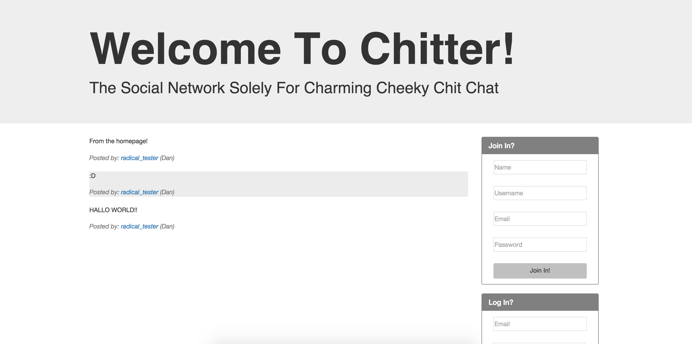

[](https://travis-ci.org/DanBlakeman/chitter-challenge)
[](https://coveralls.io/r/DanBlakeman/chitter-challenge)


Chitter - The Social Network Solely For Charming Cheeky Chit Chat
=================

Screenshot:
-------



About:
-------

A fully TDD'd Twitter clone including secure signin/signout (made in just one weekend)!

Lovingly made in monochrome, to elicit feelings of charming 50's chitter chatter in New York bars.

User stories:
-------

```sh
As a Maker
So that I can post messages on Chitter as me
I want to sign up for Chitter

As a Maker
So that I can post messages on Chitter as me
I want to log in to Chitter

As a Maker
So that I can avoid others posting messages on Chitter as me
I want to log out of Chitter

As a maker
So that I can let people know what I am doing
I want to post a message (peep) to chitter

As a maker
So that I can see what others are saying
I want to see all peeps in reverse chronological order
```

Technology and approaches used:
------

Fully test driven from a BDD approach: Using Cucumber with Capybara for feature tests and rspec for integration and unit tests of the models.

Languages: Ruby, Gherkin, HTML, CSS

Technologies: Cucumber, Rspec, Sinatra, Heroku, Postgresql, BCrypt, Bootstrap, DataMapper


How to Contribute:
-----

This was a weekend challenge to test my own development during week 5 of Makers Academy, an intensive 12 week coding bootcamp.

However i'd be delighted to receive any comments or hear of any ideas to take this forward.

If you'd like to do either, just leave a comment! :)

How to Use:
-----

It's easy! Simply visit https://stark-peak-1974.herokuapp.com/ and signup to leave 'Peeps' for the world to read!

Or to test: download the repo and run 'rake' to run all tests, or 'cucumber'/'rspec' to test the feature/unit levels seperately.

Or to run on your own machine, simply download the repo and type 'rackup' in the root.
