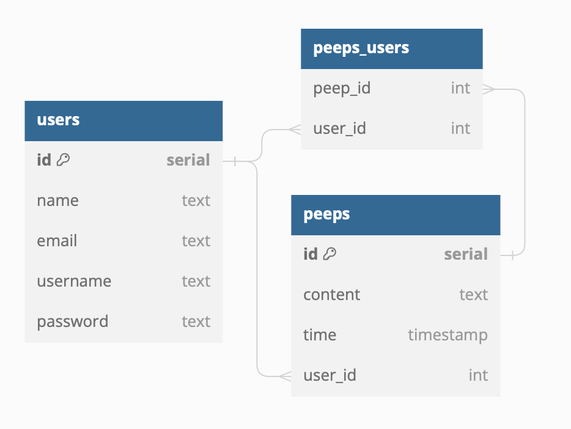
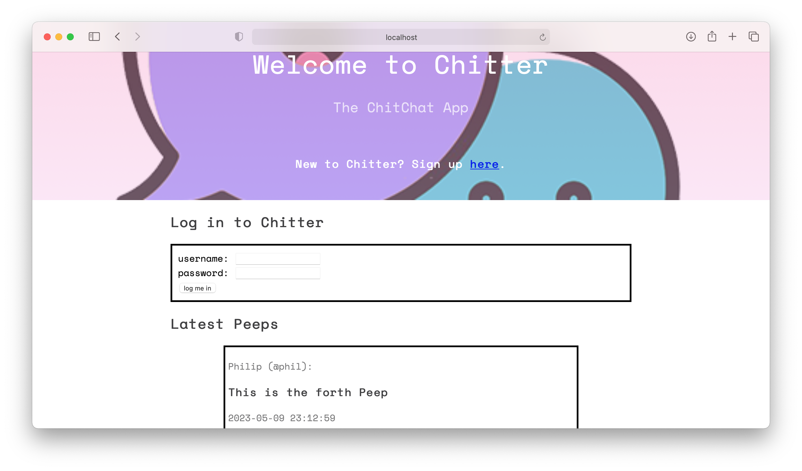
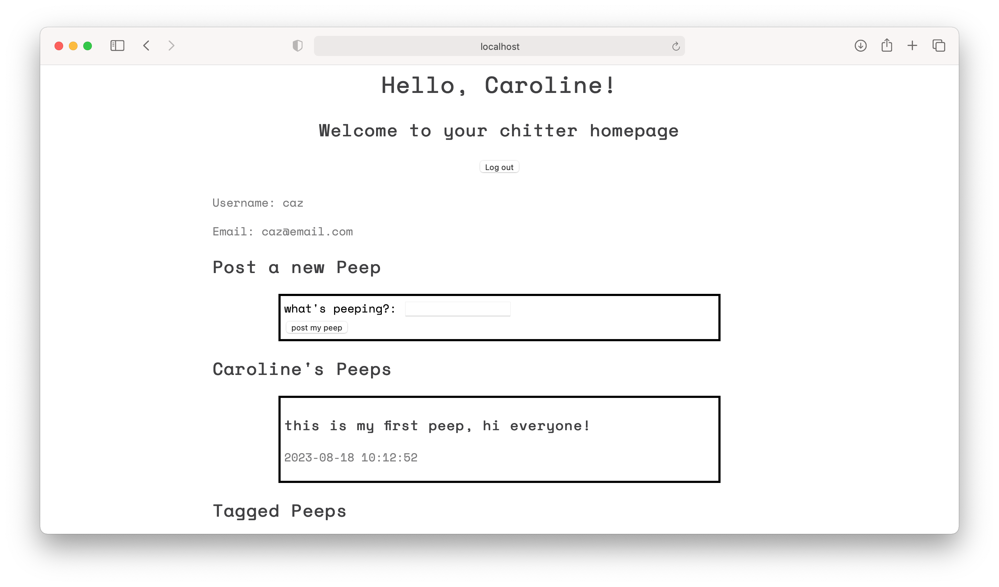

# chitter-challenge

A Twitter clone built as part of the Makers Academy software development course.

## Features

## How to run

```shell
bundle install
rackup
```

## Database Structure

Database Table design template can be found [here](chitter_two_tables_design_recipe.md)

Database diagram (generated by dbdiagram.io using DBML converted from the SQL seed code)


## Class Design

Ruby Model and Repository class design template can be found [here](chitter_model_and_repository_design_recipe.md)

## Webpage view




## Pending TODOs

- User "tagging" functionality
- improve CSS design

## Built with

- Ruby
- Rspec
- Sinatra
- PostgreSQL
- BCrypt
- Render

## Deployment

Initially deployed on Render (https://chitter-the-chit-chat-app.onrender.com) but is currently inactive.

## Contact

- [Caroline Evans](mailto:carolineevans261@gmail.com)
