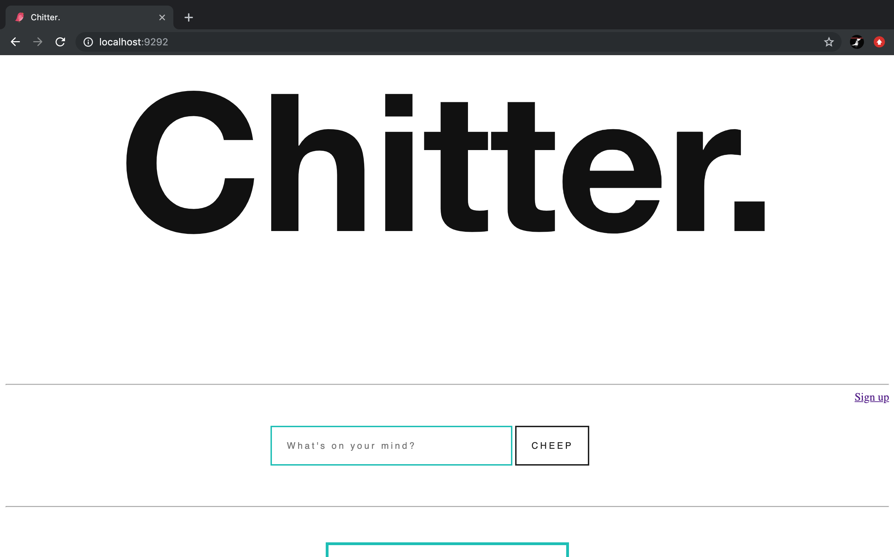
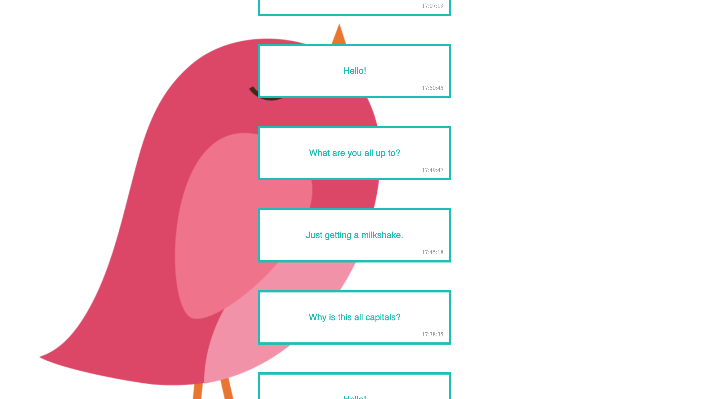

Chitter Challenge
=================

A small Twitter clone that will allow users to post messages to a public stream.

User Stories:
-------

```
As a Maker
So that I can let people know what I am doing 
I want to post a message (peep) to chitter
```
```
As a Maker
So that I can see what others are saying  
I want to see all peeps in reverse chronological order
```
```
As a Maker
So that I can better appreciate the context of a peep
I want to see the time at which it was made
```
```
As a Maker
So that I can post messages on Chitter as me
I want to sign up for Chitter
```

Getting Started:
-----
* Close the repository `https://github.com/hughbric/rps-challenge`
* Navigate to the project root: `cd ./rps-challenge`
* Run `bundle install`
* Follow the `db/migrations` in `psql` to get your databases setup.

Usage:
-----
* In the terminal, you can either `rackup` or `ruby app.rb`
* Navigate to your `http://localhost:9292/`

Testing & Technologies:
-------

From the project root, you can run RSpec to run the tests: `rspec`  

I use `simplecov` to provide a report on the test coverage and `capybara` to enable my web application for feature testing.

I also use `sinatra/base` and `rack` to run my web application.

Screenshots:
------------






To work on:
-----
* In order to a different user to submit a peep, I want to log out and then log in.
* In order to start a conversation as a maker I want to reply to a peep from another maker.
