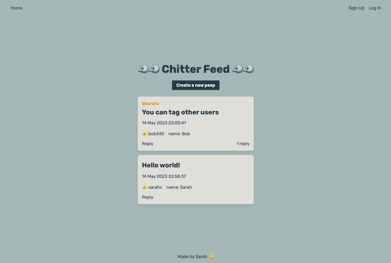
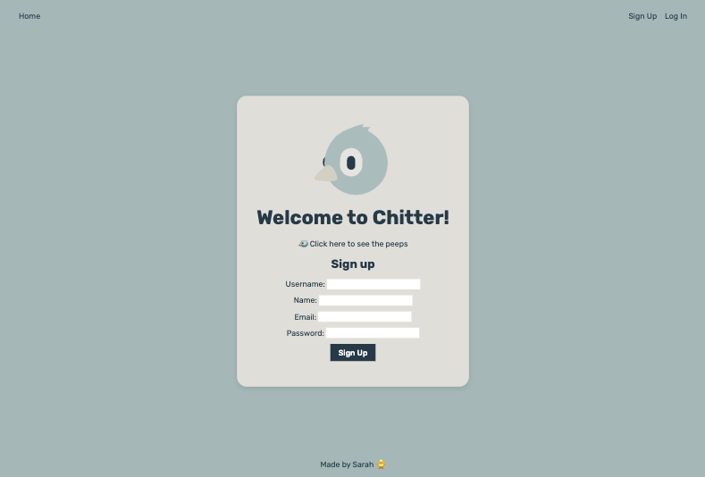
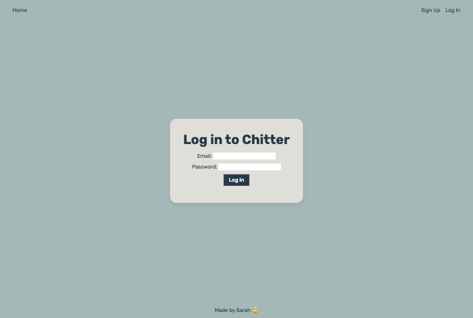
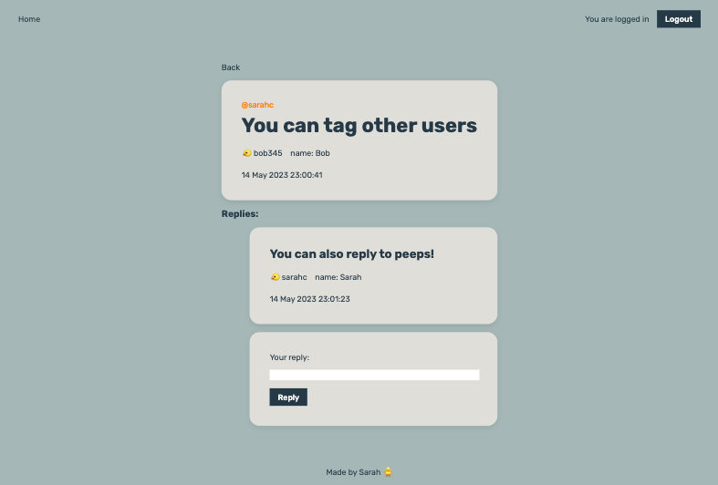
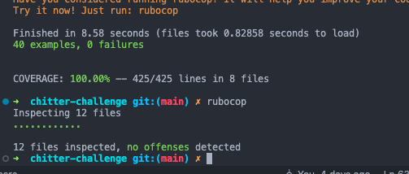
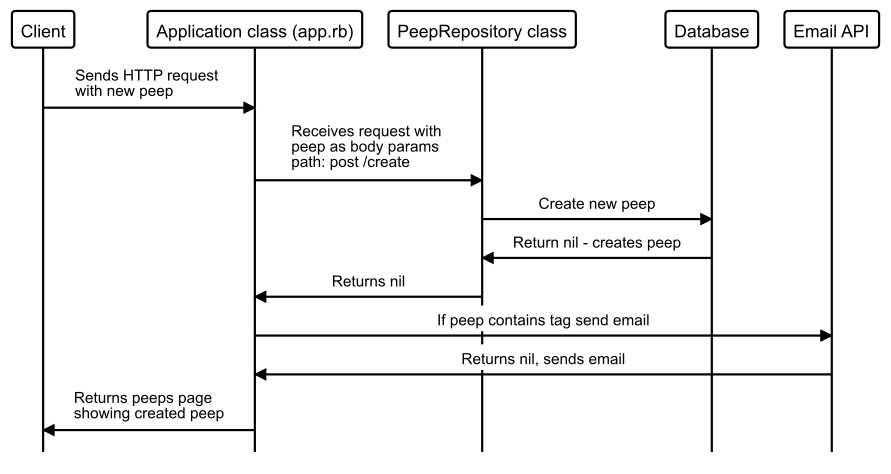
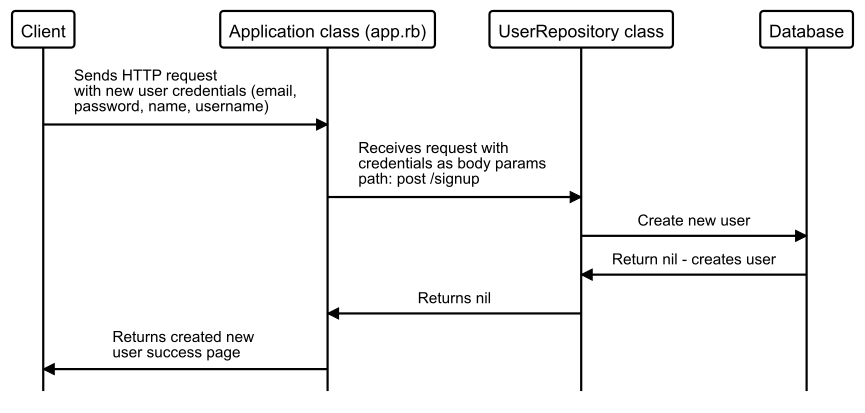
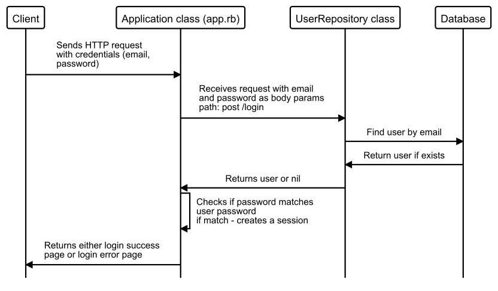
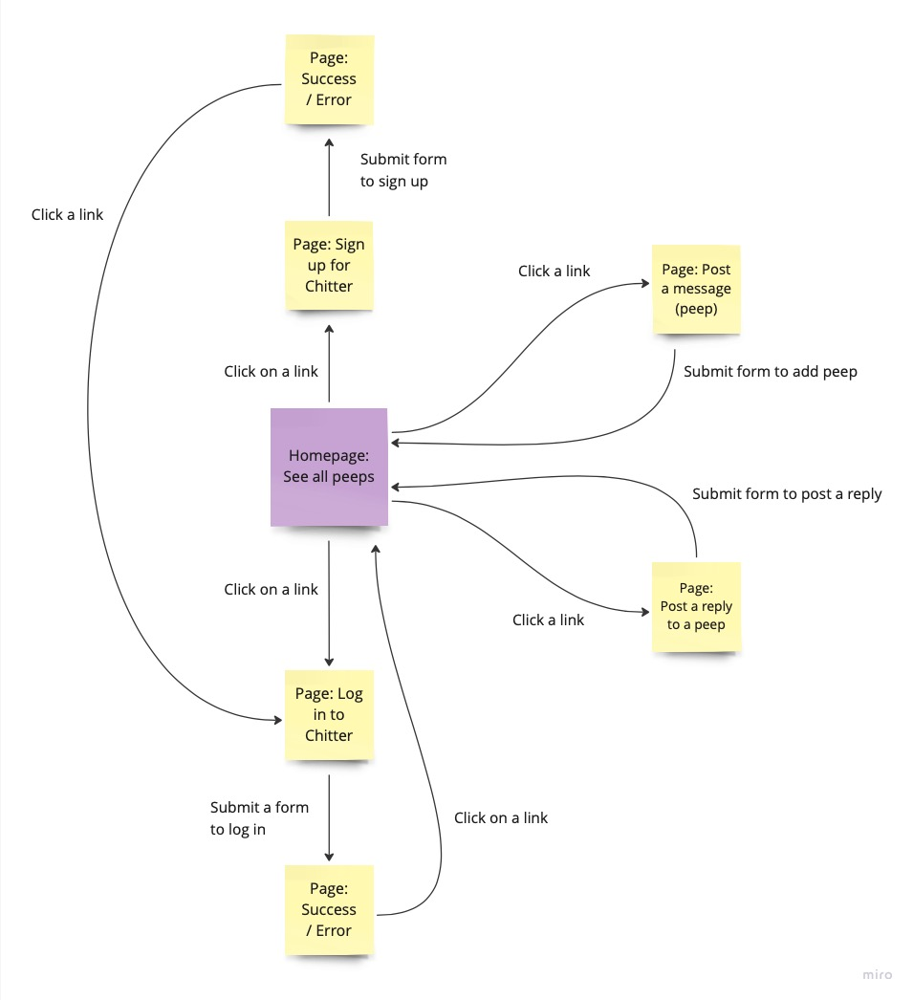

# Chitter Challenge

The solo challenge for Week 4 was to write a small Twitter clone that will allow the users to post messages to a public stream.

You can visit my site here: [https://chitter-app-4z4y.onrender.com/](https://chitter-app-4z4y.onrender.com/)

You should be able to sign in with the following credentials:
- Username: example@example.com
- Password: 123

I have not yet added the functionality to email a user when they are tagged. But here are some screenshots of the working app. You can sign up, log in, logout, post peeps, tag users in peeps and reply to peeps.







The diagrams below are from my initial plan. Whilst I was working through the challenge the final implementation is changed slightly from this.

My #all_with_user method is doing a lot of work - because I want my list of peeps to display the peep, the user, the number of replies and the tags. This involves getting all of the peeps from the database - and doing some manipulation to create a reply_count attribute and returning only peeps that are not a reply.

In creating a Peep object, I am also making another call to the database to get the list of tags. I chose to add the tags to a separate table because there is a many-to-many relationship - one peep can have multiple tags and one user can be tagged multiple times. I'm not sure if this is the most effective way of implementing this?

I was also a little unsure on where the error handling should go - in the model or the controller? It seemed easier to return an alternative status direct from the model.

The focus of this challenge was not CSS, I have added some CSS to make it look nice, but it is not fully responsive.

Going forward, I would like to try using an Object Relational Mapper as the database interface instead of Repository classes.

## Instructions

```bash
# To use my program locally - go to http://localhost:9292/

$ git clone https://github.com/sarahc-dev/chitter-challenge.git
$ cd chitter_challenge
$ bundle install
$ createdb chitter_test
$ psql -h 127.0.0.1 chitter_test < chitter_tables.sql
$ psql -h 127.0.0.1 chitter_test < spec/seeds_chitter_test.sql
$ rspec
$ rackup
```

## Technologies Used

- Miro - Designing and planning
- Diagram.codes - Sequence diagrams
- Ruby
- Sinatra & ERB
- BCrypt
- PostgreSQL
- HTML & CSS
- Render (cloud hosting)

## User Stories

```plain
As a Maker
So that I can let people know what I am doing
I want to post a message (peep) to chitter

As a Maker
So that I can see what others are saying
I want to see all peeps in reverse chronological order

As a Maker
So that I can better appreciate the context of a peep
I want to see the time at which it was made

As a Maker
So that I can post messages on Chitter as me
I want to sign up for Chitter

As a Maker
So that only I can post messages on Chitter as me
I want to log in to Chitter

As a Maker
So that I can avoid others posting messages on Chitter as me
I want to log out of Chitter

As a Maker
So that I can stay constantly tapped in to the shouty box of Chitter
I want to receive an email if I am tagged in a Peep

As a Maker
So that I can start a conversation
I want to reply to a peep from another Maker
```

### Functionality

- See all peeps without being logged in, in reverse chronological order
- Peeps have the name and username of the Maker and the time of the peep
- Sign up - with email (unique), password, name and username (unique)
- Log in - email and password
- Log out
- Post peep
- Reply to a peep
- Tag other Makers
- Receive an email if tagged

## Modelling and Planning Web Application

Initially, I have created some sequence diagrams for the main functionality of my program - posting a peep, logging in and signing up to Chitter.

### Sequence diagrams

Post a new peep:



New user sign up:



Log in the user:



### Design database

Extracted the nouns from the user stories to infer the table names and properties. I have also considered the relationships between the tables.

- One peep can have one user (as author)
- One user can have many peeps
- Replies: One peep can also have one parent (a peep) or null
- Tags: One peep can tag many users, one user can have many tags

To implement the tags, as this is a many-to-many relationship, I will need to create a join table - which contains user_id and peep_id.

#### Infer the table names and columns

| Record | Properties                                                             |
| ------ | ---------------------------------------------------------------------- |
| peep   | message, timestamp, author (user_id), reply (parent_id), tag (user_id) |
| user   | email (unique), password (encrypted), name, username (unique)          |

1. Name of the first table (always plural): `peeps`

   Column names: `message`, `timestamp`, `user_id`, `parent_id`

2. Name of the second table (always plural): `users`

   Column names: `email`, `password`, `name`, `username`

3. Name of the join table (table1_table2): `peeps_users`

   Column names: `peep_id`, `user_id`

#### Decide the column types

```plain
Table: peeps
id: SERIAL
message: text
timestamp: timestamp
user_id: user_id
peep_id: peep_id

Table: users
id: SERIAL
email: text
password: text
name: text
username: text
```

#### Write the SQL

```sql
CREATE TABLE peeps (
  id SERIAL PRIMARY KEY,
  message text,
  timestamp timestamp,
  user_id int,
  peep_id int,
  constraint fk_user foreign key(user_id) references users(id),
  constraint fk_peep foreign key(peep_id) references peeps(id)
);

CREATE TABLE users (
  id SERIAL PRIMARY KEY,
  email text,
  password text,
  name text,
  username text
);

CREATE TABLE peeps_users (
  peep_id int,
  user_id int,
  constraint fk_peep foreign key(peep_id) references peeps(id),
  constraint fk_user foreign key(user_id) references users(id),
  PRIMARY KEY (peep_id, user_id)
);
```

### Planning pages

I have created a diagram outlining the different pages the user will use and how they will navigate to these pages.



### Planning routes

I have created RESTful routes for the peeps but was unsure regarding the login and signup pages.

| Route Name                       | URL Path   | HTTP Method | Purpose                      |
| -------------------------------- | ---------- | ----------- | ---------------------------- |
| Index                            | /          | GET         | Show signup page             |
| All                              | /peeps     | GET         | Display all peeps            |
| New                              | /peeps/new | GET         | Show form for new peep       |
| Create                           | /peeps     | POST        | Creates new peep             |
| Show                             | /peeps/:id | GET         | Shows one peep (for replies) |
| Edit, Update, Delete - not using |            |
| Login                            | /login     | GET         | Display login page           |
| Login user                       | /login     | POST        | Login user and redirect      |
| Sign up user                     | /signup    | POST        | Sign up user and redirect    |

### Designing the Repository classes

```ruby
class Peep
  attr_accessor :id, :message, :timestamp, :parent_id, :user
end

class PeepRepository
  def all_with_user
    # displays all peeps with user info

    # No arguments
    # Returns array of Peep and user (author)

    SQL = '
    SELECT peeps.id, message, timestamp, users.id as user_id, users.name, users.username
    FROM peeps
    JOIN users ON users.id = peeps.user_id
    WHERE peep_id IS NULL;'
  end

  def create(peep)
    # creates a new peep
    # takes a peep object as an argument
    # Returns nothing - creates a new peep

    SQL = '
    INSERT INTO peeps (message, timestamp, user_id, peep_id)
    VALUES($1, CURRENT_TIMESTAMP, $2, $3);'
  end

  def find_by_id(id)
    # Finds a single peep (for replies)
    # Takes an id as an argument
    # Returns a single peep

    SQL = '
    SELECT peeps.id, message, timestamp, users.id as user_id, users.name, users.username
    FROM peeps
    JOIN users ON users.id = peeps.user_id
    WHERE peep_id IS NULL and peeps.id = $1;'
  end

  def get_replies(id)
    # gets a list of replies to a single peep
    # takes the peep id as an argument
    # returns a list of peep objects

    sql = 'SELECT peeps.id, message, timestamp, users.id as user_id, name, username
    FROM peeps JOIN users ON users.id = peeps.user_id
    WHERE peep_id = $1;'
  end

  def get_tags(id)
    # finds the tags associated with a single peep
    # takes the peep id as an argument
    # returns a list of usernames tagged
    SQL = 'SELECT users.id, users.username
    FROM users
    JOIN peeps_users ON peeps_users.user_id = users.id
    JOIN peeps ON peeps_users.peep_id = peeps.id
    WHERE peeps.id = 4;'
  end
end

class User
  attr_accessor :id, :email, :password, :name, :username
end

class UserRepository

  def create(user)
    # creates a new user
    # takes a user object argument
    # encrypt password
    # returns nothing - creates new user

    sql = '
    INSERT INTO users (email, password, name, username)
    VALUES($1, $2, $3, $4);'
  end

  def find_by_email(email)
    # Takes an email as an argument (and password?)
    # Returns a single user

    sql = '
    SELECT id, email, name, username
    FROM users
    WHERE email = $1;'
    # (and password = $2)?
  end
end
```

### Test-drive and implement

I am going to write my tests directly into the test file.
