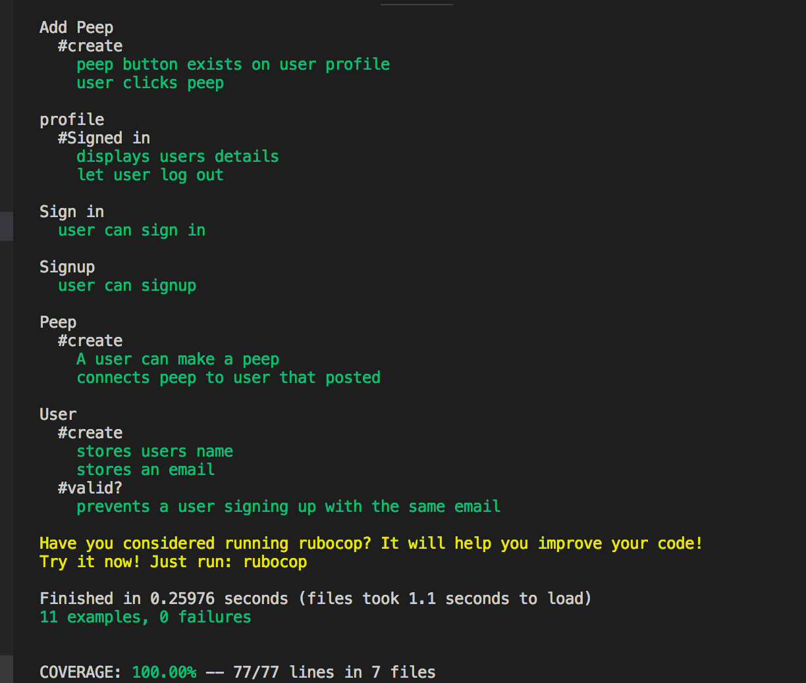
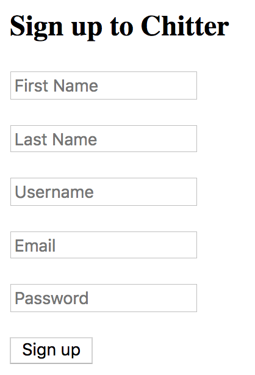
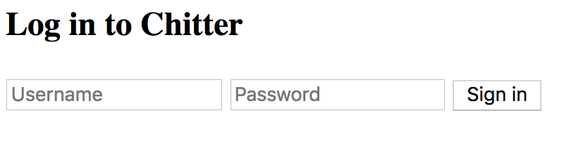
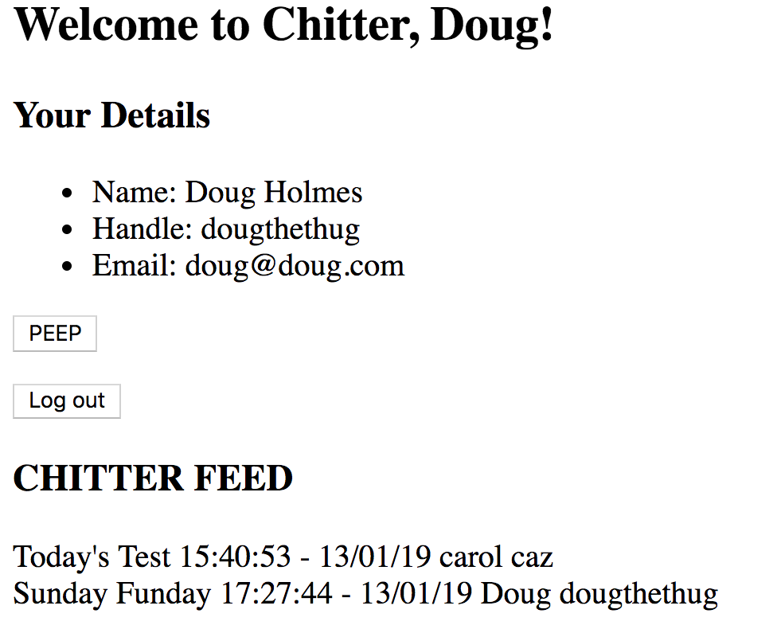

Chitter Challenge
=================

Description
-------
Chitter is a small Twitter clone that allows users to post messages to a public stream. It was built using [Sinatra](http://sinatrarb.com/) and [ActiveRecord ORM](https://guides.rubyonrails.org/active_record_basics.html). Testing done with [Rspec](http://rspec.info/) 
and [Capybara](https://relishapp.com/rspec/rspec-rails/docs/feature-specs/feature-spec)


User Stories
-------
Chitter was created with the following user stories

```
STRAIGHT UP

As a Maker
So that I can let people know what I am doing  
I want to post a message (peep) to chitter

As a maker
So that I can see what others are saying  
I want to see all peeps in reverse chronological order

As a Maker
So that I can better appreciate the context of a peep
I want to see the time at which it was made

As a Maker
So that I can post messages on Chitter as me
I want to sign up for Chitter

HARDER

As a Maker
So that only I can post messages on Chitter as me
I want to log in to Chitter

As a Maker
So that I can avoid others posting messages on Chitter as me
I want to log out of Chitter

ADVANCED

As a Maker
So that I can stay constantly tapped in to the shouty box of Chitter
I want to receive an email if I am tagged in a Peep
```

Installation
-------
- $ `git clone git@github.com:CazaBelle/chitter-challenge.git`
- $ `bundle install`

Database Config
-------
- $`rake db:create` reated dbs that exist in database.yml file)
- $`rake db:migrate`
- $`rake db:test:prepare`
- $`rake db:reset` 

QuickStart
-------
- $ `rackup`
- Navigate to `local host:9292` in your browser

Testing 
-------
- $ `rspec`



Demo
-------
Homepage
-------

Sign up
-------


Log in
-------

Profile
-------


Extensions
-------
* Adding password encryption
* Styling
* Ability to tag other users in peeps
* Start a conversation as by replying to a peep
