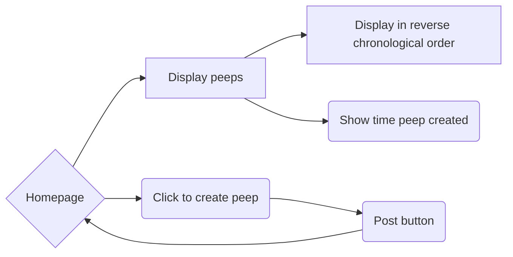
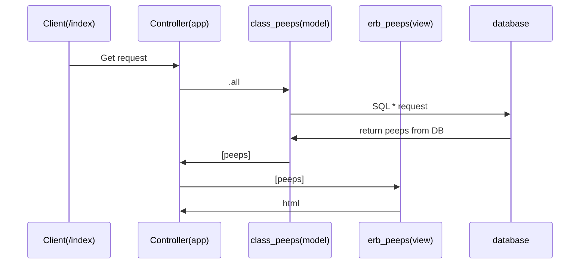
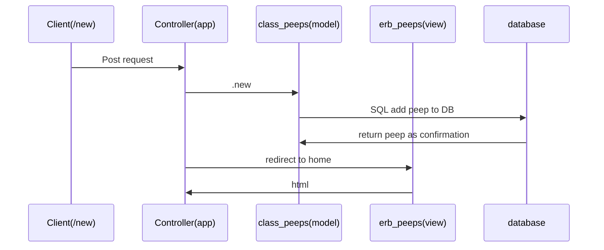
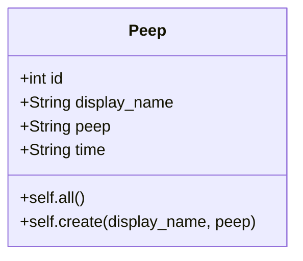
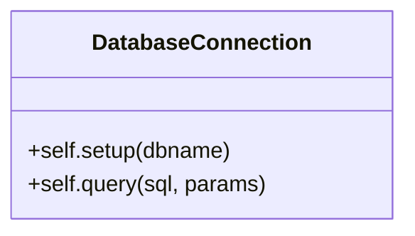

Chitter Challenge
=================

This is my weekend challenge as part of the Makers Academy bootcamp. 

The task is to create a simple web app inspired by Twitter which we are calling Twitter

Features:
-------

I will be focusing on the following user stories for this challenge. 

```
As a Maker
So that I can let people know what I am doing  
I want to post a message (peep) to chitter

As a maker
So that I can see what others are saying  
I want to see all peeps in reverse chronological order

As a Maker
So that I can better appreciate the context of a peep
I want to see the time at which it was made
```
Diagram of site
---------------



Domain Models
-----------

Viewing peeps

Creating peeps



Database setup
----------

Proposed table

id  | display_name |  peep  | time_of_peep <br>

SQL to create the table. <br>
```
CREATE TABLE peeps(id SERIAL PRIMARY KEY, display_name VARCHAR(60), peep VARCHAR(280), time TIMESTAMPTZ);
```

Class Diagram
---------

Main class for the model


*self.all returns class instances that wrap the data from the database

Helper classes

This gets called at the beginning of the app.rb file via a script to establish connection to either the test database or the production database. It also abstracts the use of params to prevent SQL injection attacks when making queries. 



Technical Approach:
-----


Notes on functionality:
------

* Peeps (posts to chitter) have the name of the maker and their user handle.
* Your README should indicate the technologies used, and give instructions on how to install and run the tests.


Automated Tests:
-----

Opening a pull request against this repository will trigger Travis CI to perform a build of your application and run your full suite of RSpec tests. If any of your tests rely on a connection with your database - and they should - this is likely to cause a problem. The build of your application created by has no connection to the local database you will have created on your machine, so when your tests try to interact with it they'll be unable to do so and will fail.

If you want a green tick against your pull request you'll need to configure Travis' build process by adding the necessary steps for creating your database to the `.travis.yml` file.

- [Travis Basics](https://docs.travis-ci.com/user/tutorial/)
- [Travis - Setting up Databases](https://docs.travis-ci.com/user/database-setup/)

Notes on test coverage
----------------------

Please ensure you have the following **AT THE TOP** of your spec_helper.rb in order to have test coverage stats generated
on your pull request:

```ruby
require 'simplecov'
require 'simplecov-console'

SimpleCov.formatter = SimpleCov::Formatter::MultiFormatter.new([
  SimpleCov::Formatter::Console,
  # Want a nice code coverage website? Uncomment this next line!
  # SimpleCov::Formatter::HTMLFormatter
])
SimpleCov.start
```

You can see your test coverage when you run your tests. If you want this in a graphical form, uncomment the `HTMLFormatter` line and see what happens!
