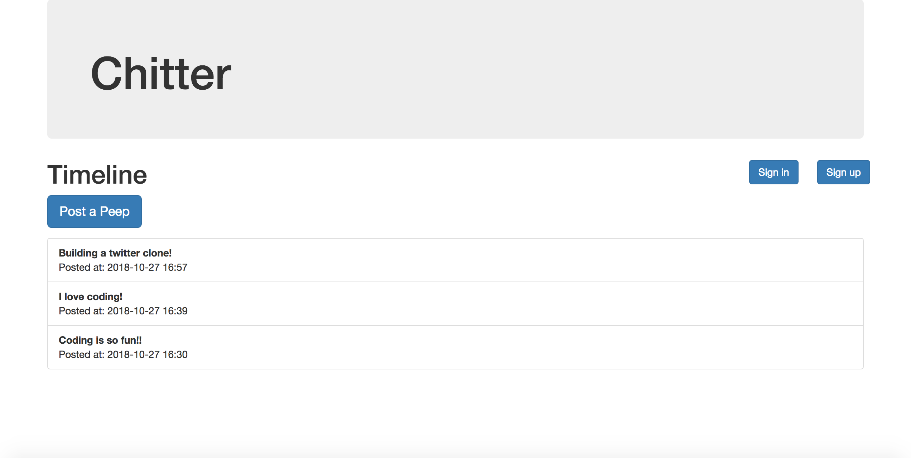
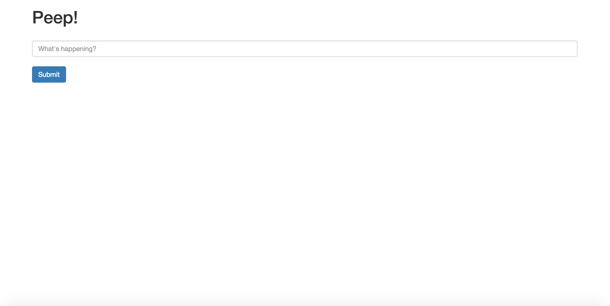
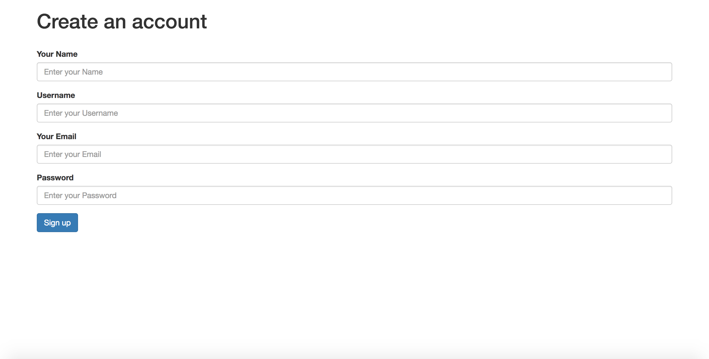
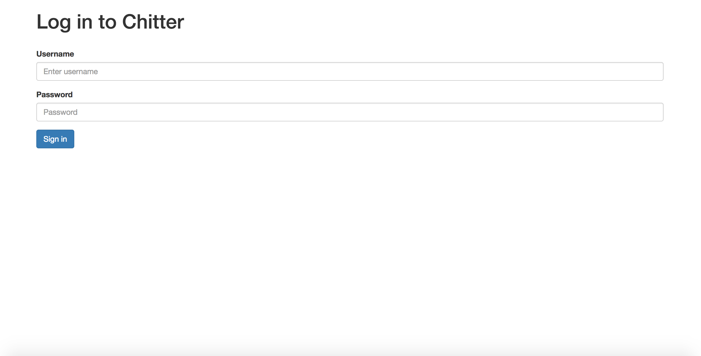
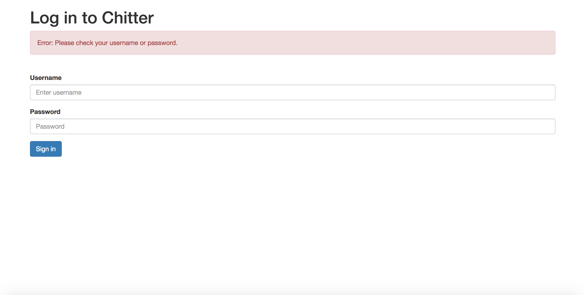
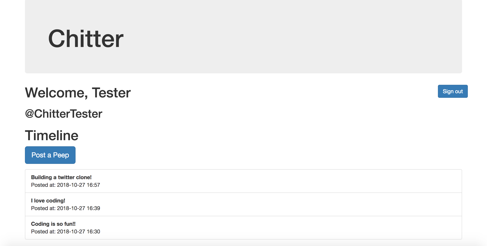
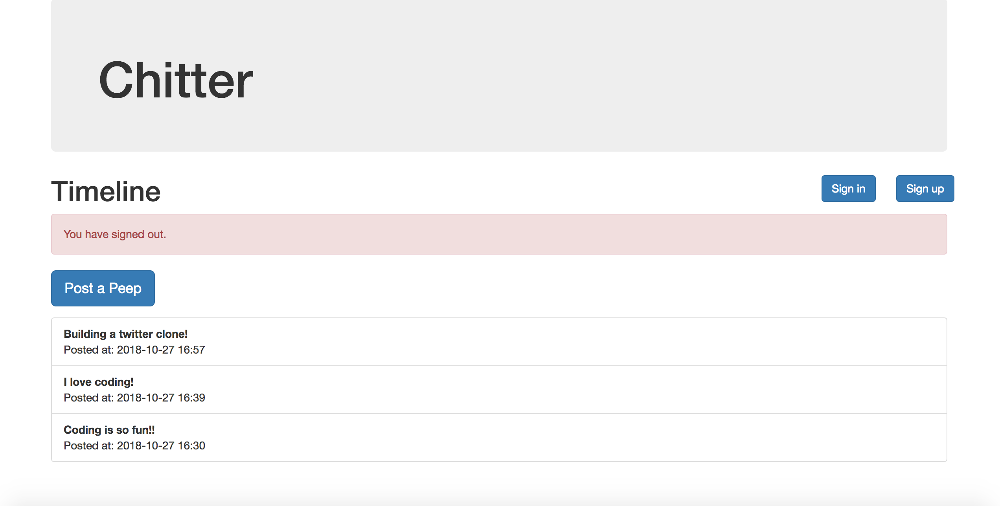

# Chitter

Chitter is a basic clone of twitter where users can posts ‘peeps’ on a timeline.
It’s back-end is built in Ruby/Sinatra & Postgres, front end in HTML, CSS & Bootstrap and test driven using RSpec & Capybara.

## Motivations for this project

* Week 4 Makers Academy weekend challenge
* Build a web app that uses a database
* Build complete full-stack features - including controller, model, view and database code.
* Implement RESTful routing conventions
* Build a Registration system & Authentication system
* Use database GUIs to interact with databases
* Set up a test environment
* Test-Drive advanced Objects in Ruby, including adapter, wrapper, and service objects

## User Stories:

```
STRAIGHT UP

As a Maker
So that I can let people know what I am doing  
I want to post a message (peep) to chitter

As a maker
So that I can see what others are saying  
I want to see all peeps in reverse chronological order

As a Maker
So that I can better appreciate the context of a peep
I want to see the time at which it was made

As a Maker
So that I can post messages on Chitter as me
I want to sign up for Chitter

HARDER

As a Maker
So that only I can post messages on Chitter as me
I want to log in to Chitter

As a Maker
So that I can avoid others posting messages on Chitter as me
I want to log out of Chitter

ADVANCED

As a Maker
So that I can stay constantly tapped in to the shouty box of Chitter
I want to receive an email if I am tagged in a Peep
```

## Features

* A user doesn’t have to be logged in to view peeps.
* A user can view peeps and their timestamps in reverse chronological order
* A user can add ‘peeps’ (posts to chitter)
* A user can sign up to chitter with their email, password, name and a username
* A user can sign in to chitter with their username & password
* A user sees an error if they get their username wrong
* A user sees an error if they get their password wrong
* A user can sign out

### Screenshots









## Approach

* 3 Classes: Peep, User, & DatabaseConnection (extracted database setup object)
* 4 Views: /peeps, /peeps/new, /sessions/new, /users/new. The index page redirects to /peeps.
* Fully test driven app using RSpec & Capybara
* Aimed to use the MVC pattern to improve the maintainability of the app
* 100% test coverage with a total of 22 unit & feature tests (all passing)

## Getting started

### To set up the project

1. clone repo to your local machine `git clone https://github.com/MHUS25/chitter-challenge.git`
2. Run the command `gem install bundle` (if you don't have bundle already)
3. When the installation completes, `run bundle`

### To set up the database

Connect to `psql` and create the `chitter` and `chitter_test` databases:

```
CREATE DATABASE chitter;
CREATE DATABASE chitter_test;
```

To set up the appropriate tables, connect to each database in `psql` and run the SQL scripts in the `db/migrations` folder in the given order.

## Usage

To start the server, execute the ruby file directly `ruby app.rb`.
Visit http://localhost:4567/ in your browser.

## Running tests

Run both feature and unit tests using:
`rspec`

## Next steps & ideas for extending the application:

* Check usernames and emails are unique on sign up
* Allow only logged in users to post peeps
* Add the name of the user and their user handle to peeps on the Timeline
* Implement ADVANCED user story
* Automate migrations - Write a Rake task to set up the development and test databases
