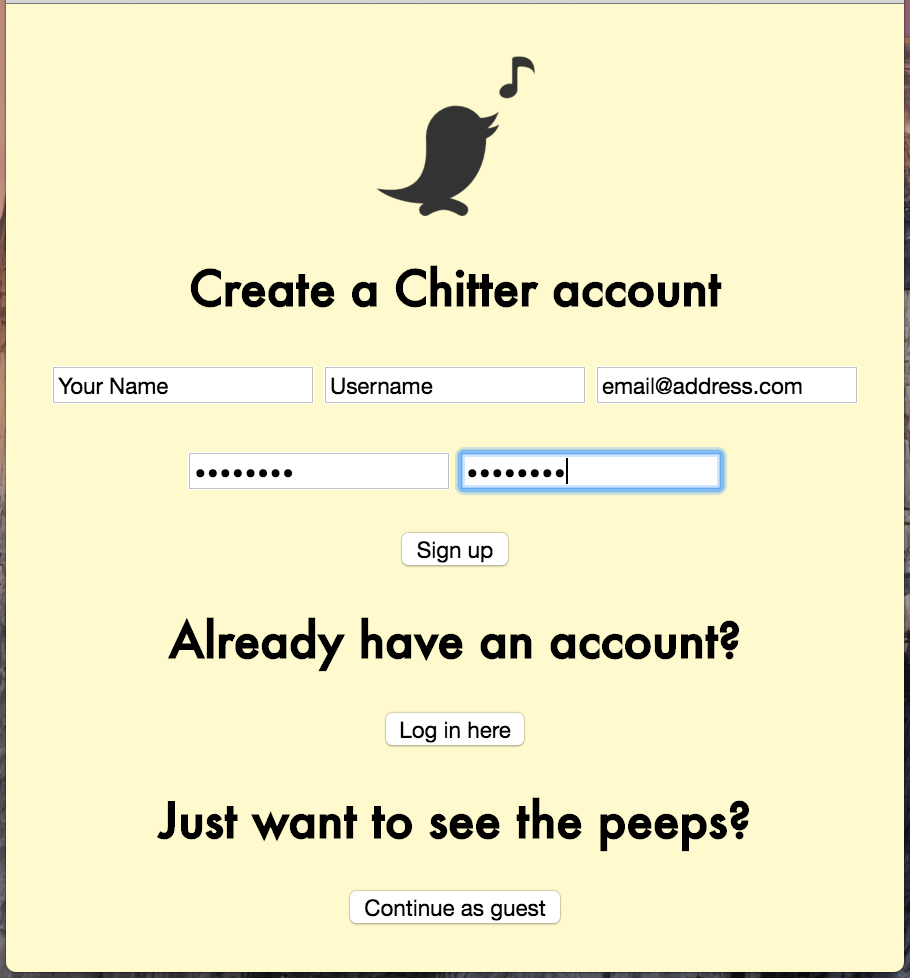
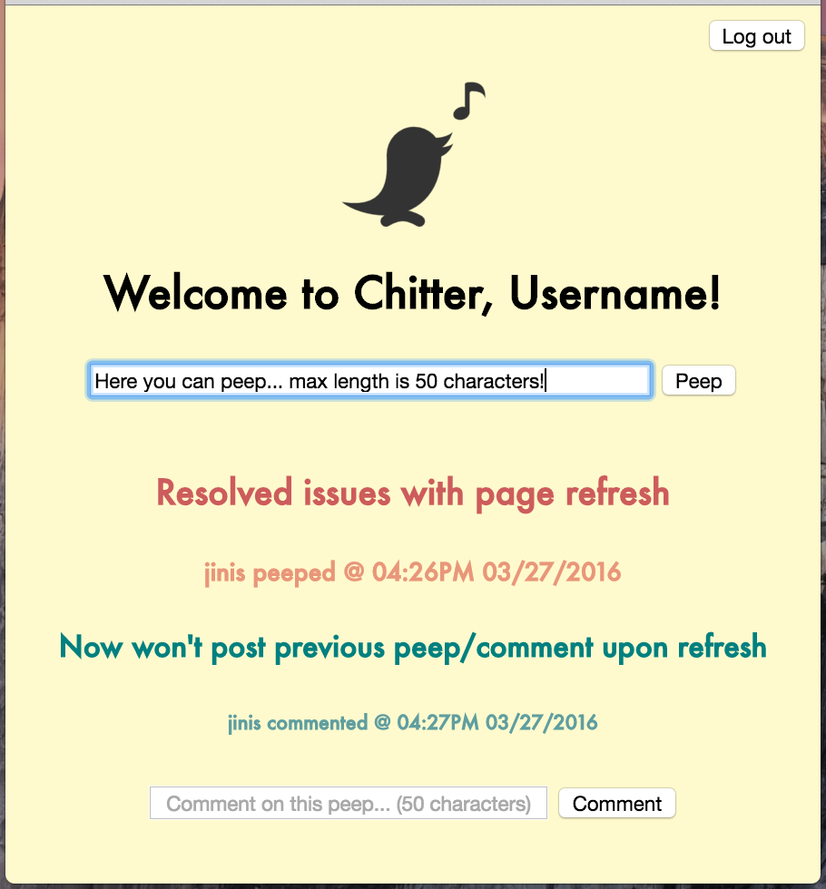
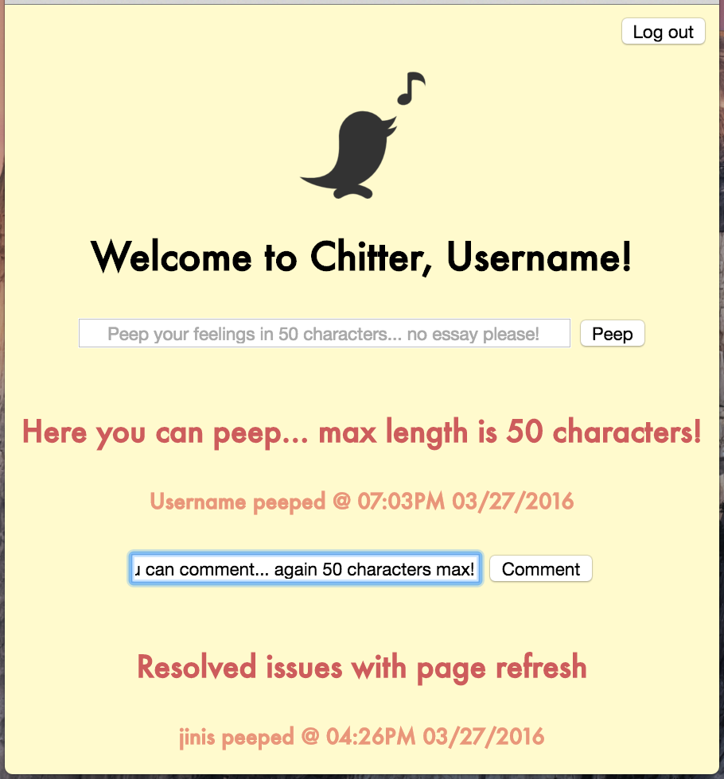
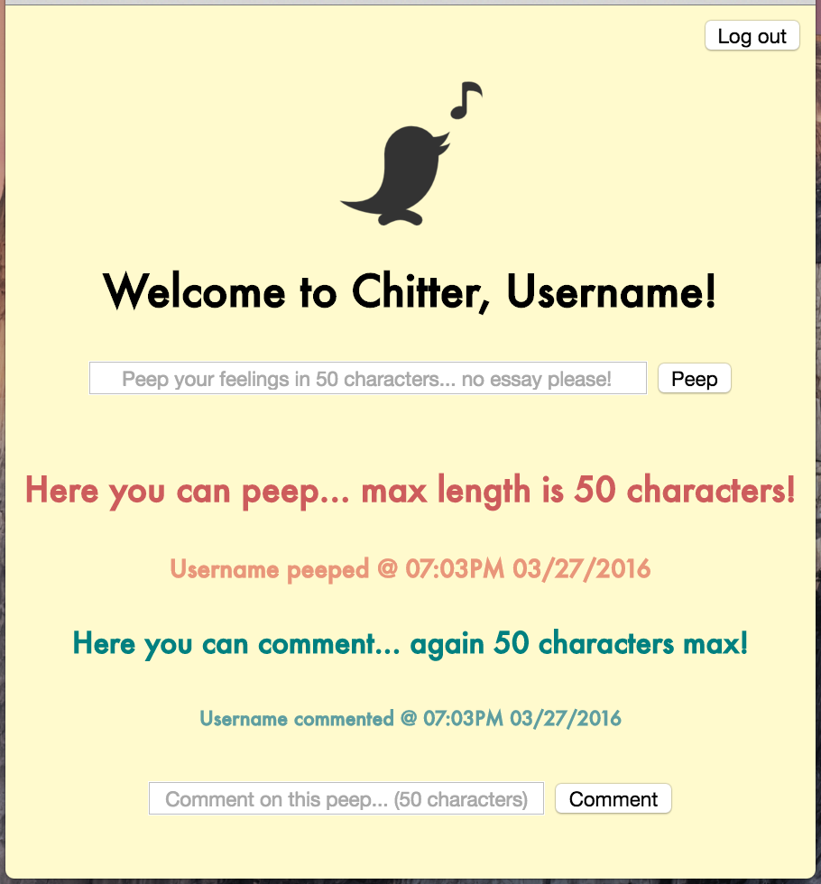
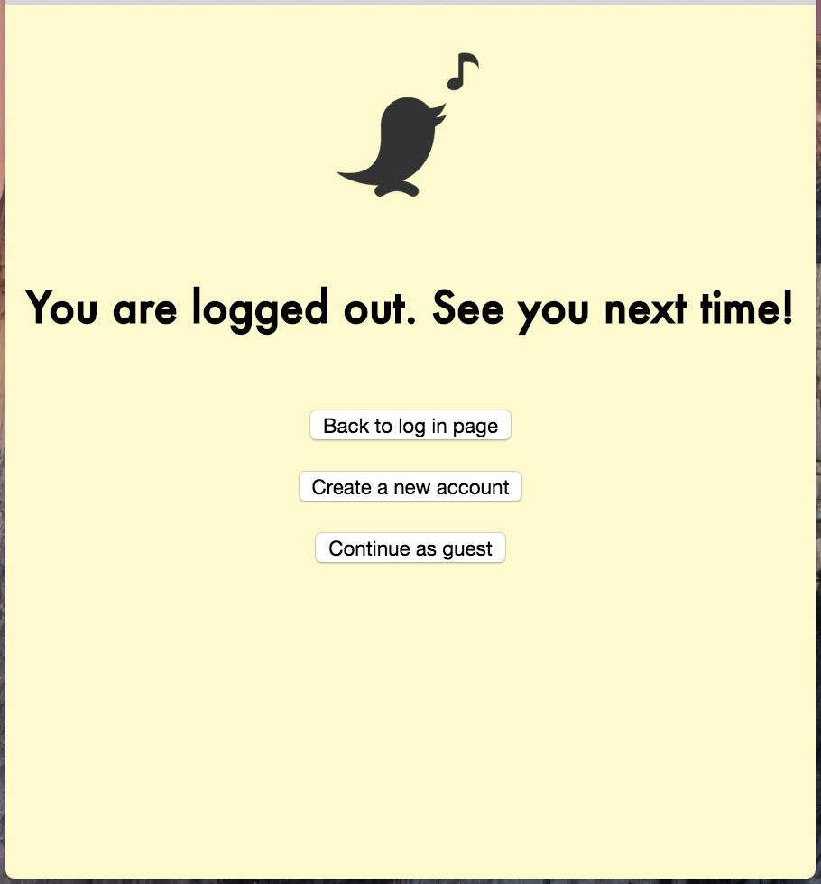
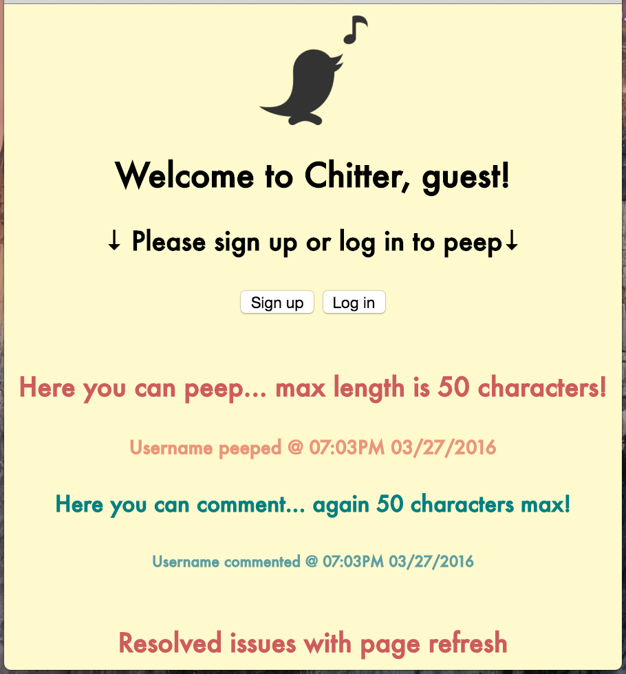

#### Makers Academy Week4 - Chitter challenge

### Forget about twitter, use Chitter! [](https://travis-ci.org/makersacademy/chitter-challenge)

### 1. Introduction
Chitter is a user-friendly web browser-based application that allows you to communicate with fellow chitters. You can choose to use it either as a guest or a registered user. As a guest, you can see others' peeps and comments. As a user, you are able to post and comment on peeps.

### 2. Development
Chitter is written in **Ruby 2.2.3** and has been developed using **Sinatra 1.4.7** ( https://github.com/sinatra/sinatra ). It uses **RSpec 3.2.2** as a platform for behaviour-driven development (BDD) in conjunction with **Capybara 2.6.2** ( https://github.com/jnicklas/capybara#using-capybara-with-rspec ) as an acceptance test framework. The continuous integration is assessed through Travis-CI with the latest test coverage of 100%.

Password encryption for safer services is provided by **bcrypt** ( https://github.com/codahale/bcrypt-ruby ). The Database is managed by **PostgreSQL** ( http://www.postgresql.org/ ), an open-source Object-Relational Database Management System (ORDBMS). The communication between the database and the application is performed via **DataMapper** ( http://datamapper.org/ ). Online version is supported by a cloud application platform **Heroku** ( https://www.heroku.com/ ).

### 3. Installation & How to use
#### Local mode :
1. Fork this repo
2. Copy the URL of the forked repo
3. Fire up terminal ( or equivalent ) and move to the desired directory, in which you want to create a clone of Chitter
4. Clone the forked repo : ```$ git clone URL```
5. Run bundle to install relevant gems : ```$ bundle install```
6. Run the programme with this command : ```$ rackup```
7. Check the port number in the terminal output. In the example below, it is *port=4567*
8. Open a preferred browser and type ```localhost:port number``` into the URL bar. ( e.g. ```localhost:9292``` if port number is 9292 )
9. The browser should display the sign-up page

Example of terminal output upon running ```$ rackup``` :
```
$ ruby mb_rpsls.rb
[2016-03-28 11:51:17] INFO  WEBrick 1.3.1
[2016-03-28 11:51:17] INFO  ruby 2.2.3 (2015-08-18) [x86_64-darwin14]
[2016-03-28 11:51:17] INFO  WEBrick::HTTPServer#start: pid=65398 port=9292
                                                                     ↑
                                                     This is the port number you need
                                                         to type into the URL bar
```
#### Remote mode :
The real fun comes with online version of Chitters! Sign up today and join the pack of friendly people. Available here:

https://chitter-app-misa.herokuapp.com

#### How to use :
Below is a quick demonstration of what your first chitter experience will look like.

1. Sign-up :

  Upon visiting the above link, you will be automatically redirected to sign-up page.

  Few things to consider :
  - username and email must be unique, so can't be used twice
  - password and password confirmation have to match

    

2. Home :

  Once you sign-up, you will be able to post your own peeps and/or comment on others posts.

  Please note :
  - peeps and comments can't be longer than 50 characters
  - be considerate to others... no nasty words please!

    

3. Posting a peep :

  Now it's time to post your first peep and introduce yourself to the pack :)

  

4. Commenting on a peep :

  Chitter is a place for two-way communication! Expand your circle by commenting on others posts and getting to know each other.

  

5. Log out :

  Once you're satisfied with your session, you can log out from the button on the top-right corner.

  

6. Guest mode :

  As a guest, you are not able to post but you can still see others' peeps and comments.

  


### 4. Authour
Misa Ogura
