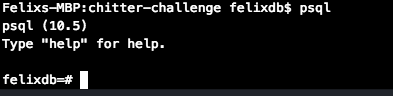

# Chitter Challenge

Welcome to Cheetah, the forum for all. Talk away your worries as yourself or as
an anonymous Cheetah. Know when the conversation happens by the timestamps and
stay relevant by contributing to the current topic.

## How to set up

### 1.  Install needed gems and modules
Type ```$ bundle ``` to auto install needed packages.

### 2.  Create tables in databases
In console you will need to use psql to manually create the tables, as I have
not added that functionality to the Rakefile. To do this you must type ```$ psql```
and you should see the following in your console (FELIX-MBP is my machine and felixdb
is the name of my user. Yours will be different.):



``` CREATE DATABASE ```

``` CREATE TABLE cheets(id SERIAL PRIMARY KEY, cheet VARCHAR(300), timestamp VARCHAR(60), username VARCHAR(60)); ```

``` CREATE TABLE cheetahs(id SERIAL PRIMARY KEY, username VARCHAR(300), password VARCHAR(60)); ```

### 3.  Rack up to start server

In console ```$ rackup ``` will start the server. If successful then you should
see


## Features:
-------

```
STRAIGHT UP

As a Maker
So that I can let people know what I am doing  
I want to post a message (peep) to chitter

As a maker
So that I can see what others are saying  
I want to see all peeps in reverse chronological order

As a Maker
So that I can better appreciate the context of a peep
I want to see the time at which it was made

As a Maker
So that I can post messages on Chitter as me
I want to sign up for Chitter

HARDER

As a Maker
So that only I can post messages on Chitter as me
I want to log in to Chitter

As a Maker
So that I can avoid others posting messages on Chitter as me
I want to log out of Chitter

ADVANCED

As a Maker
So that I can stay constantly tapped in to the shouty box of Chitter
I want to receive an email if I am tagged in a Peep
```
