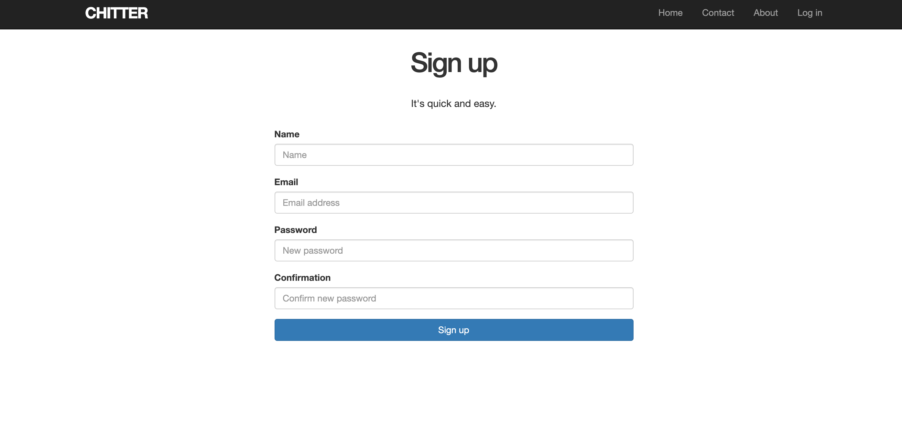
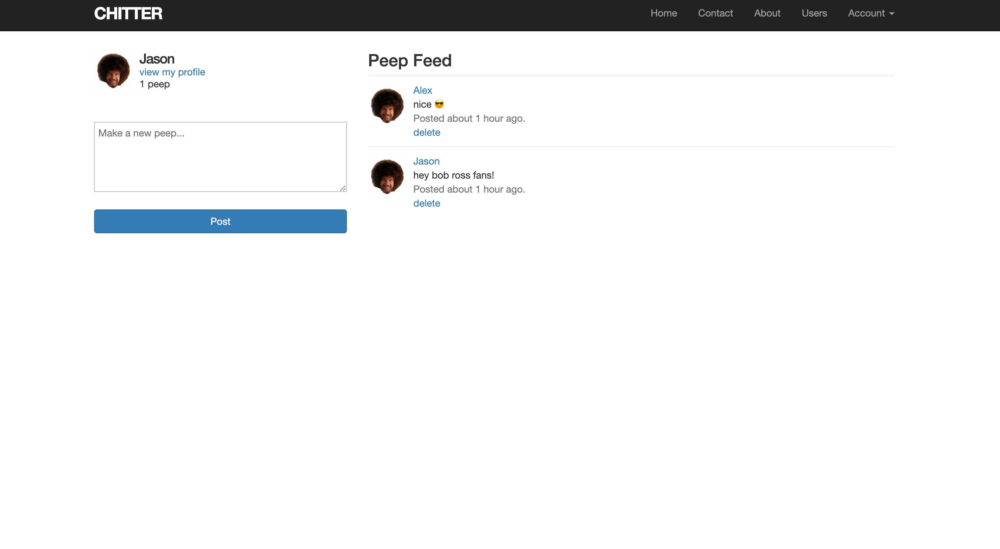
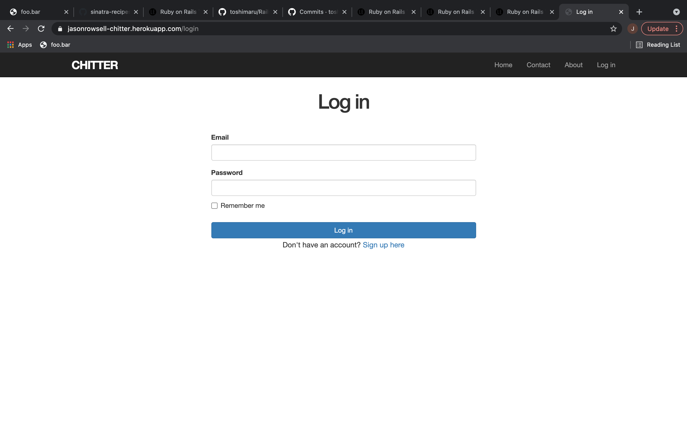

# Chitter Challenge 🦜

[](https://travis-ci.org/jasonrowsell/chitter-challenge)

A full-stack web app inspired by the functionality of Twitter. The web app allows the user to create an account, sign-in, and post a peep.

**Visit the website here: https://jasonrowsell-chitter.herokuapp.com/**

The features built in this project are based on [user stories.](./resources/user_stories.md)
The features built in this project are structured on a [CRC and process models.](./resources/plan.md)
The features built in this project were researched with a variety of [resources.](./resources/resources.md)

Design, layout, functionality, and features were inspired by Facebook and Twitter.

## Screenshots







## Getting Started

To get started with the app, clone the repo then install the required gems:

```sh
bundle install --without production
```

Next, migrate the database:

```sh
rails db:migrate
```

Run the test suite to verify that everything is working correctly.

```sh
rails test
```

If the test suite passes, run the app in a local server:

```sh
rails server
```

## Features

- Create an account
- Sign in with created account
- Post a (message) peep to the feed
- View all (messages) peeps on the main feed
- View own (messages) peeps on the profile feed
- View (messages) peeps of the chosen user's feed
- View other user profiles
- Remain logged in (remember token)
- Log out

## Built Using

- HTML
- CSS (Bootstrap)
- JavaScript
- jQuery
- Ruby
- Ruby on Rails
- PostgreSQL

### To-do

- Email verification
- View all users
- Followers
- Likes
- Reposts
- Edit credentials
- User bio
- Forgotten password reset
- Edit user (pfp, name)
- Two-factor authentication
- Image posts
