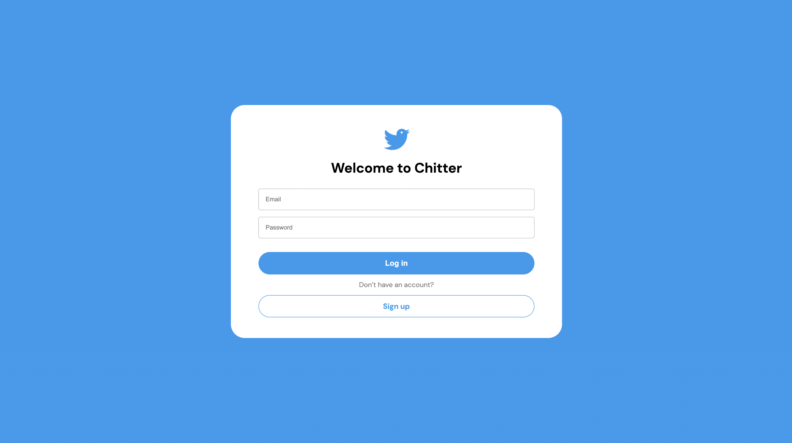
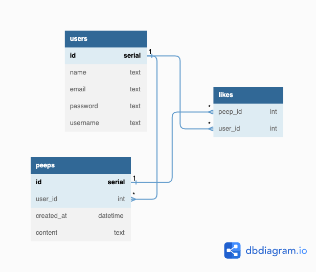

# Chitter Challenge

This project is one of the solo projects during the study at Makers. By combining all the skills I learnt from previous weeks, I was aksed to clone Twitter with test-driven approach and object-oriented design. `Ruby`, `Postgresql`, `RSpec`, `Sinetra`, `Active Record` will be used in this project.

I took `Twitter` as the blueprint of this app. Users have to login in order to read peeps from others or create a peep.

➡️ Application Demo: [link](https://chitter-4v2b.onrender.com/)



## Table of Contents

- [Chitter Challenge](#chitter-challenge)
  - [Table of Contents](#table-of-contents)
  - [User Stories](#user-stories)
    - [STRAIGHT UP LEVEL](#straight-up-level)
    - [HARDER LEVEL](#harder-level)
    - [ADVANCED LEVEL](#advanced-level)
  - [Database Diagrams](#database-diagrams)
  - [MVC Model - ActiveRecord](#mvc-model---activerecord)
    - [Models](#models)
    - [Migrations](#migrations)
    - [Controllers/Routes](#controllersroutes)
  - [Getting Started](#getting-started)
    - [1. Install Dependencies](#1-install-dependencies)
    - [2. Set Up `.env` file](#2-set-up-env-file)
    - [3. Set Up Database](#3-set-up-database)
    - [4. Run Tests](#4-run-tests)
    - [5. Start Development Server](#5-start-development-server)
    - [6. Deployment](#6-deployment)
  - [Chitter Future Roadmap](#chitter-future-roadmap)
  - [Dependencies](#dependencies)
  - [Contributors](#contributors)

## User Stories

Makers gave me instructions on how I could start to work on this project. Details can be viewed [here](docs/instructions.md).

Here are the user stories as a starting point of the development of this app.

### STRAIGHT UP LEVEL

As a Maker, I want to:

- post a message (peep) to chitter
- see all peeps in reverse chronological order
- see the time at which it was made
- sign up for Chitter

### HARDER LEVEL

As a Maker, I want to:

- log in to Chitter
- log out of Chitter

### ADVANCED LEVEL

As a Maker, I want to:

- receive an email if I am tagged in a Peep

## Database Diagrams

This project used relational database - `Postgresql` for data storage. Here is the diagram to show the relationships among tables.

> Please note that `Likes` table has not effect on this app in this stage. A 'like' function is planned to be implemented in the near future so this table has been pre-defined in this app.



---

## MVC Model - ActiveRecord

This project used `Active Record` as the tool for object relational mapping. This framework applies `MVC(Model-View-Controller) model` to this app. It is the same concpet of a `Ruby on Rails` app.

### Models

Models are defined in `Models` folder ([link](models)). For example, if you define a model called `User`, `ActiveRecord` will create all the methods you need to interact with database automatically.

You can take a look at the following example. Not only the methods, this file also defines relationship with other classes.

```ruby
# file: models/user.rb

class User < ActiveRecord::Base
  # this liine is a special method to implement Bcrypt for 'password'
  has_secure_password
  # Validations for inputs
  validates :email, presence: true, uniqueness: true
  validates :username, presence: true, uniqueness: true
  validates :name, presence: true
  # Relationship with Peep model and its table
  has_many :peeps, through: :likes
end
```

### Migrations

Migrations for the database are handle by the gem `rake`. You can modify the config in [this file](Rakefile). You can create a new migration by running `rake db:generate_migration` and migrate all changes to the database by running `rake db:migrate`.

All migration files and seeds are put in [this folder](db). As for the commands to control `rake`, please run `rake -T` for details.

### Controllers/Routes

The routes from `Sinatra` act like controllers in this MVC model. They mange the logics of how to handle inputs and interact with database by using the pre-defined models.

## Getting Started

Please make sure your local machine gets `Ruby` installed. If not, please visit [this link](https://www.ruby-lang.org/en/documentation/installation/). Get the code by running `git clone`.

### 1. Install Dependencies

To install all dependencies you need to run this project, `cd` to the folder and run the following command.

```
bundle
```

---

### 2. Set Up `.env` file

To set up the environment variables that this app needs, you can modify `.env.teamplate` ([link](.env.template)).

```sh
# MODE tells your server and activerecord (for migration) which db to use
MODE= # production / development(default) / test

# Your database details for 'production' mode
# You might not need them if you only want to run tests or develop
HOST_PRODUCTION=
USERNAME_PRODUCTION=
PASSWORD_PRODUCTION=
```

---

### 3. Set Up Database

Before running the following commands, please make sure `postgresql` has been installed in your local machine. If not, please visit [this website](https://www.postgresql.org/download/).

Then run the following commands to create the seed database.

```sh
rake db:create
rake db:migrate
rake db:seed # This line will set up chitter_development
rake db:seed RACK_ENV=test # This line will set up chitter_test
```

---

### 4. Run Tests

Once your database is ready, you can run the following command to test the app.

```sh
# Runs all tests
rspec
```

---

### 5. Start Development Server

After all tests passed, the app is ready to run. If you want to run a development server, you have to make sure `MODE=development` is included in `.env` file.

Then run the following command:

```sh
rackup
```

---

### 6. Deployment

If you want to deploy the app, please make sure `MODE=production` is written in your `.env` file. `HOST_DATABASE`, `HOST_USERNAME` and `HOST_PASSWORD` have to be filled too.

The final step will be to run `rake db:create` and `rake db:migrate` to set up the production database.

## Chitter Future Roadmap

There are some features I'd like to add to the app in the near future.

- Responsive layout for tablet and mobile
- 'Like' function
- 'Tag your friend' function
- Personal profile page
- Expandable and also collapsible side menu
- set up CI/CD by using `CircleCI`

## Dependencies

Version of each dependency can be viewed in [this Gemfile](Gemfile). Here is the list showing all dependecies this project used.

- Ruby
- RSpec
- Sinatra
- Bcrypt
- Postgresql
- ActiveRecord
- Rake
- dotenv
- Rack-flash3

## Contributors

- [@terryhycheng](https://github.com/terryhycheng)
