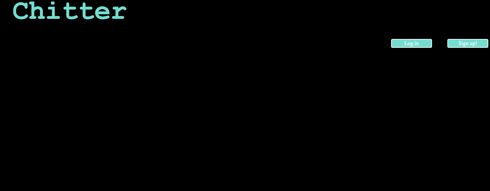
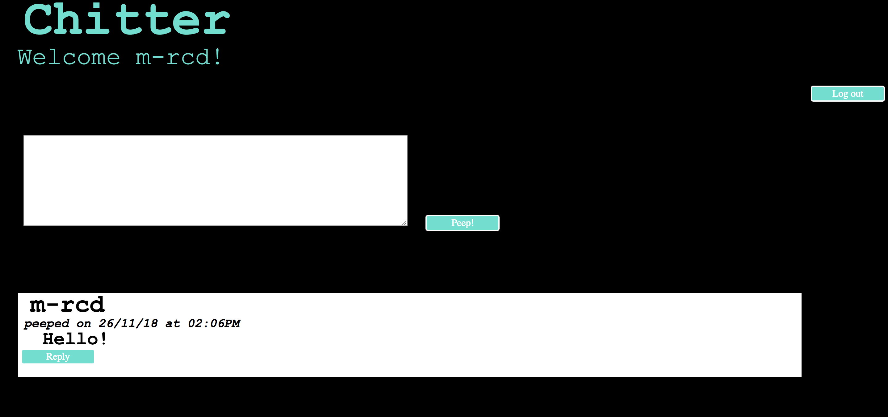
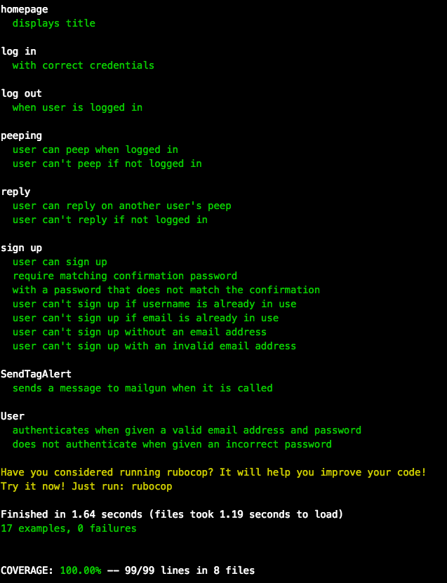

Chitter Challenge
=================

[User Stories](#user-stories) |  [Technologies](#technologies) | [User Interaction and Interaction](#experience) | [Running the App](#running-the-app) | [Running tests](#running-tests)  | [Contributing](#contributing) 

This is a  small Twitter clone that will allow the users to post messages to a public stream.

<a name="user-stories"> User stories</a>
-------

```
As a Maker
So that I can let people know what I am doing  
I want to post a message (peep) to chitter

As a maker
So that I can see what others are saying  
I want to see all peeps in reverse chronological order

As a Maker
So that I can better appreciate the context of a peep
I want to see the time at which it was made

As a Maker
So that I can post messages on Chitter as me
I want to sign up for Chitter

As a Maker
So that only I can post messages on Chitter as me
I want to log in to Chitter

As a Maker
So that I can avoid others posting messages on Chitter as me
I want to log out of Chitter

As a Maker
So that I can stay constantly tapped in to the shouty box of Chitter
I want to receive an email if I am tagged in a Peep

As a Maker
So that I can talk with my friends
I want to be able to reply to Peeps
```

<a name="technologies" >Technologies</a>
---
- ruby
- Sinatra
- Sinatra flash to alert users when username or email already taken, or when wrong credentials
- Datamapper: ORM to manage databases
- mailgun-ruby: to send emails when users are tagged
- bcrypt: to keep users' passwords secure
- Capybara to feature test the app
- RSpec to test the logic
- rubocop to correct syntax errors
- Heroku

<a name="experience">User Interaction and Interaction</a>
---




<a name="running-the-app"> Running the app</a>
---
- Clone this repository
```
 $ git clone https://github.com/m-rcd/chitter-challenge
 $ cd chitter-challenge
 ```
- Install dependencies

  ```
  $ gem install
  ```
- Run the app
  ```
  $ rackup
  ```
- In your browser, go to localhost
  ```
  localhost:9292
  ```

<a name="running-tests">Running tests</a>
---

- In terminal, run rspec
  ```
  $ rspec
  ```


<a name="contributing"> Contributing </a>
---
Pull Requests are always welcome.

When you edit the code, please run `rspec` to check all the tests pass. Also run `rubocop` before you git commit.

Ensure the PR description clearly describes the problem and solution. It should include the relevant issue number, if applicable.


[Sign up!](https://chitter0.herokuapp.com/)
