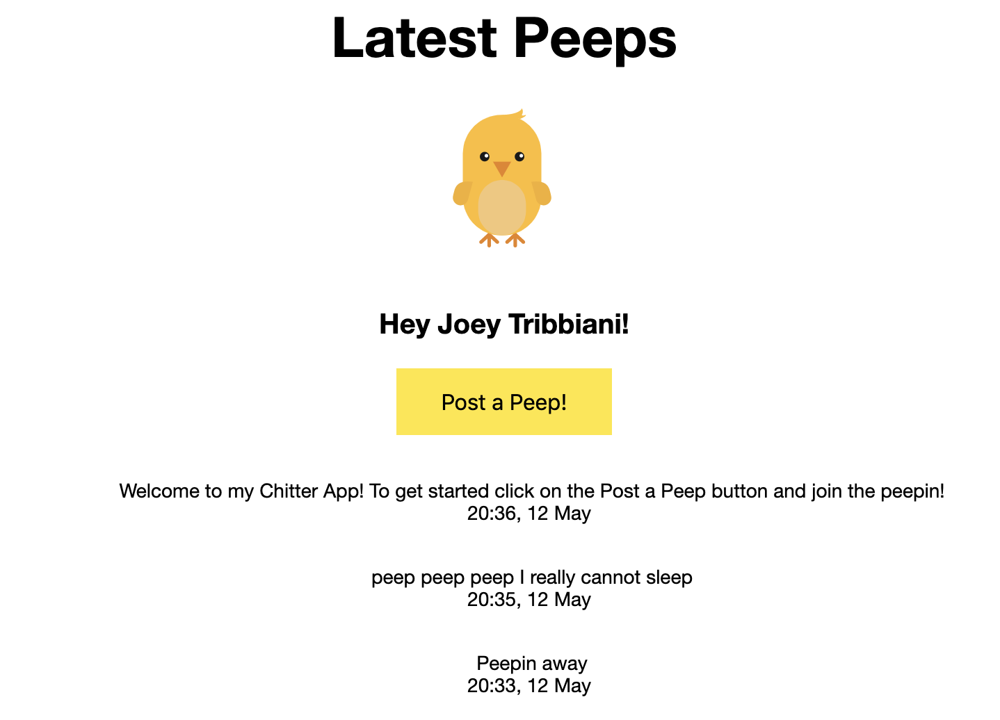

# Chitter Challenge
-------

This is the Makers Academy Week 4 weekend challenge, which gave me the opportunity to practice building web apps using databases. The challenge was to build a small Twitter clone that will allow users to post messages to a public stream.

## Status
All 4 user stories complete. MVP achieved :)

## Technologies used
### Development Environment
* Languages: Ruby, SQL
* Framework: Sinatra

### Testing Environment
* Feature Testing: Rspec, Capybara
* Unit Testing: Rspec

### Database
* PostgreSQL
* PG gem, psql


## User stories:
-------

```
STRAIGHT UP

As a Maker
So that I can let people know what I am doing  
I want to post a message (peep) to chitter

As a maker
So that I can see what others are saying  
I want to see all peeps in reverse chronological order

As a Maker
So that I can better appreciate the context of a peep
I want to see the time at which it was made

As a Maker
So that I can post messages on Chitter as me
I want to sign up for Chitter

```

## How to install the program:
------

### Set up the databases
You will need to set up local databases in order to run and test this program. Firstly, please ensure that postgreSQL is installed. If not, type `brew install postgresql` into your command line.

From the command line, run `createdb <user>` Swap '<user>' for the username on your machine. I.e. I typed `createdb jordan`.

### Complete the set up
1. Clone this repo
2. Run `bundle install` from the command line to install all the necessary gems
3. The final step is to run `psql -f ./db/migrations/01_create_peeps_table.sql` and `psql -f ./db/migrations/users.sql`, which will run the scripts in the `db/migrations` folders and set up the tables you need.

## How to run the program:
------

1. Enter `rackup -p 1234` into the command line, substituting '1234' for any port number you wish.  
2. Visit http://localhost/1234 (or substitute port)
3. You will be prompted to sign up - please enter a name, email and password.
4. This will redirect you to the most recent peeps. You can scroll through these or post your own peep by clicking on the "Post a Peep" button.
5. Happy Peeping!


<div align="center">
    
</div>


## Learning objectives covered:
------
1. Building a simple web app with a database
2. Following an effective debugging process for database applications
3. Better understanding of how databases work (e.g. tables, SQL, basic relationships)
4. How to use tools such as TablePlus when using databases
5. Further practice with Agile and TDD

## Acknowledgments:
------
Jordan Roberts - Makers Academy Challenge
