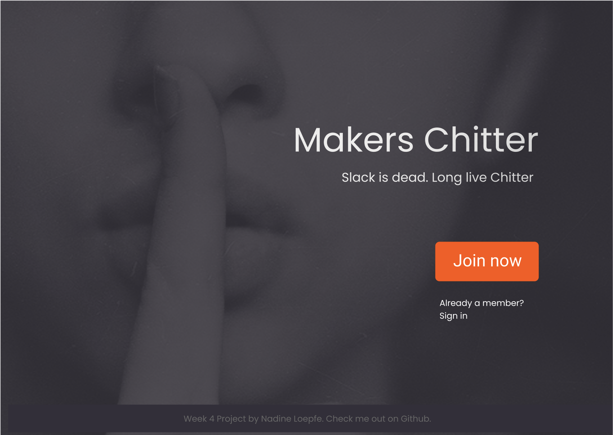

Chitter Challenge
=================


Write a small Twitter clone, make it look awesome.


Features:
-------

```
STRAIGHT UP

As a Maker
So that I can let people know what I am doing  
I want to post a message (peep) to chitter

As a maker
So that I can see what others are saying  
I want to see all peeps in reverse chronological order

As a Maker
So that I can better appreciate the context of a peep
I want to see the time at which it was made

As a Maker
So that I can post messages on Chitter as me
I want to sign up for Chitter

HARDER

As a Maker
So that only I can post messages on Chitter as me
I want to log in to Chitter

As a Maker
So that I can avoid others posting messages on Chitter as me
I want to log out of Chitter

ADVANCED

As a Maker
So that I can stay constantly tapped in to the shouty box of Chitter
I want to receive an email if I am tagged in a Peep
```


Functionality:
------

* You don't have to be logged in to see the peeps.
* Makers sign up to chitter with their email, password, name and a username (e.g. samm@makersacademy.com, password123, Sam Morgan, sjmog).
* The username and email are unique.
* Peeps (posts to chitter) have the name of the maker and their user handle.
* Your README should indicate the technologies used, and give instructions on how to install and run the tests.


Design Choices:
-----



I took this challenge as an opportunity to brush up on CSS flexbox and using containers, as this was always something I've found quite difficult.


How to actually use it:
------

data base setup blabla will write later blah
