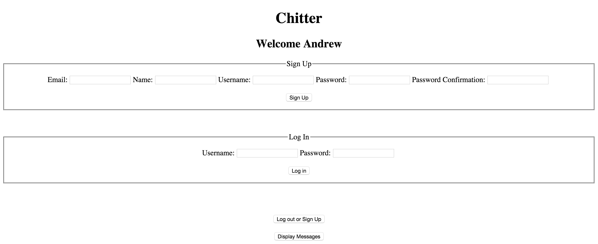
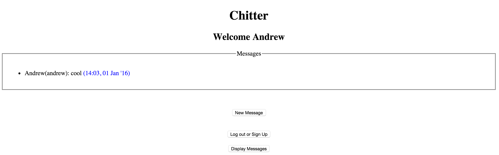
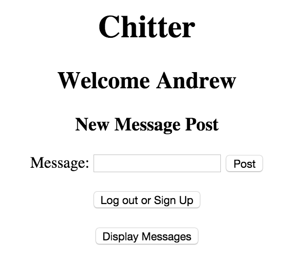

# Chitter Challenge

This is a solution to Makers Academy's [Chitter Challenge](https://github.com/makersacademy/chitter-challenge). This creates a [Sinatra](http://www.sinatrarb.com) application that mimics Twitter. This uses a test-driven approach with both unit tests using [RSpec](http://rspec.info) and feature tests using [Capybara](https://github.com/jnicklas/capybara).


##Installation Instructions

This program requires a database to operate. [PostgreSQL](http://postgresapp.com) was the database
used by the author of the program.

Run the following in the command line:

```
$ git clone git@github.com:Andrew47/chitter-challenge.git
$ bundle
$ createdb chitter_development
$ rake auto_migrate
$ rspec
$ rackup
```

Then use following URL: [http://localhost:9292/](http://localhost:9292/)

##Guide to using the program

###Home-page

To see posted messages, click 'Display Messages'. Otherwise, 'Sign Up' if you are
a new user, or 'Log In' if you are a returning user.



###Messages Page

Messages are displayed in reverse chronological order. The time of posting is in
blue. To post a new message, click 'New Message'.



###New Message Post Page

Type the text in the box, and then click post. Then your message should be
displayed.


