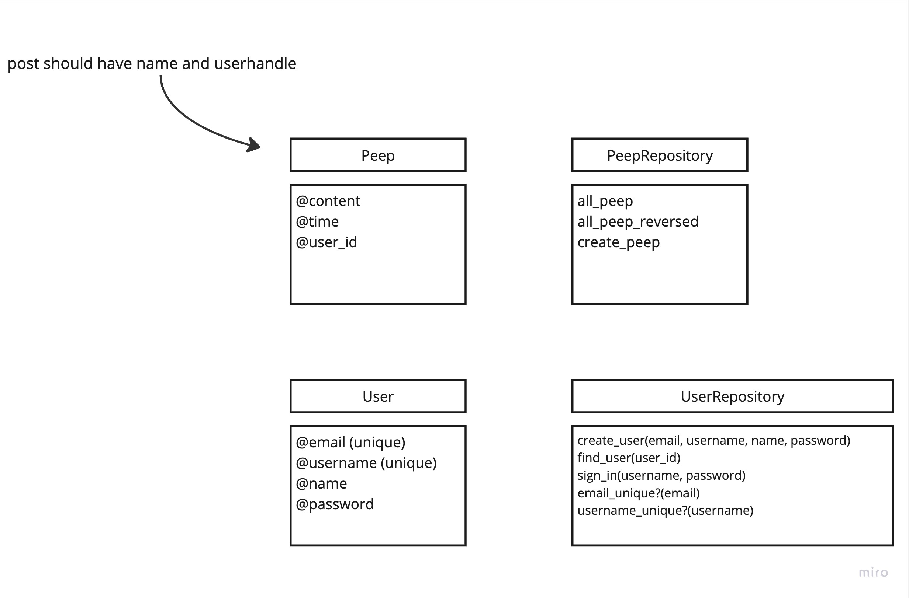
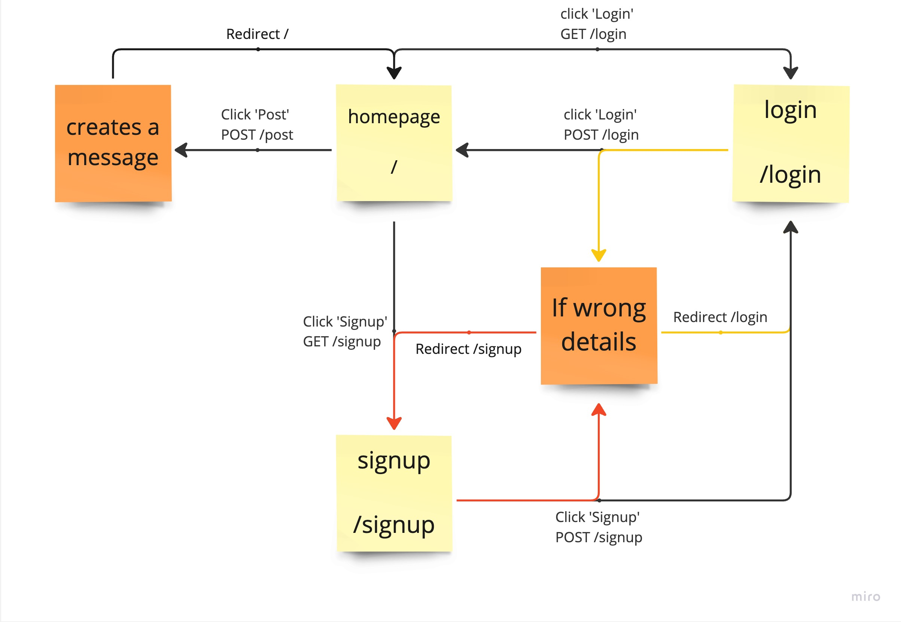

Chitter Challenge
=================

Challenge:
-------
To write a small Twitter clone that will allow the users to post messages to a public stream.

Features:
-------

```
STRAIGHT UP

As a Maker
So that I can let people know what I am doing  
I want to post a message (peep) to chitter

As a maker
So that I can see what others are saying  
I want to see all peeps in reverse chronological order

As a Maker
So that I can better appreciate the context of a peep
I want to see the time at which it was made

As a Maker
So that I can post messages on Chitter as me
I want to sign up for Chitter

HARDER

As a Maker
So that only I can post messages on Chitter as me
I want to log in to Chitter

As a Maker
So that I can avoid others posting messages on Chitter as me
I want to log out of Chitter

ADVANCED

As a Maker
So that I can stay constantly tapped in to the shouty box of Chitter
I want to receive an email if I am tagged in a Peep
```

Notes on functionality:
------

* You don't have to be logged in to see the peeps.
* Makers sign up to chitter with their email, password, name and a username (e.g. samm@makersacademy.com, password123, Sam Morgan, sjmog).
* The username and email are unique.
* Peeps (posts to chitter) have the name of the maker and their user handle.

Initial Planning:
------
**Multi-Class System**



**Pages Plan**


Technologies used:
------
Programming language:
* Ruby

Libraries:
* RSpec for testing
* SimpleCov for code coverage reporting
* SimpleCov-Console for displaying code coverage results in the console
* Timecop for mocking dates and times in tests

Tools:
* Rubocop for static code analysis and linting
* PostgreSQL as the database
* WEBrick as the web server
* HTML for structuring the web pages
* CSS for  styling the web pages

Frameworks:
* Sinatra as the web framework
* Sinatra-Contrib for additional Sinatra extensions
* Rack-Test for testing web applications

Instruction on how to install and run the tests:
------
Make sure you are in the chitter-challenge directory and execute the commands below in the command line:

1. Check if ruby version is 3.0.2 in the command line:

```bash
ruby -v
```

2. if using a different version, install ruby 3.0.2 in the command line:

```bash
$ rvm install ruby-3.0.2
```

3. Install Bundler:  # Package manager

```bash
$ gem install bundler
```

4. Use Bundler to install all necessary packages: # install all the packages in the gem file

```bash
$ bundle install
```

5. create the database for testing:

```bash
$ createdb chitter_database_testing
```

6. import SQL script file into the PostgreSQL database:

```bash
$ psql -h 127.0.0.1 createdb chitter_database_testing < chitter_tables.sql
```

7. execute `rspec` to run the tests:

```bash
$ rspec
```

Link to the Chitter website:
------
(https://md-chitter-app.onrender.com/)
