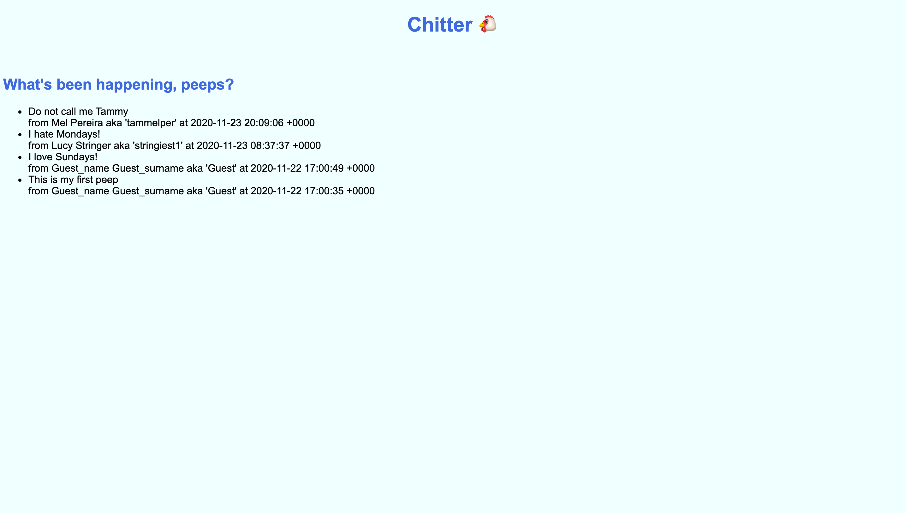
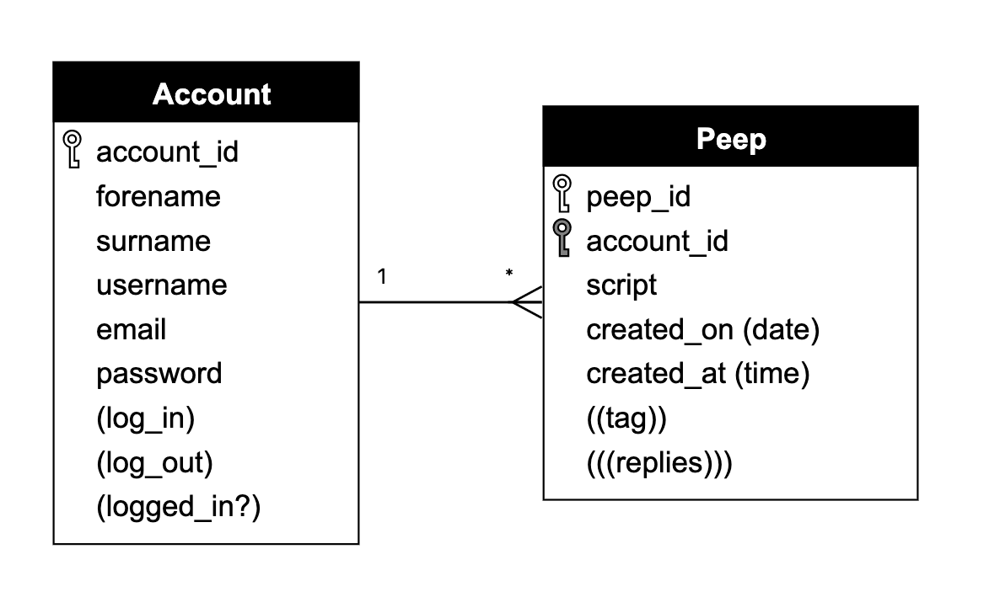
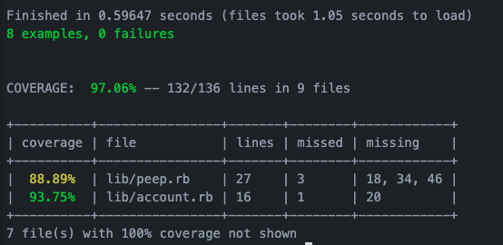

# Chitter Challenge

Build a small Twitter clone that will allow the users to post messages to a public stream.

## Motivation
This was the week 4 weekend challenge for Makers Academy.

## Peeps display



## How to use the program

### Cloning the repo & installing the necessary gems
```sh
$ git clone git@github.com:stringiest/chitter-challenge.git
$ cd chitter-challenge
$ bundle
```

### Creating the database
1. Connect to `psql`
2. Create the database using the `psql` command `CREATE DATABASE chitter_challenge;`
3. Connect to the database using the `psql` command `\c chitter_challenge;`
4. Run the query we have saved in the file `01_create_account_table.sql`
5. Run the query we have saved in the file `02_create_peeps_table.sql`

### Setting up the test database
1. Connect to `psql`
2. Create the database using the `psql` command `CREATE DATABASE chitter_challenge_test;`
3. Connect to the database using the `psql` command `\c chitter_challenge_test;`
4. Run the query we have saved in the file `01_create_account_table.sql`
5. Run the query we have saved in the file `02_create_peeps_table.sql`

### To run the Chitter app:
```
rackup -p 3000
```
Then navigate to localhost:3000 on your web browser to use the app.

## Challenge Progress
Completed the 'straight up' user stories.  

Outstanding functionality:
* username & email are unique  

To improve the code I would:
* tackle the 'harder', 'advanced' and 'bonus user stories'

To improve the feel of the app I would:
* add a logo!
* improve the layout of existing peeps



### Test coverage



## Main focuses for this week

- Agile and TDD
- Engineering and 'Dev Recipes'
- Databases
- Tooling

## Notes on functionality:

* You don't have to be logged in to see the peeps.
* Makers sign up to chitter with their email, password, name and a username (e.g. samm@makersacademy.com, password123, Sam Morgan, sjmog).
* The username and email are unique.
* Peeps (posts to chitter) have the name of the maker and their user handle.

## User stories

### STRAIGHT UP
```
As a Maker
So that I can let people know what I am doing  
I want to post a message (peep) to chitter

As a maker
So that I can see what others are saying  
I want to see all peeps in reverse chronological order

As a Maker
So that I can better appreciate the context of a peep
I want to see the time at which it was made

As a Maker
So that I can post messages on Chitter as me
I want to sign up for Chitter
```

### HARDER
```
As a Maker
So that only I can post messages on Chitter as me
I want to log in to Chitter

As a Maker
So that I can avoid others posting messages on Chitter as me
I want to log out of Chitter
```

### ADVANCED
```
As a Maker
So that I can stay constantly tapped in to the shouty box of Chitter
I want to receive an email if I am tagged in a Peep
```

### BONUS
```
As a maker
In order to start a conversation
I want to reply to a peep from another maker
```
