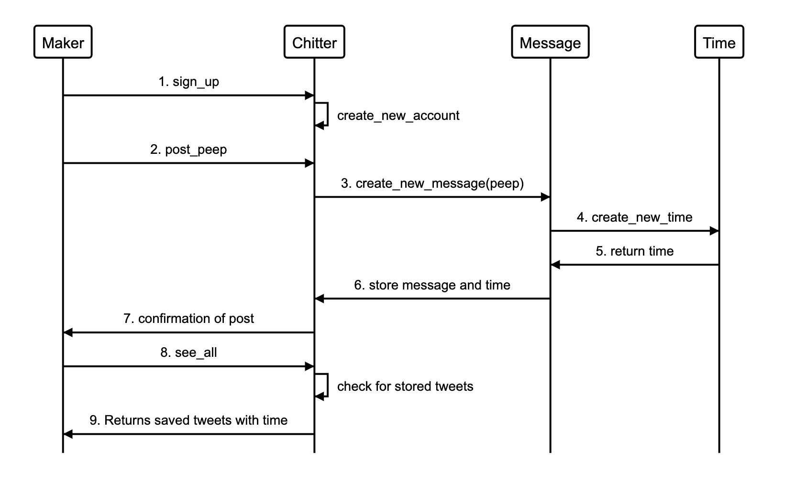
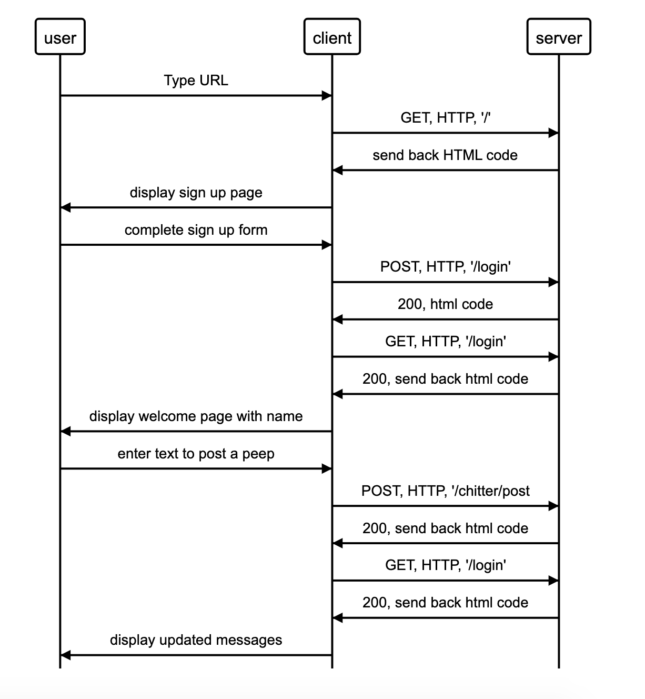

# Steps 

Set up a web project. (Sinatra, Capybara and rspec)





### User story 1

```
As a Maker
So that I can post messages on Chitter as me
I want to sign up for Chitter
```

- Feature test: Maker can sign up to Chitter. 
- Wrote capybara test. RED: Test failed 
- Added Index.erb with form in views folder
- Feature test passed. GREEN: Test passed
- Refactored code 
<hr>

- Feature test: Login page. Users can see their welcome name.
- Wrote capybara test. RED: Test failed
- Added welcome return to ‘/login’ route in app.rb
- Feature test passed. GREEN: Test passed
<hr>

- Creating a Chitter database
- Database called chitter created in Postgresql.
- Extracting Logic to the Model. (rewrite bullet points)
- Wrote a unit test for Account instance to return username. RED. Test failed.
- Defined Account class in lib folder with correct return. GREEN. Test passed.

### User story 2

```
As a Maker
So that I can let people know what I am doing  
I want to post a message (peep) to chitter
```

- Feature test: Maker can post a peep. 
- Wrote feature test: User can submit message to send. RED: Test failed.
