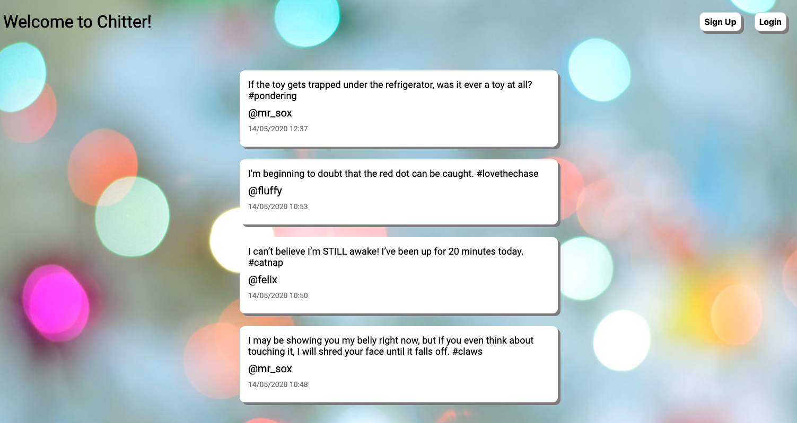
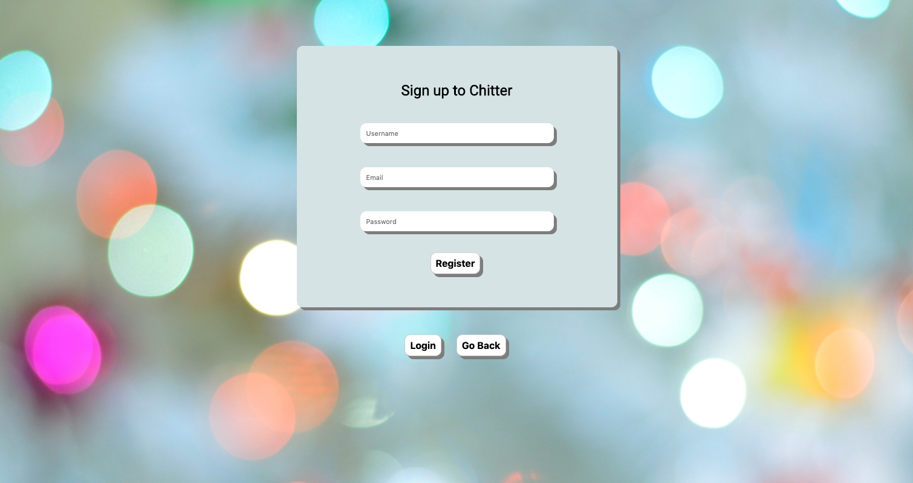
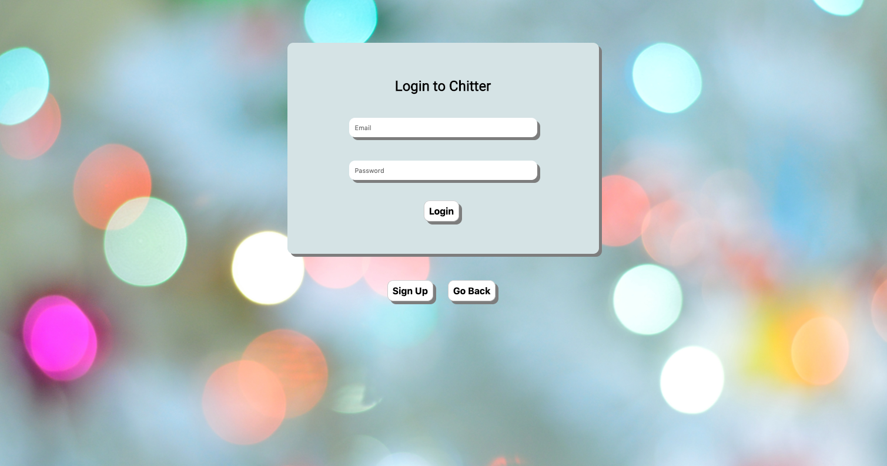
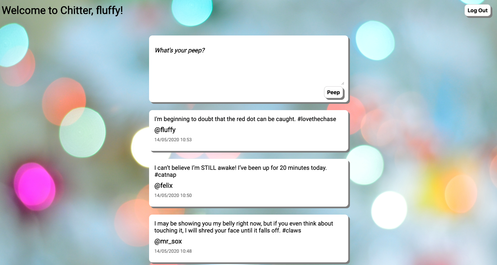

Chitter
===================

This is a project created during my time as a student at Makers. The requirements were to create a Twitter clone using Sinatra, PostgreSQL and ActiveRecord.

**Travis build status:**


Getting Started
===================

#### Setup

Prerequisites:

- You will need Bundler and PostgreSQL installed.

To use this project:

- `git clone` this repo to your local machine
- `cd` into the folder

#### Dependencies

To install dependencies:

```
$ bundle install
```

This project relies on the following dependencies:

- bcrypt
- pg
- rake
- sinatra
- sinatra-activerecord
- sinatra-flash
- sinatra-partial

#### Database

To setup the database:

```
$ bundle exec rake db:create
$ bundle exec rake db:migrate
```

#### Run the App

To start up the app:

```
$ rackup
```

Then navigate to `localhost:9292` in your browser.

#### Interacting with the App

Main page:


Sign up page:


Login page:


Main page when logged in:


Running Tests
===================

This project is setup with:

- Capybara
- RSpec
- SimpleCov
- Rubocop

To run the tests:
```
$ bundle exec rspec
$ bundle exec rubocop
```

All tests and linting pass with 100% test coverage. Travis CI is used to ensure all tests pass on each commit.

Criteria for Building the Project
===================

#### Approach

My first attempt at this project involved setting up a database connection using PG, which took a considerable amount of time to get up and working as well as fully tested. I was therefore not able to implement many of the required features. I later came back to the project with some knowledge of ActiveRecord and was able to complete all the requirements.

Starting the project over and with the user stories provided below, I first implemented the user model using ActiveRecord and ensured that the sign up, login and logout features were fully working. Setting up the user first helped to ensure that all the paths in my app were as I wanted them, which made it easier to implement the peep features on the main page. Especially considering that a user can only post a peep once signed up.

Implementing the peep features was relatively straightforward after this point as I was able to utilise ActiveRecord's timestamps to store the date the peep was created and also link the peep to the current user using a database foreign key.

To make the app look more streamlined, I opted to keep the 'new peep' form on the main page above the list of posted peeps. At first, I kept my routes and views simple by having an index, register and login view. The index page contained all the peeps and the new peep form. However, I realised later that my app needed to be more RESTful. I therefore refactored the main app controller into separate Users, Peeps and Sessions controllers. And then refactored the views and routes using Sinatra Partials to segregate out the various different parts of the site, as per below.

```
├── views
│   ├── sessions
│   │   ├── login.erb
│   ├── users
│   │   ├── register.erb
│   ├── _header.erb
│   ├── _newpeep.erb
│   ├── _peeps.erb
│   ├── index.erb
│   ├── layout.erb
```

#### Domain Model

|Models | Methods | State |
|:-------|:-------|:-------|
| User | sign_up, login, logout | username, email, password |
| Peep | create, all | message, user_id, created_at |

#### User Stories

```
As a user
So that I can post messages on Chitter as me
I want to sign up for Chitter

As a user
So that only I can post messages on Chitter as me
I want to log in to Chitter

As a user
So that I can avoid others posting messages on Chitter as me
I want to log out of Chitter

As a user
So that I can let people know what I am doing
I want to post a peep to chitter

As a user
So that I can see what others are saying
I want to see all peeps in reverse chronological order

As a user
So that I know who posted the peep
I want to see the name of the user who posted the peep
```

#### Acceptance Criteria

The above user stories were implemented with the following criteria in mind:

Sign up:
- [x]  the user does not need to be signed up to view peeps
- [x]  from the main page, the user can click on the Sign Up button and is redirected to a sign up page
- [x]  the sign up page prompts them to enter in their username, email and password
- [x]  the password is encrypted for security purposes
- [x]  when the user submits their details, they are logged in and redirected back to the peeps page
- [x]  the user's name appears in the welcome message
- [x]  the user can only sign up with the same username or email once, otherwise they see a helpful message to indicate why their details were not valid

Login:
- [x]  from the main page, the user can click on the Login button and is redirected to a login page
- [x]  the login page prompts them to enter in their email address and password
- [x]  when the user submits their details, they are logged in and redirected to the peeps page
- [x]  if the user provides incorrect details, they recieve a helpful message to indicate their details are incorrect
- [x]  the user is able to logout

Peeps:
- [x]  the user can only post a peep once signed up or logged in
- [x]  the peeps in appear in reverse chronological order
- [x]  the peeps show who posted them
- [x]  the peeps show the time that they were posted

#### Further development

This project can be developed further with the following features:

- Password confirmation on sign up
- User profile and image
- User can delete or modify account
- User can delete or modify own peeps
- User can post images
- User can like peeps
