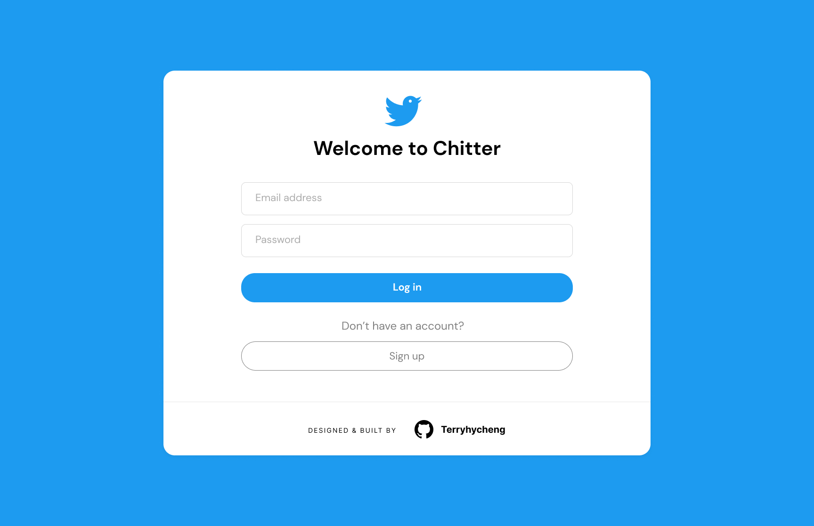

# Chitter Challenge

This project is one of the solo projects during the study at Makers. By combining all the skills I learnt from previous weeks, I was aksed to clone Twitter with test-driven approach and object-oriented design. `Ruby`, `Postgresql`, `RSpec`, `Sinetra`, `Active Record` and `Figma` will be used in this project.

I took `Twitter` as the blueprint of this app. Users have to login in order to read peeps from others or create a peep.



<!-- ➡️ Application Demo: [link](https://www.google.com) -->

➡️ Figma Demo: [link](https://www.figma.com/file/f4rYLrUdqjwXm0GrsHvBXv/Chitter---Twitter-Clone?node-id=0%3A1&t=Es3QajIJr0ajuMtW-1)

## Table of Contents

- [Chitter Challenge](#chitter-challenge)
  - [Table of Contents](#table-of-contents)
  - [Requirements \& Planning](#requirements--planning)
    - [User Stories](#user-stories)
    - [Database Diagrams](#database-diagrams)
    - [ORM - Object Relational Mapping](#orm---object-relational-mapping)
  - [Class \& Test Designs](#class--test-designs)
    - [Classes](#classes)
    - [Tests](#tests)
  - [Getting Started](#getting-started)
  - [Dependencies](#dependencies)
  - [Contributors](#contributors)

## Requirements & Planning

### User Stories

```
STRAIGHT UP

As a Maker
So that I can let people know what I am doing
I want to post a message (peep) to chitter

As a maker
So that I can see what others are saying
I want to see all peeps in reverse chronological order

As a Maker
So that I can better appreciate the context of a peep
I want to see the time at which it was made

As a Maker
So that I can post messages on Chitter as me
I want to sign up for Chitter

```

```
HARDER

As a Maker
So that only I can post messages on Chitter as me
I want to log in to Chitter

As a Maker
So that I can avoid others posting messages on Chitter as me
I want to log out of Chitter
```

```
ADVANCED

As a Maker
So that I can stay constantly tapped in to the shouty box of Chitter
I want to receive an email if I am tagged in a PeepSTRAIGHT UP
```

### Database Diagrams

This project used relational database - `Postgresql` for data storage. Here is the diagram to show the relationships among tables.


### ORM - Object Relational Mapping

This project used `Active Record` as ORM tool.

## Class & Test Designs

### Classes

```ruby

```

### Tests

```ruby

```

## Getting Started

## Dependencies

## Contributors

- [@terryhycheng](https://github.com/terryhycheng)
