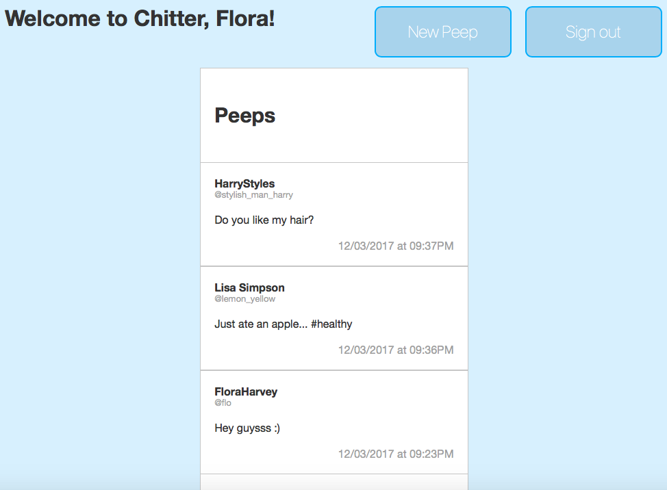

Chitter Challenge
=================

A clone of Twitter that allows users to post messages to a public stream.

User stories:
-------

```
As a Maker
So that I can post messages on Chitter as me
I want to sign up for Chitter

As a Maker
So that I can post messages on Chitter as me
I want to log in to Chitter

As a Maker
So that I can avoid others posting messages on Chitter as me
I want to log out of Chitter

As a Maker
So that I can let people know what I am doing  
I want to post a message (peep) to chitter

As a maker
So that I can see what others are saying  
I want to see all peeps in reverse chronological order

As a maker
So that I can better appreciate the context of a peep
I want to see the time at which it was made
```

Notes on functionality:
------
* Users sign up to chitter with their email, password, name and a user name.
* Peeps (posts to chitter) have the name of the user, their username, and the date and time posted.
* Passwords are secured with BCrypt
* You don't have to be logged in to see the peeps.
* You only can peep if you are logged in.

How to use
----
https://chitter-chat-app.herokuapp.com/
- Sign up with name, username, email, and password
- Start peeping!

How to download and run tests
-----
- Clone repository
- In the Command Line do 'gem install bundler', then 'bundle', to download the necessary gems
- Run 'rspec' from within the root to run tests
- Run 'coveralls report' to view test coverage

Technologies used
-----
Sinatra, Capybara, RSpec, Heroku, DataMapper, DatabaseCleaner, BCrypt

How it looks
-----


Issues I encountered
--------
- Getting datamapper gem to work correctly - struggled to upgrade an old version.
- When I added a one-to-many relationship between user and peeps, existing peeps which had null values in the user_id column kept making rackup fail until I realised and deleted them.
- BCrypt - realising that using 'password_digest' is necessary, and 'password_hash' will not work!
- Using DataMapper's DateTime stamp, and then testing with Capybara!

Thing I would do if I had more time...
-----
- Add a password confirmation box to the sign up form
- Prevent users from signing up with the same email/username as another user
- Prevent users from signing up with any of the fields missing
- Forgotten password recovery
- Allow users to reply to peeps and start a thread
