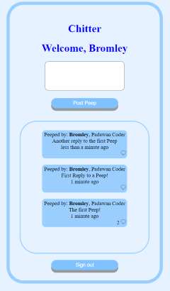

# Chitter

---------
### Functions

1. Sign up. Error handling: prevent register the same email or username twice, with error message in red.

2. Sign in. Error handling: reject wrong email or password, with error message in red.

3. View messages without the need to sign in. Messages are listed from latest to oldest.

4. Post message after sign in. 

---------
### How to use

1. [Setup](docs/setup.md)
2. Run command `rackup`
3. In web browser, enter i.e. "localhost:9292" (or the port provided from previous step)

---------
### Infrastructure

- Web Framework: Sinatra
- Test: Capybara, rspec
- Database: postgresql

---------
### Extras

- Responsive web pages (scale up/down when resize browser window)
- Styling
- Deal with apostrophes in text fields before passing to database

---------
### Future Scope

- Tag user and send notification email
- Use database on the cloud
- Host site on the cloud