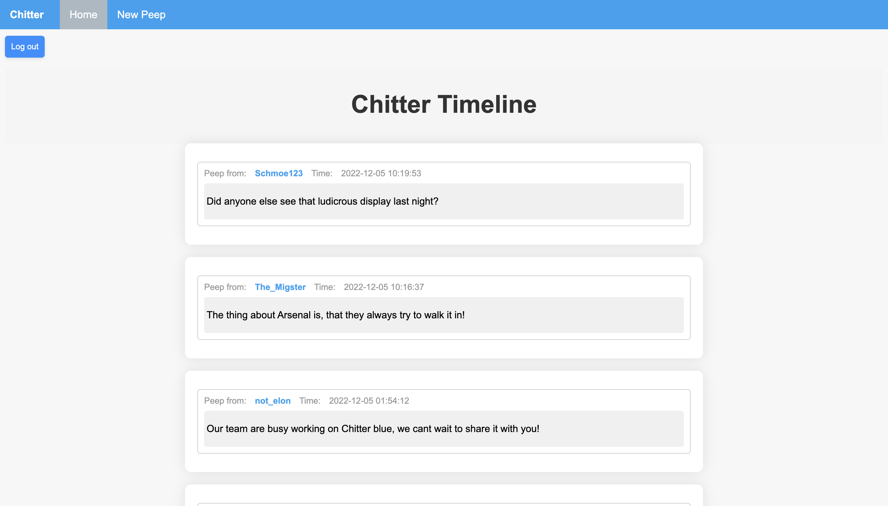
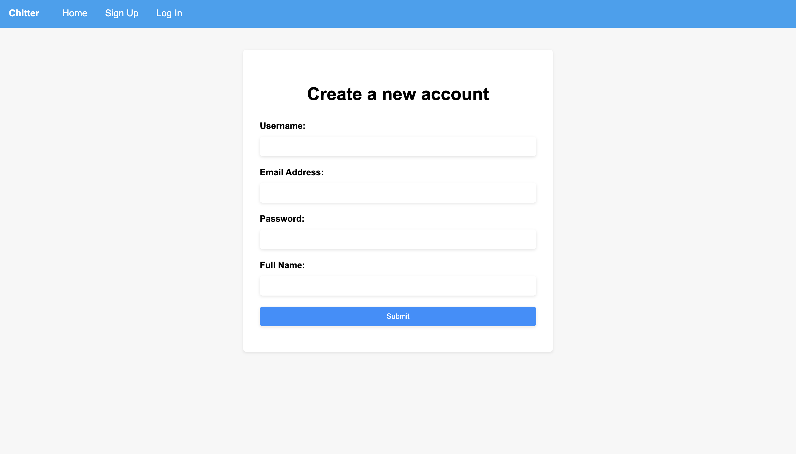

About this project:
-------

Chitter is a simple twitter clone built over 2 days using Ruby, Sinatra and PostgreSQL, as a weekend project for the Makers Academy Course. It focuses on five core features:

* Users can post a message (peep) to the Chitter timeline
* All users can view all peeps in reverse chronological order
* All peeps have the time of posting displayed
* All users can sign up for a Chitter account 
* Users can log in and out of Chitter

Technologies used:
-----
     
 
* Additional Gems:
  * Capybara
  * Rubocop
  * SimpleCov
  * Timecop

Project Learnings:
-----

Through creating this app, I improved my ability to:

* Implement web routes using a lightweight web framework
* Demonstrate how HTTP requests and responses work in a web application
* Create a postgreSQL database and implement routes that interact with and manipulate data in these databases
* Authenticate users using sessions
* Create dynamic HTML using ERB

Screenshots 
------

#### Timeline

#### Sign Up 

How to install:
------

* Clone this repository 
* Create the database using the sql file: chitter-challenge/database/chitter_database.sql
* Install the gem files using the terminal command 'bundle install' 
* Use the command 'Rackup' to run the Sinatra Server
* Use the command 'Rspec' to see test coverage 

