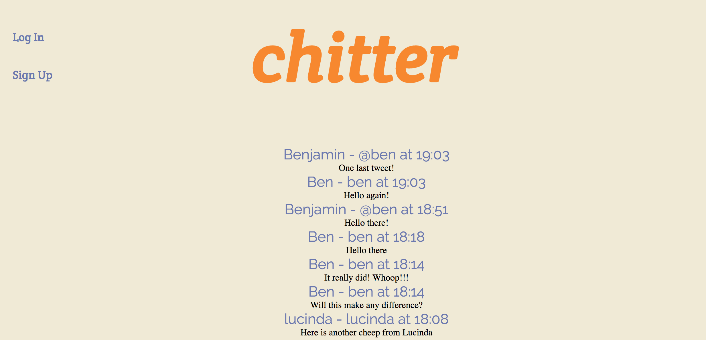
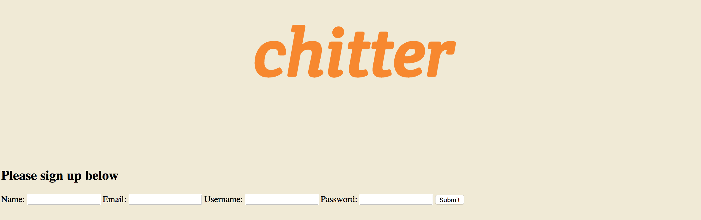
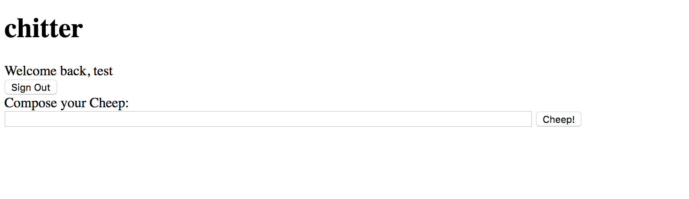

# Chitter Challenge

As part of one of the Makers Academy weekend challenges, I have been asked to produce a website which is similar in nature to 'Twitter'.


## Specifications / User Stories

```
User Story 1:

As a Maker
So that I can post messages on Chitter as me
I want to sign up for Chitter

User Story 2:

As a Maker
So that I can post messages on Chitter as me
I want to log in to Chitter

User Story 3:

As a Maker
So that I can avoid others posting messages on Chitter as me
I want to log out of Chitter

User Story 4:

As a Maker
So that I can let people know what I am doing  
I want to post a message (peep) to chitter

User Story 5:

As a maker
So that I can see what others are saying  
I want to see all peeps in reverse chronological order

User Story 6:

As a maker
So that I can better appreciate the context of a peep
I want to see the time at which it was made
```

## Installing

* Fork or clone this repository

* Create the following local databases using psql:
    'chitter_development'
    'chitter_test'

* At the command line, run '$ rackup'

* Within your web browser, visit 'http://localhost:9292'

## Using the App

On landing at the http://localhost:9292, for the first time, the user will see a page, inviting them to 'Sign Up'.  This page also displays a list of any previous posts made by users (this will be empty the first time the app is run)



If the user has not previously used the app, they are required to 'Sign up' before they are permitted to make a post.  



When the user wishes to compose a new 'cheep', they should click on the 'Compose Cheep' button.  This takes the user to the following screen:



On clicking the 'Cheep' button, the user is redirected back to the index page, with their cheep displayed at the top of the page.


## Running Tests

In order to run the test suite, please use the command '$ rspec'

## Additional Features

In the future, I would like to implement the following additions to this project:

* Improved interface using HTML and CSS;

* Requesting that a user repeats his/her password when signing up to the service;

* Allowing a user to reset his/her password;

* Allowing a user to 'respond' to another user's cheeps;
