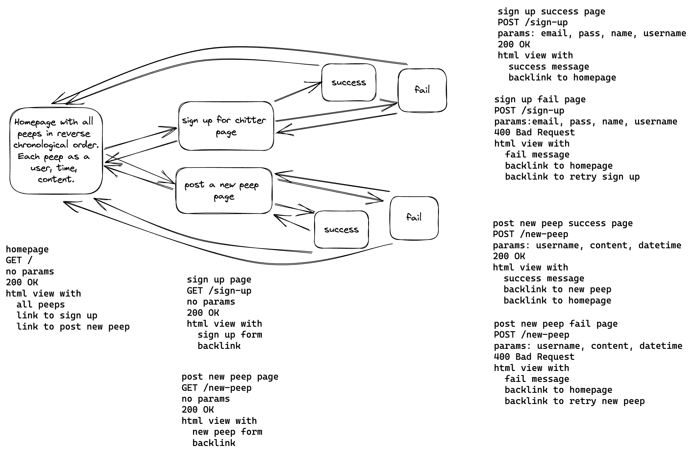

Chitter Challenge
=================

An implementation of the solo project from the Makers Academy Web Applications module. The deployed app can be found at https://chitter-challenge-ct9w.onrender.com/

Running the app locally
-----------------------
```
$ git clone https://github.com/ev-th/chitter-challenge.git
$ bundle install
$ createdb chitter
$ psql -h 127.0.0.1 chitter < chitter.sql
$ createdb chitter_test
$ psql -h 127.0.0.1 chitter_test < chitter.sql
$ rspec
$ rackup
```

App features
------------
* A user can sign up for an account. Username and email address must be unique.
* Users can log in and out using their account.
* Users can post peeps when logged in.
* Peeps are listed on the homepage in reverse chronological order.
* Peeps are displayed with the user's name and username and a timestamp.
* When a user is tagged in a peep, they will receive a notification email.

Technologies
------------
* Languages: Ruby, HTML, CSS, SQL
* git and GitHub
* Sinatra
* PostgreSQL
* Bcrypt
* Brevo API
* Render
* Excalidraw
* rack
* RSpec
* rubocop

Approaching the challenge
-------------------------
This was a big challenge with lots of optional extras, so I wasn't sure what I'd be able to achieve in the time. Therefore, I took the approach to create an MVP with the 'straight up' features first, then iteratively add additional features as time allowed.

To start, I planned the views, then the necessary routes:


Then I planned the database tables. The database has two tables: peeps and users. Users has a one to many relationship with peeps. I set this up and wrote the seeds.

After that, I wrote the database repositories. The fastest option for me was to write the repositories myself as I'm currently unfamiliar with ORMs. This was something I'd hoped to revisit at the end.

Then I wrote the https routes and sanitised user input for empty inputs and any angle brackets that could be an attempt to inject html by a user. This is a pretty basic attempt as sanitising user input and is another aspect of the project that could be examined further.

In order to finish the 'straight up' version of the challenge, I added functionality to the database repository to check whether a username or email already exists in the users table to ensure there are no duplications when a user signs up. If users sign up with a duplicated email or username, or input invalid data, they are taken to a failure page with a 400 status code. I also used the bcrypt gem to encrypt user passwords.

Once the basic features were complete, I moved to the advanced ones. I implemented log in and log out using sessions built into Sinatra. With this, I updated the homepage to adapt to the session. If the user was logged in they could make a new peep or log out. If the user was not logged in they could sign up or log in. Now that the user can log in, I updated the new peep POST route to use session data for user id instead of having the user input their id manually.

Next, I implemented the email sending feature using Brevo. I copied some boilerplate code from their documentation for this and attempted to unit test it, but it was proving to be very complex and didn't seem to be a good use of time. Therefore this is not covered in the test suite. However when testing it manually, it was working. I put secret data in a .env file and added that to my .gitignore. I also added these to my Render environment variables and checked that the emails were also being sent in the deployed version.

Finally, I added some CSS styling. Currently there is one style sheet used for all the views. I had some fun here! 🐦

What would I do with more time?
-------------------------------
Overall I'm happy with what I achieved, but there are a number of things I would like to have done if I had more time:

* I missed the final bonus feature to add replies to peeps.
* Following on from the previous point, I would have liked the app to have pages for users, where you can see only their peeps, along with comments on the peeps. This is where the one to many relationship between the database tables would have made sense.
* The failure pages for invalid user inputs are very basic and don't give the user information about why the input was invalid. I would have liked more detail here.
* Bcrypt was severely slowing my tests down so I turned down the cost slightly to make it more workable while in development. I would like to work out how to only turn down costs in tests and leave it higher for deployed code.
* HTML form input sanitisation was very basic and could have been developed further.
* I would implement ActiveRecord as an ORM.
* Overall, I'm happy with my testing and used TDD throughout the majority of the process. However, I struggled to use testing when implementing the email sender, so this is not covered by the test suite.
* I'd like to have spent some more time on styling.

---

The following are the specifications for the project provided by Makers:

Chitter Challenge Specifications
================================

* Feel free to use Google, your notes, books, etc. but work on your own
* If you refer to the solution of another coach or student, please put a link to that in your README
* If you have a partial solution, **still check in a partial solution**
* You must submit a pull request to this repo with your code by 10am Monday morning

Challenge:
-------

As usual please start by forking this repo.

We are going to write a small Twitter clone that will allow the users to post messages to a public stream.

Features:
-------

```
STRAIGHT UP

As a Maker
So that I can let people know what I am doing  
I want to post a message (peep) to chitter

As a maker
So that I can see what others are saying  
I want to see all peeps in reverse chronological order

As a Maker
So that I can better appreciate the context of a peep
I want to see the time at which it was made

As a Maker
So that I can post messages on Chitter as me
I want to sign up for Chitter

HARDER

As a Maker
So that only I can post messages on Chitter as me
I want to log in to Chitter

As a Maker
So that I can avoid others posting messages on Chitter as me
I want to log out of Chitter

ADVANCED

As a Maker
So that I can stay constantly tapped in to the shouty box of Chitter
I want to receive an email if I am tagged in a Peep
```

Technical Approach:
-----

In the last two weeks, you integrated a database using the `pg` gem and Repository classes. You also implemented small web applications using Sinatra, RSpec, HTML and ERB views to make dynamic webpages. You can continue to use this approach when building Chitter Challenge.

You can refer to the [guidance on Modelling and Planning a web application](https://github.com/makersacademy/web-applications/blob/main/pills/modelling_and_planning_web_application.md), to help you in planning the different web pages you will need to implement this challenge. If you'd like to deploy your app to Heroku so other people can use it, [you can follow this guidance](https://github.com/makersacademy/web-applications/blob/main/html_challenges/07_deploying.md).

If you'd like more technical challenge now, try using an [Object Relational Mapper](https://en.wikipedia.org/wiki/Object-relational_mapping) as the database interface, instead of implementing your own Repository classes.

Some useful resources:
**Ruby Object Mapper**
- [ROM](https://rom-rb.org/)

**ActiveRecord**
- [ActiveRecord ORM](https://guides.rubyonrails.org/active_record_basics.html)
- [Sinatra & ActiveRecord setup](https://learn.co/lessons/sinatra-activerecord-setup)

Notes on functionality:
------

* You don't have to be logged in to see the peeps.
* Makers sign up to chitter with their email, password, name and a username (e.g. samm@makersacademy.com, password123, Sam Morgan, sjmog).
* The username and email are unique.
* Peeps (posts to chitter) have the name of the maker and their user handle.
* Your README should indicate the technologies used, and give instructions on how to install and run the tests.

Bonus:
-----

If you have time you can implement the following:

* In order to start a conversation as a maker I want to reply to a peep from another maker.

And/Or:

* Work on the CSS to make it look good.

Good luck and let the chitter begin!

Code Review
-----------

In code review we'll be hoping to see:

* All tests passing
* High [Test coverage](https://github.com/makersacademy/course/blob/main/pills/test_coverage.md) (>95% is good)
* The code is elegant: every class has a clear responsibility, methods are short etc.

Reviewers will potentially be using this [code review rubric](docs/review.md).  Referring to this rubric in advance may make the challenge somewhat easier.  You should be the judge of how much challenge you want at this moment.

Notes on test coverage
----------------------

Please ensure you have the following **AT THE TOP** of your spec_helper.rb in order to have test coverage stats generated
on your pull request:

```ruby
require 'simplecov'
require 'simplecov-console'

SimpleCov.formatter = SimpleCov::Formatter::MultiFormatter.new([
  SimpleCov::Formatter::Console,
  # Want a nice code coverage website? Uncomment this next line!
  # SimpleCov::Formatter::HTMLFormatter
])
SimpleCov.start
```

You can see your test coverage when you run your tests. If you want this in a graphical form, uncomment the `HTMLFormatter` line and see what happens!
