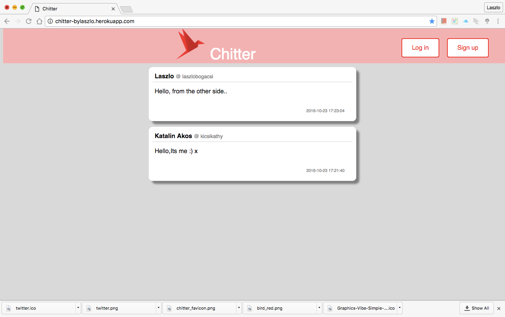

Chitter Challenge
=================
Features:
-------

```
As a Maker
So that I can let people know what I am doing  
I want to post a message (peep) to chitter
```

```
As a maker
So that I can see what others are saying  
I want to see all peeps
```

```
As a maker
So that I can see a particular peep in detail  
I want to view each peep
```

```
As a maker
So that I can keep my peeps relevant
I want to delete a peep
```

```
As a maker
So that I can keep my peeps up to date
I want to edit a peep
```


## Domain Model

Below is a domain model for the peeps model.




## How to use

### To set up the project

Clone this repository and then run:

```
bundle
```

### To set up the database

Connect to `psql` and create the `citter` and `chitter_test` databases:

```
CREATE DATABASE chitter;
CREATE DATABASE chitter_test;
```

To set up the appropriate tables, connect to each database in `psql` and run the SQL scripts in the `db/migrations` folder in the given order.

### To run the Chitter app:

```
rackup -p 3000
```

To view peeps, navigate to `localhost:3000/peeps`.

### To run tests:

```
rspec
```

### To run linting:

```
rubocop
```
