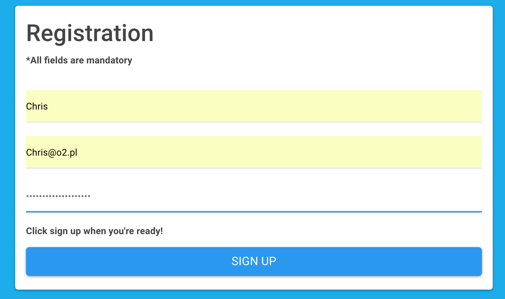
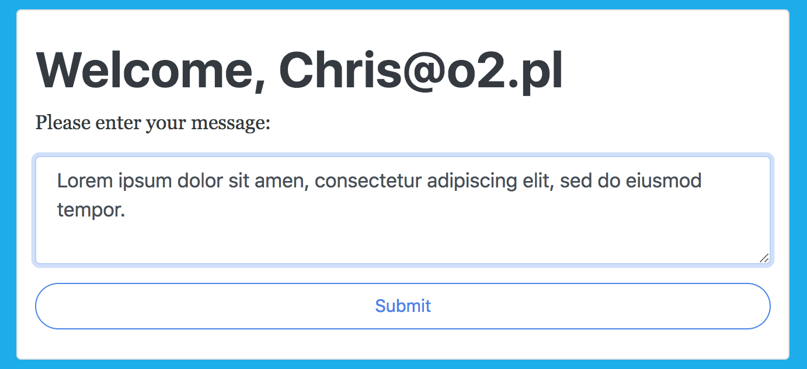
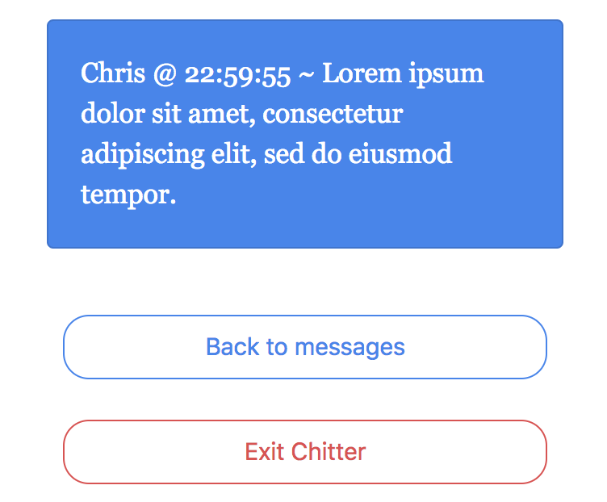

Chitter Challenge
=================

My weekend challenge was to build a small Twitter clone that will allow the users to post messages to a public stream.

I have used following tools and technologies to complete this project:

* Ruby / Sinatra
* PostgreSQL
* RSpec / Capybara
* Rubocop
* HTML / CSS
* Bootswatch

**I was aiming for:**

* Complete TDD process ✔
* 100% test coverage ✔
* Cool user interface which resembles original Twitter ✔

-----
** App screenshots: **

1. Main page


2. Registration



3. Messages



4. Chitts




Features:
-------

```
STRAIGHT UP

As a Maker
So that I can let people know what I am doing  
I want to post a message (peep) to chitter

As a maker
So that I can see what others are saying  
I want to see all peeps in reverse chronological order

As a Maker
So that I can better appreciate the context of a peep
I want to see the time at which it was made

As a Maker
So that I can post messages on Chitter as me
I want to sign up for Chitter
```
-----
**To test the application please clone the repository using below: **

`git clone https://github.com/KrzysztofBalejko/chitter-challenge.git`

**Anyone needing to setup the database from scratch will need to do the following things:**

`Connect to psql
Create the database using the psql command CREATE DATABASE chitter_challenge;
Connect to the database using the pqsl command \c chitter_challenge;
Run the query CREATE TABLE users(id SERIAL PRIMARY KEY, email VARCHAR(60),
password VARCHAR(60), nameVARCHAR(60));
Run the query CREATE TABLE chitter(id SERIAL PRIMARY KEY, message VARCHAR(140));`
