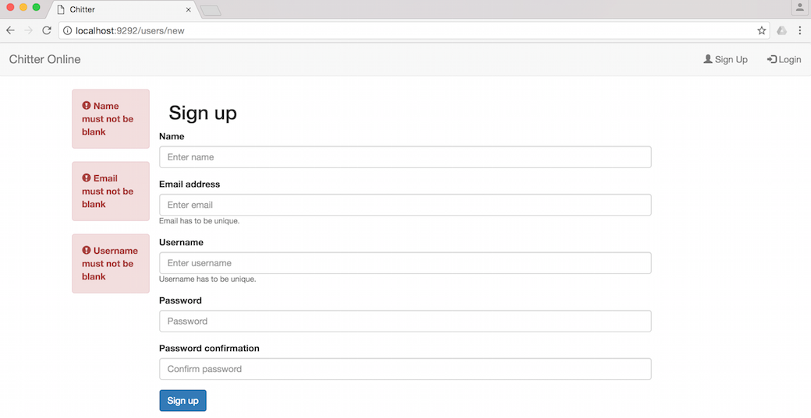
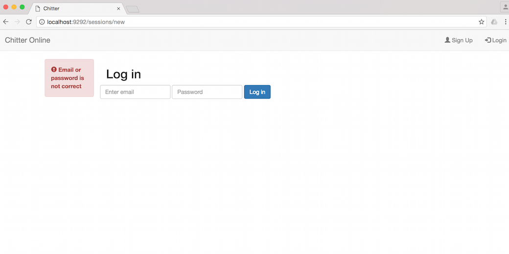
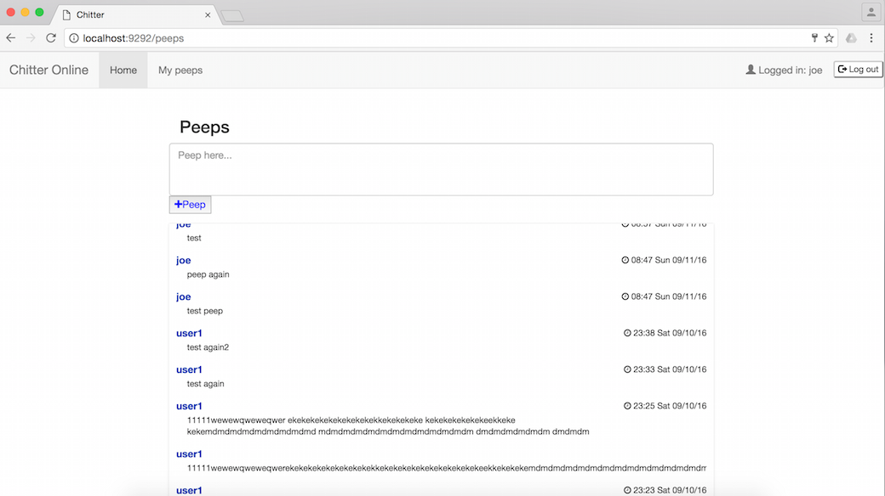

[](https://travis-ci.org/makersacademy/chitter-challenge)
[](https://camo.githubusercontent.com/f94be65e08a3d7d3f00f326f84543941dc58232b/68747470733a2f2f636f766572616c6c732e696f2f6275696c64732f373833323132372f6261646765)

Chitter Challenge
=================

Description:
-------

The program acts as a little Twitter clone that allows the users to post messages to a public stream.

The program covers the following user stories:

```
As a Maker
So that I can post messages on Chitter as me
I want to sign up for Chitter

As a Maker
So that I can post messages on Chitter as me
I want to log in to Chitter

As a Maker
So that I can avoid others posting messages on Chitter as me
I want to log out of Chitter

As a Maker
So that I can let people know what I am doing  
I want to post a message (peep) to chitter

As a maker
So that I can see what others are saying  
I want to see all peeps in reverse chronological order

As a maker
So that I can better appreciate the context of a peep
I want to see the time at which it was made
```

The program provides the following functions:
------

* Makers sign up to chitter with their email, password, name and a user name (e.g. sam@makersacademy.com, s3cr3t, Samuel Russell Hampden Joseph, tansaku);
* The username and email are unique;
* Peeps have the user's name and creation date;
* BCrypt is used to secure the passwords;
* Users can see all the peeps without logging in;
* User can only peep if she/he is logged in;

### Screenshots of main functions
#### Sign up screen (with error messages)


#### Login screen (with error message)


#### Peeps


### Instructions for how to run the program

```
$ git clone https://github.com/peter-miklos/chitter-challenge
$ bundle
$ createdb chitter_development
$ rake auto_migrate
$ rspec
$ rackup
```

### Heroku
The program is available on Heroku: http://chitternow.herokuapp.com/

Tests
-------
### Feature tests
In feature tests the following test cases have been used:
```
Add peep
  logged in user can add a peep that is stored in db
  user cannot add a peep unless logged in

Show peeps
  users' peeps are visible with username and creation date
  users' peeps are visible in reverse chronological order
  user can see his/her own peeps at my peeps

User sign up
  user can sign up with valid data
  user cannot sign up with mismatching password
  user cannot sign up with the same username twice
  user cannot sign up with no username
  user cannot add username with special char other than '_'
  user cannot add name with special char other than '_'
  user cannot sign up with no name
  user cannot sign up with no email address
  user cannot sign up with the same email address twice
  user cannot sign up with invalid email address

User log in
  user can sign in with valid credentials and see a welcome message
  user cannot sign in with wrong email and/or password

User logs out
  user can log out successfully
```

### Unit tests
The following test cases pass the unit test:
```
User
  #authenticate
    authenticates the user and returns the user object if authentication complete
    authentication fails because of wrong password
    authentication fails because of wrong email
```
