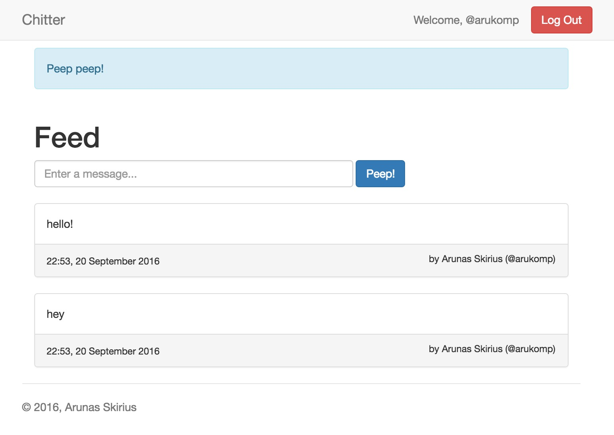
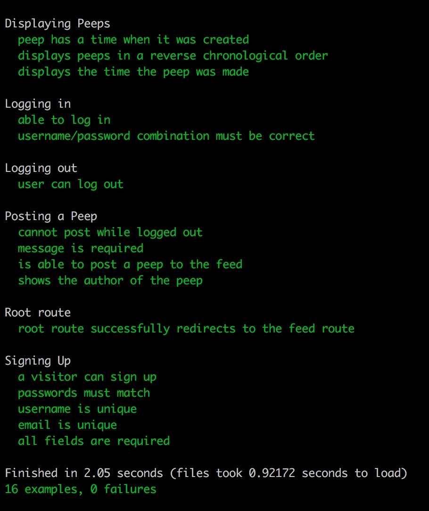

Chitter Challenge
=================

[Live Demo on Heroku](https://aru-chitter.herokuapp.com)

Technologies used:
-------
* Ruby
* Sinatra as a slim HTTP framework
* Capybara for feature testing
* DataMapper ORM
* PostgreSQL database
* BCrypt password encryption
* Bootstrap for CSS styling

How to use it:
-------

To run the app locally, do the following:
* Clone the project
* Run `bundle`
* Create a local Postgres database `chitter_development` and `chitter_test` for
  testing
* Run with `rackup`
* Visit http://localhost:9292/

To run the tests:
* Run `rspec`

User Stories implemented:
-------

```
As a Maker
So that I can post messages on Chitter as me
I want to sign up for Chitter

As a Maker
So that I can post messages on Chitter as me
I want to log in to Chitter

As a Maker
So that I can avoid others posting messages on Chitter as me
I want to log out of Chitter

As a Maker
So that I can let people know what I am doing  
I want to post a message (peep) to chitter

As a maker
So that I can see what others are saying  
I want to see all peeps in reverse chronological order

As a maker
So that I can better appreciate the context of a peep
I want to see the time at which it was made
```

Screenshots
-------

### User Interface



### RSpec tests


