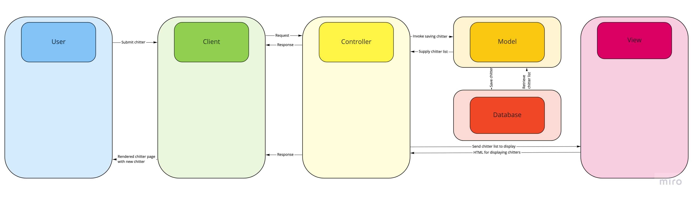

# Chitter challenge
This challenge aims to create a chitter clone. The project is far from completed but it is possible to create a peep and view it.

## Instructions
**Set up project**
* Clone the project to a local directory using `git clone https://github.com/SipofTea/chitter-challenge.git`.
* In the root of the project directory run `bundle`.

**Set up database**

* Ensure PostgreSQL is installed and set up.
* Connect to psql (`psql postgres`).
* Create the development and testing databases. 
 
```
CREATE DATABASE chitter;
CREATE DATABASE chitter_test;
```

* Connect to development database (`\c chitter;`).
* Run SQL scripts in `db/migrations` in given order.
* Repeat connection and script steps for the test database.

**Run app**

To run the app execute `rackup -p 4567` in the command line.

Visit http://localhost:4567/ to see created peeps.

Visit http://localhost:4567/create_peep to create a peep.

**Run tests**

To run tests execute `rspec` in the command line from the project root directory.

## Specification


## User story

**Completed**
```
As a Maker
So that I can let people know what I am doing  
I want to post a message (peep) to chitter
```

### Domain model


**Incomplete**
```
As a maker
So that I can see what others are saying  
I want to see all peeps in reverse chronological order

As a Maker
So that I can better appreciate the context of a peep
I want to see the time at which it was made

As a Maker
So that I can post messages on Chitter as me
I want to sign up for Chitter

HARDER

As a Maker
So that only I can post messages on Chitter as me
I want to log in to Chitter

As a Maker
So that I can avoid others posting messages on Chitter as me
I want to log out of Chitter

ADVANCED

As a Maker
So that I can stay constantly tapped in to the shouty box of Chitter
I want to receive an email if I am tagged in a Peep
```