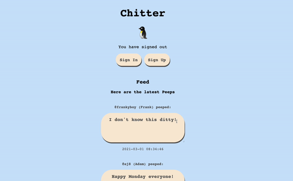
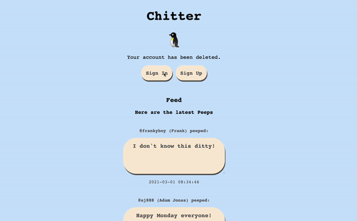
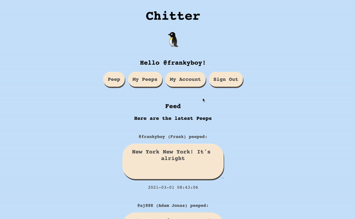
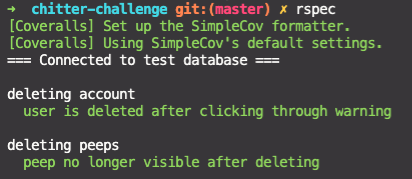
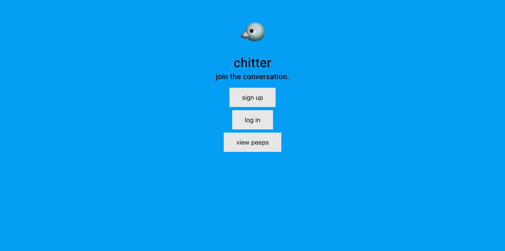

# Chitter

[](https://travis-ci.com/AJ8GH/chitter-challenge) [](https://coveralls.io/github/AJ8GH/chitter-challenge?branch=master) [](https://codeclimate.com/github/AJ8GH/chitter-challenge/maintainability)

Version 1.0.0 deployed through Heroku: [Chitter](https://gentle-mountain-55342.herokuapp.com/)
----------------------------------------------------------------------------------------------



## Ruby version

- `2.7.2`

## Dependencies

- `bcrypt`
- `capybara`
- `coveralls_reborn (~> 0.20.0)`
- `pg`
- `puma`
- `rack`
- `rake`
- `rspec`
- `rubocop (= 0.79.0)`
- `simplecov`
- `simplecov-console`
- `sinatra-flash`
- `sinatra`

## Getting Started

### Initial Setup

* You will need Ruby installed, this project uses version 2.7.2
  * Use of a version manager tool such as RVM is recommended
  * You can find documentation for installing RVM [here](https://rvm.io/rvm/install)

* Clone this repository and navigate to the root of the project

```shell
git clone git@github:AJ8GH/chitter-challenge.git
cd chitter-challenge
```

* Install `bundler` if you do not already have it and install project dependenices

```shell
gem install bundler
bundle install
```

* This app uses a PostgreSQL database, so you will need to install and set up Postgres
  * Using a package manager such as Homebrew is recommended
  * You can install Homebrew [here](https://brew.sh/)
  * Then install PostgreSQL with: `brew install postgresql`
  * After Homebrew has downloaded PostgreSQL it will show you some installation instructions: follow them!
  * Next run: `brew services start postgresql` to keep PostgreSQL running in the background

* Create the test and development databases and migrate the table schema

```shell
rake db:create:all
rake db:migrate:all
```

These rake tasks will create 2 databases, `chitter` and `chitter_test`, and migrate the db schema for each. Full details on the database schema can be found in `db/migrations` folder.

## Running Tests

* Ensure you are in the root directory
  * To run entire test suite, run: `rspec`
  * To run only feature tests, run: `rspec spec/features`
  * To run only unit tests, run: `rspec spec/models`
  * To run individual spec files: `rspec spec/<directory_name>/<file_name>`

Notes on the test suite:
* App has been development using outside in TDD, writing a feature test based on a user story, then implementing the feature to make the test pass.
* `Capybara` is used for feature testing and `rspec` is used for unit testing
* Tests are configured to output documentation format
* Suite is configured to automatically connect to the test database before running
* Test database is 'cleaned' after each test

## Usage

To use the app in the local development environment, start the server with `rackup`. Then head to [localhost, port 9292](http://localhost:9292)

To use the deployed version of the app, [click here](https://gentle-mountain-55342.herokuapp.com/)

## Public interface

### Models:

#### post

Public class methods:

##### .create

Creates a new instance and saves data in database, takes 2 keyword arguments - content: (string) and user_id: (integer)

```ruby
post = Post.create(content: 'Hello World!', user_id: 1)
post.content
 # => Hello World!

post.user_id
# => 1
```

##### .all

Returns arrray of all instances of the class. Takes no arguments

```ruby
Post.all
# => [post1, post2, ...]
```

##### .delete

Deletes the instance from database, takes id: (integer) as keyword argument

```ruby
Post.delete(id: 7)
```

##### .find

Finds the post by its id, takes id: (integer) as keyword argument

```ruby
Post.find(id: 7)
```

##### .update

Updates post content, takes id: (integer) and content: (string) as keyword arguments

```ruby
post.content
# => '!dlroW olleH'
post.id
# => 1

Post.update(id: 1, content: 'Hello World!')

post.content
# => 'Hello World!'
```

##### .user_posts

Returns all posts of that user, takes user_id: (integer) as keyword argument

```ruby
Post.user_posts(user_id: 1)
# => '[user_post1, user_post2, ...]'
```

#### User

## Example usage

Check your posts in reverse chronological order - no need to be signed in for this feature.

Sign in to access more features such as posting and editing posts and account details.



If you're new to Chitter, you'll need to sign up to start posting. Your password will be stored safely.


Edit and delete your posts any time.


As well as your user account data.



## Reflections

### Design and approach

- I set out to build a an app which ticks boxes for:
  - CRUD features
  - Use of ORM with postgres database
  - Polished look using CSS
  - RESTful routing
  - Encryption of passwords and authentication of users using sessions
  - Adhering to MVC standards and separation of concerns / SRP.

- User Stories have all been hit, bar email notifications. Instead I prioritised implementing all of the CRUD features for the user info and posts.
- I went for an approach of using ORM and wrapping my database connection in a class. - I applied rake tasks to handle everything to do with environment and db setup. I setup tasks for connecting to the correct database depending on the environmnent, cleaning the database and creating and migrating the database.

## Test and development environments

- Raketask `db:connect` automatically connects to the correct database depending on which environment the app is running in, and outputs a confirmation to the terminal.

- Bcrypt is set up with minimum cost factor in the test environment, so as not to slow down the tests. In development and Production this is higher for additional security.

```ruby
BCrypt::Engine.cost = 1
```

- Test database is cleaned automatically after each test to eliminate test data pollution

### Extending the application

Future features include:
- Email notifications
- Replies and favourites
- Building a frontend interface with React or vanilla JS

## User Stories

```
As a Maker
So that I can let people know what I am doing
I want to post a message (post) to chitter

As a maker
So that I can see what others are saying
I want to see all posts in reverse chronological order

As a Maker
So that I can better appreciate the context of a post
I want to see the time at which it was made

As a Maker
So that I can post messages on Chitter as me
I want to sign up for Chitter

As a Maker
So that only I can post messages on Chitter as me
I want to log in to Chitter

As a Maker
So that I can avoid others posting messages on Chitter as me
I want to log out of Chitter

As a Maker
So that I can stay constantly tapped in to the shouty box of Chitter
I want to receive an email if I am tagged in a post
```


