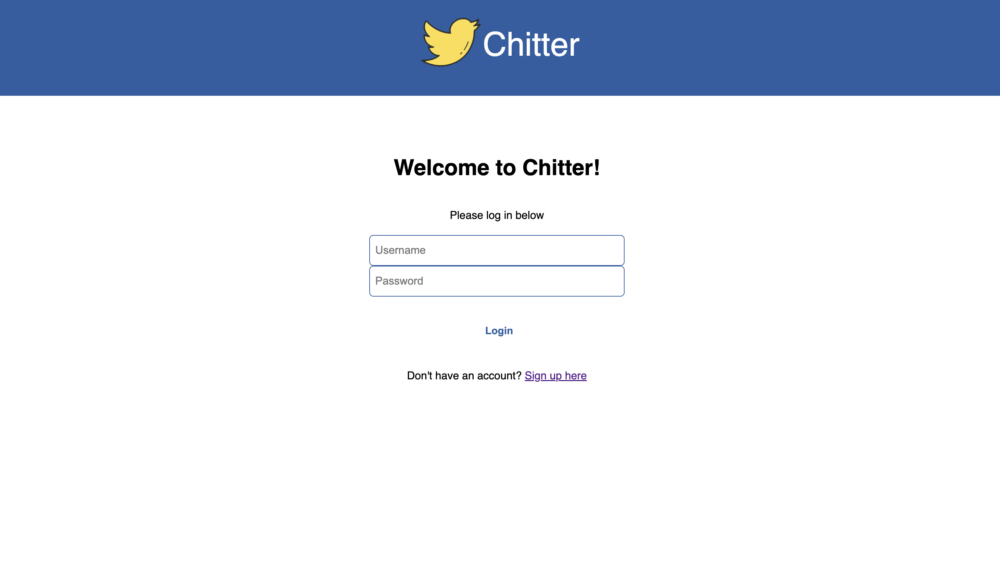

Chitter 
=================

Recreation of Twitter using Ruby and ActiveRecord. **Tools used**: Ruby, ActiveRecord, PostGreSQL, HTML, CSS, RSpec, Rubocop.

# Build Instructions

Clone the repo and then cd into the directory.

Run ```bundle install```

After install is complete, run ```rackup```

Now you should be able to navigate to `localhost:9292` to display the site.



